# Capítulo II: Requirements Development and Software Solution Design

## 2.1. Competidores

### 2.1.1. Análisis competitivo

<table border="1px">
        <thead>
            <th colspan="11">Competitive Analysis Landscepe</th>
        </thead>
        <tbody>
            <tr>
                <td rowspan="2" colspan="2">¿Por qué llevar a
                    cabo este análisis?</td>
                <td colspan="9">Escriba en el recuadro la pregunta que busca responder o el objetivo de
                    este análisis.</td>
            </tr>
            <tr>
                <td colspan="9">El objetivo de este análisis es comprender el funcionamiento y las características que presentan los productos de nuestros competidores, para posteriormente planificar estrategias y tácticas para aprovechar las fortalezas de nuestro producto y las debilidades de nuestros competidores.   </td> 
            </tr>
            <tr>
                <tr>
                    <td colspan="3">(En la cabecera colocar por cada competidor nombre y logo)</td>
                    <td colspan="2">Eventify</td>
                    <td colspan="2"> Bizzabo</td>
                    <td colspan="2"> PartySlate</td>
                    <td colspan="2"> Eventective</td>
                </tr>
            </tr>
            <tr>
                <td rowspan="2" colspan="1">Perfil</td>
                <td colspan="2">Overview</td>
                <td colspan="2">Plataforma que brinda herramientas de gestion para organizadores y los conecta con anfitriones que desean contratar sus servicios</td>
                <td colspan="2">Plataforma para la gestión de eventos corporativos, especializada en conferencias y experiencias presenciales, virtuales e híbridas </td>
                <td colspan="2">Plataforma donde organizadores de eventos pueden publicar sus servicios mediante portafolios visuales para atraer la atención de los anfitriones que buscan sus servicios.</td>
                <td colspan="2">Plataforma para buscar y contratar proveedores de servicios para eventos (locales, catering, etc.)</td>
            </tr>
            <tr>
                <td colspan="2"> Ventaja competitiva    ¿Qué valor ofrece a los clientes?</td>
                <td colspan="2">Los organizadores tienen herramientas que facilitan la gestion de eventos. Mientras que los anfitriones pueden encontrar, cotizar y analizar distintas propuestas desde un mismo lugar.</td>
                <td colspan="2">Permite crear y gestionar eventos(presencial, virtual o hibrido). Además presenta sección de networking para cada evento, permitiendo a los participantes interactuar entre ellos. </td>
                <td colspan="2">Ofrece a los organizadores presentar sus servicios mediante experiencias visuales basadas en portafolios de fotos y videos de eventos anteriores.</td>
                <td colspan="2">Ofrece facilidad para encontrar servicios para eventos (locales, catering, etc.), gracias a su amplia variedad de proveedores</td>
            </tr>
            <tr>
                <td rowspan="2" colspan="1">Perfil de Marketing</td>
                <td colspan="2">Mercado Objetivo</td>
                <td colspan="2">Organizadores de eventos y anfitriones ubicados en Lima, Perú</td>
                <td colspan="2">Empresas medianas y grandes que organizan conferencias, cumbres o lanzamientos de productos</td>
                <td colspan="2">Organizadores de eventos, proveedores (catering, musica, fotografos, etc.) y anfitriones, mayormente de EE.UU.</td>
                <td colspan="2">Proveedores de servicios para eventos (locales, catering, etc) y anfitriones que desean contratar sus servicios en EE.UU. y Canada</td>
            </tr>
            <tr>
                <td colspan="2">Estrategia de Marketing</td>
                <td colspan="2">Posicionamiento del Landing page del producto.   Campañas en Google Ads.   Publicidad en redes sociales.  Colaboración con organizadores de eventos</td>
                <td colspan="2">Posicionamiento del Landing page del producto.   Publicidad en redes sociales.   Organización de eventos propios para mostrar las caracteristicas de su plataforma</td>
                <td colspan="2">Publicidad en redes sociales    Posicionamiento de su plataforma</td>
                <td colspan="2">Publicidad en redes sociales    Posicionamiento de su plataforma</td>
            </tr>
            <tr>
                <td rowspan="3" colspan="1">Perfil de Producto</td>
                <td colspan="2">Producto & Servicio</td>
                <td colspan="2">Es una aplicación web que conecta a organizadores de eventos con anfitriones que necesitan contratar sus servicios. Además, ofrece herramientas para los organizadores, como calendarios de eventos, notas internas, comunicación directa con los anfitriones, entre otros.  </td>
                <td colspan="2">Es una aplicación web y movil que ofrece herramientas para gestion de eventos como registro de asistentes, gestión de entradas, networking y analiticas en tiempo real </td>
                <td colspan="2">Es una aplicación web que ofrece servicios de organizadores de eventos mediante portafolios visuales </td>
                <td colspan="2">Es una aplicación web que permite realizar busquedas de servicios de proveedores para eventos, como locales, catering, musica, etc.</td>
            </tr>
            <tr>
                <td colspan="2">Precio & Costos  </td>
                <td colspan="2">El registro a la aplicación sera de forma gratuita, sin embargo, para acceder a las herramientas de gestión, los organizadores deberan pagar una suscripción mensual.</td>
                <td colspan="2">La aplicación ofrece una tarifa de $17,999 por año</td>
                <td colspan="2">Publicación gratuida ilimitada y planes desde $195 a $695 mensuales para mayor visibilidad</td>
                <td colspan="2">Pago por leads o suscripción mensual de $100 a $170</td>
            </tr>
            <tr>
                <td colspan="2">Canales de distribucion (web y/o Movil)</td>
                <td colspan="2">Aplicación web</td>
                <td colspan="2">Aplicación web y Móvil</td>
                <td colspan="2">Aplicación web</td>
                <td colspan="2">Aplicación web</td>
            </tr>
            <tr>
                <td rowspan="5">Analisis SWOT</td>
                <td colspan="10">Realice esto para su startup y sus competidores. Sus fortalezas deberían apoyar sus
                    oportunidades y contribuir a lo que ustedes definen como su posible ventaja
                    competitiva</td>
            </tr>
            <tr>
                <td colspan="2">Fortalezas</td>
                <td colspan="2">Ofrecemos herramientas de gestión, como calendarios para organizar eventos, comunicación de organizadores y anfitriones</td>
                <td colspan="2"> Solución potente y robusta para eventos corporativos grandes. Además, se puede integrar con herramientas empresariales</td>
                <td colspan="2"> Permite a los organizadores y proveedores a crear portafolios visuales de sus servicios para captar la atención de los anfitriones</td>
                <td colspan="2"> Presenta una amplia variedad de proveedores registrados y es accesible para proveedores pequeños que inician en el rubro.</td>
            </tr>
            <tr>
                <td colspan="2">Debilidades</td>
                <td colspan="2">Nuestra aplicación es nueva en el mercado nacional, lo que podria complicar atraer nuevos usuarios</td>
                <td colspan="2">Es compleja y costosa para organizadores de eventos no masivos</td>
                <td colspan="2">Ofrece pocas opciones para el mercado nacional, ya que esta centrado mayormente para EE.UU. Además no ofrece herramientas de gestión</td>
                <td colspan="2">Presenta una interfaz muy simple y poco atractiva. Además, los servicios que ofrece solo estan disponibles en EE.UU. y Canada</td>
            </tr>
            <tr>
                <td colspan="2">Oportunidades</td>
                <td colspan="2">Es una solución escalable para nivel nacional e inclusive para todo latinoamerica.</td>
                <td colspan="2">Tiene la posibilidad de liderar el sector de eventos híbridos y virtuales, integrando tecnologías como IA para automatizar procesos de gestión.</td>
                <td colspan="2">Puede expandirse a nuevos países y fortalecer su red de organizadores mediante alianzas estratégicas</td>
                <td colspan="2">Puede mejorar su interfaz para dale mejor visibilidad a sus proveedores, además de integrar herramientas de gestión</td>
            </tr>
            <tr>
                <td colspan="2">Amenazas</td>
                <td colspan="2">Al ser una aplicación nueva, el exito depende tener una amplia cantidad de organizadores y anfitriones simultaneamente, ya que si hay poca oferta o demanda en la aplicación, los usuarios no tendrán motivos para permanecer activos.</td>
                <td colspan="2">La mayor parte de sus clientes son grandes empresas que requieren soluciones personalizadas. Si no cumplen con las expectativas, podrían perder contratos importantes </td>
                <td colspan="2">Competencia con redes sociales visuales, como Instragram</td>
                <td colspan="2">Puede quedar obsoleta frente a nuevas soluciones más modernas </td>
            </tr>
        </tbody>
    </table>

### 2.1.2. Estrategias y tácticas frente a competidores

**Estrategia de diferenciación:**
 
La estrategia de diferenciación se basa en ofrecer una solución de software única que se distinga de la competencia. En este caso, la propuesta es crear una aplicación web que conecte a organizadores de eventos con anfitriones, brindando herramientas de gestión para facilitar la planificación y ejecución de eventos. Esto permitirá a los organizadores optimizar su trabajo y a los anfitriones encontrar fácilmente el servicio que necesitan.
 

* **Tácticas:**  
  * Incluir funcionalidades como calendario, chat directo, cotizaciones, notas personalizadas y seguimiento por pasos.
  * Diseñar una interfaz intuitiva, clara y amigable desde el primer uso.
 

**Estrategia de liderazgo en costos:**
 
La estrategia de liderazgo en costos implica ofrecer una solución a un precio más bajo que la competencia. En este caso, se propone ofrecer una suscripción mensual asequible para los organizadores de eventos, lo que les permitirá acceder a herramientas de gestión sin incurrir en altos costos iniciales.
 

* **Tácticas:**
  * Implementar un modelo freemium: registro gratuito y herramientas básicas sin costo.
  * Ofrecer una suscripción mensual accesible para funciones avanzadas, en contraste con los altos precios de aplicaciones como Bizzabo.
  * No cobrar comisiones por contratos gestionados dentro de la app.
 

**Estrategia de diferenciación enfocada:**
 
La propuesta se enfoca en atender a nichos específicos del mercado de eventos sociales (como cumpleaños, bodas y celebraciones familiares), evitando la complejidad de plataformas orientadas a eventos corporativos de gran escala.
 

* **Tácticas:**
  * Simplificar las funcionalidades para que se adapten a las necesidades reales de los eventos sociales.
  * Ajustar la comunicación visual y verbal al tono cercano, emocional y personal que estos eventos suelen tener.
 

**Estrategias competitivas adicionales:**
  

* **Tácticas:**
  * Permitir a los usuarios dejar reseñas y calificaciones de los organizadores.
  * Implementar notificaciones automáticas sobre el avance de cada evento (como recordatorios o pendientes).
 

**Estrategia de construcción de marca:**
 
Apostar por una identidad visual cálida, cercana y profesional, que conecte emocionalmente con el público objetivo y genere confianza.
 

* **Tácticas:**
  * Desarrollar una identidad visual con colores amigables y un logo simple pero memorable.
  * Utilizar redes sociales como Instagram, TikTok y Facebook para mostrar casos reales de uso de la app (antes y después de eventos organizados con Eventify).
  * Fomentar una comunidad activa alrededor de la marca, compartiendo consejos y experiencias sobre organización de eventos.

## 2.2. Entrevistas

### 2.2.1. Diseño de entrevistas

Para el desarrollo de las entrevistas de los segmentos objetivos definidos, se redactaron las siguientes preguntas:

### **Organizadores de eventos no masivos:**

* **Preguntas Demográficas:**

  * ¿Cuál es su nombre?
  * ¿Qué edad tiene?
  * ¿Cómo se definiría usando solo 3 adjetivos?
  * ¿Cuál es su estado civil?
  * ¿A qué se dedica? (freelance o como organización)
  * ¿En qué distrito/provincia reside?
  * ¿Hace cuánto tiempo lleva trabajando como organizador de eventos?
  * ¿Porque decidió trabajar en el rubro de organizador de eventos?

* **Preguntas de Hábitos Digitales:**

  * ¿Por qué medio se comunica con sus clientes con mayor frecuencia (Whatsapp, Instagram, Facebook, correo Hotmail/Gmail)?
  * ¿Con qué dispositivo interactúa con mayor frecuencia (Pc, laptop, iPad)?
  * ¿Cuál es el navegador web que con mayor frecuencia usa? (Chrome, Safari, Brave, Opera).

* **Preguntas Principales:**

  * ¿Qué tipo de eventos organiza con mayor frecuencia?
  * ¿Cuántos eventos gestiona por mes (promedio)?
  * ¿Qué diferencia nota de organizar un evento sencillo de uno complejo?
  * ¿Cuál es el rango salarial para organizar un evento (quinceañero, boda, bautizo, etc.)?
  * ¿Podría contarnos paso a paso, como es su proceso para organizar un evento, desde que un cliente lo contacta hasta el día del evento?
  * ¿Como gestiona su planificación de eventos? ¿Utiliza alguna aplicación de calendario, agenda o recordatorio? ¿Alguna es de paga? ¿Si es así cuales y cuánto?
  * ¿Qué desafíos encuentra al comunicarse con sus clientes?
  * ¿Como ha logrado conseguir la mayoría de sus clientes, promocionándose en alguna red social, sitio web o por contactos? ¿Si es así cual y cómo?
  * ¿Qué aspecto del trabajo considera que los clientes menos comprenden? ¿Hay términos técnicos en la organización de eventos?
  * ¿Como gestiona el pago de sus eventos (cuotas, adelantos, al finalizar)?
  * ¿Cuáles son los medios de pagos que utiliza con mayor frecuencia?
  * ¿Cuáles son los factores (cantidad de invitados, temática, servicios, etc.) que considera para las cotizaciones de sus eventos con los clientes?
  * ¿Qué le gustaría automatizar o simplificar de su trabajo?

* **Preguntas Complementarias:**

  * ¿Qué es lo que más valoran sus clientes en relación a sus servicios según su experiencia?
  * ¿Qué es lo que más le frustra de trabajar como organizador de eventos en el ámbito de planificación? (Contratar servicios de terceros).
  * ¿Ha tenido alguna experiencia mala con alguno cliente? ¿Cómo las resolvió?

 

### Anfitriones de Eventos  

* **Preguntas Demográficas**

  * ¿Cuál es su nombre?
  * ¿Qué edad tiene?
  * ¿Como se definiría usando solo 3 adjetivos?
  * ¿Cuál es su estado civil?
  * ¿A qué se dedicas?
  * ¿En qué distrito/provincia reside?

* **Preguntas de Hábitos Digitales**

  * ¿Por medio de que navegador web contacto con el organizador?
  * ¿Cuál es el dispositivo que utiliza con mayor frecuencia (laptop, Tablet, celular, computadora)?

* **Preguntas Principales**

  * ¿Alguna vez has contratado a algún organizador de eventos?
  * ¿Cuál fue el último evento que contrato?
  * ¿Con cuánto tiempo de anticipación comenzó a planearlo?
  * ¿Como encontró al organizador de eventos? (Redes sociales, contactos, página web).
  * ¿Qué factores considero para contratar a un organizador de eventos?
  * ¿Solicito cotizaciones a diversos organizadores antes de decidir?
  * ¿Hubo algo que le costó entender o comparar entre los diferentes servicios? ¿Si es así cuáles?
  * ¿Cómo considera que fue la comunicación con el organizador y con qué frecuencia?
  * ¿Por qué medios de comunicación fue la interacción con su organizador de eventos? (correo, WhatsApp).
  * ¿Hubo algo que le hubiera gustado que le expliquen mejor?
  * ¿Qué aspecto del evento le hubiera gustado mejorar? (DJ era malo, sillas en mal estado).
  * ¿Cómo fue el proceso de cotización y pagos? ¿Por qué medios fue realizado el pago?
  * ¿Hubo algún gasto inesperado durante la planificación del evento? (Meseros extras).

* **Preguntas Complementarias**

  * ¿Recomendaría a otras personas contratar al mismo organizador de eventos?
  * ¿Qué fue lo más satisfactorio de todo el proceso?
  * ¿Qué fue lo más frustrante/estresante de todo el proceso de planificación junto con su organizador?
  * ¿Le pareció correcto el costo del evento?
  * ¿Cuánto influye el costo en su decisión de contratación? (Prefiere pagar mas por calidad o busca opciones más económicas).
  * ¿Sintió que entendieron bien su visión del evento con lo que organizaron?
  * ¿Pudo hacer seguimiento al estado de pagos fácilmente?

### 2.2.2. Registro de entrevistas

A continuación, se presentará un resumen de cada entrevista realizada a los segmentos objetivo. Además, cada entrevista contará una captura de pantalla como evidencia y el intervalo de tiempo de duración que tienen en el video realizado, para que sea más sencillo ubicarlos.

  

**Segmento Objetivo: Anfitriones de Evento**
  

**Entrevista 1: John Rafael Cutiri Chinchay**

*_Evidencia en fotografía de Entrevista 1 hacia John Rafael Cutiri Chinchay - Segmento Anfitriones_*

**Datos del entrevistado**
* **Nombre:** John Rafael Cutiri Chinchay
* **Edad:** 52 años
* **Estado civil:** Casado
* **Ocupación:** Comerciante
* **Distrito de Residencia:** Chorrillos

* **Duración de la entrevista:** [00:00:08 - 00:16:12]
* **Video de las entrevistas:** [Needfinding - Interviews](https://upcedupe-my.sharepoint.com/:v:/g/personal/u201914181_upc_edu_pe/EXks3gNtzrFPh8mlpqOnP4oBJkIS1VjexgiBtpRkFu_wow)

**Resumen de la entrevista:**

El entrevistado se llama John Rafael Cutiri Chinchay, es una persona sobria, directa y de pocas palabras. Actualmente se encuentra casado, reside en Chorrillos y trabaja como comerciante. El navegador que utiliza con frecuencia es Google Chrome y su dispositivo preferido es el celular.

Durante la entrevista, el señor John relató su experiencia al contratar a un organizador de eventos para la fiesta de quince años de su hija. La planificación del evento duró aproximadamente 10 meses. Como anfitrión, demostró pensamiento crítico al solicitar varias cotizaciones con diferentes proveedores antes de tomar una decisión. Finalmente, optó por contratar al organizador recomendado por un familiar, valorando la confianza que este le generaba y considerando que las propuestas recibidas eran similares. Además, evaluó cuidadosamente los videos de eventos anteriores publicados por el organizador en redes sociales, lo cual reforzó su elección.

Durante la planificación, aunque la comunicación inicial con el organizador fue limitada, supo adaptarse y mantener una comunicación efectiva a medida que se acercaba la fecha del evento, utilizando WhatsApp como canal principal. Esta disposición muestra su capacidad para colaborar activamente en momentos clave del proceso. También comentó que lo más estresante fue el periodo cercano al evento, ya que sentía presión por la posibilidad de que algo pudiera faltar. Esta preocupación evidencia una actitud empática hacia los invitados y hacia el éxito general del evento.

Respecto al desarrollo del evento, señaló que le hubiera gustado que se explicara con mayor claridad el tema del volumen de la música, debido a las restricciones del local ubicado en una zona de condominios. También expresó cierta insatisfacción con la atención a los invitados, ya que notó que algunas mesas eran atendidas mientras otras no. Estas observaciones reflejan su pensamiento crítico al identificar áreas de mejora y su empatía hacia los asistentes, al preocuparse por su experiencia durante la celebración.

En cuanto al pago, se estableció un adelanto del 30% y el resto a cancelar el día del evento. No obstante, el entrevistado optó por realizar pagos periódicos, mostrando así iniciativa y colaboración para facilitar la gestión económica. Todos los pagos se efectuaron mediante transferencia bancaria y no se presentaron gastos imprevistos. Aunque no recibió boletas ni facturas, conservó las capturas de pantalla como comprobantes de pago, lo que demuestra una actitud responsable y organizada.

A pesar de los inconvenientes, el entrevistado se mostró satisfecho con el resultado final. Consideró que el evento cumplió sus expectativas y que el organizador logró plasmar su visión. Asimismo, afirmó que no habría pagado más por un servicio de mayor calidad, ya que lo recibido le pareció adecuado. Finalmente, mencionó que recomendaría al organizador por haber cumplido con lo prometido.

**Entrevista 2: Cenith Luque García**

*_Evidencia en fotografía de Entrevista 2 hacia Cenith Luque García - Segmento Anfitriones_*

**Datos del entrevistado**
* **Nombre:** Cenith Luque García
* **Edad:** 39 años
* **Estado civil:** Casada
* **Ocupación:** Militar del ejército peruano
* **Distrito de Residencia:** Lima - Chorrillos

* **Duración de la entrevista:** [00:16:14 - 00:21:49]
* **Video de las entrevistas:** [Needfinding - Interviews](https://upcedupe-my.sharepoint.com/:v:/g/personal/u201914181_upc_edu_pe/EXks3gNtzrFPh8mlpqOnP4oBJkIS1VjexgiBtpRkFu_wow)

**Resumen de la entrevista:**

La entrevistada se llama Cenith Luque García. Se describe como una mujer comprometida y responsable, cualidades que considera fundamentales para el éxito en la organización de eventos. Durante la entrevista, compartió su experiencia al organizar un evento para el Ejército Peruano, específicamente un almuerzo conmemorativo por el 145 aniversario del arma de ingeniería. Actualmente, Cenith utiliza redes sociales como Facebook e Instagram para establecer contactos profesionales, lo cual le permitió comunicarse inicialmente con el cliente.

La planificación del evento se desarrolló con anticipación y requirió un trabajo constante de coordinación. Desde el inicio, la comunicación con el cliente se dio por mensajes, para luego pasar a reuniones presenciales con el objetivo de alinear expectativas y definir detalles. Uno de los temas que generó confusión fue el de la decoración, por lo que se necesitó mayor explicación para evitar malentendidos. Cenith resaltó la importancia de contar con una buena comunicación para que tanto el organizador como el cliente estén en sintonía.

En cuanto a los aspectos formales, se firmó un contrato que detallaba los servicios acordados, y los pagos se realizaron mediante transferencias bancarias. Este procedimiento, según la entrevistada, brindó seguridad a ambas partes. Además, se llevó un seguimiento ordenado de los pagos, lo cual contribuyó a generar confianza en el proceso.

Durante el desarrollo del evento, Cenith sintió cierta frustración por los tiempos de ejecución, ya que no se cumplieron tal como habían sido planeados. A pesar de ello, se mostró satisfecha con el resultado final, pues la organización comprendió correctamente la visión general del evento. Consideró que el costo fue razonable y que lo más importante era lograr una experiencia de calidad, sin enfocarse exclusivamente en el presupuesto.

Finalmente, la entrevistada afirmó que recomendaría al organizador del evento, destacando su profesionalismo y cumplimiento. También subrayó que una planificación adecuada, una comunicación constante y una buena gestión financiera son claves para llevar a cabo un evento exitoso.

**Entrevista 3: Anacristina Reymundo Mamani**

*_Evidencia en fotografía de Entrevista 3 hacia Anacristina Reymundo Mamani - Segmento Anfitriones_*

**Datos del entrevistado**
* **Nombre:** Anacristina Reymundo Mamani
* **Edad:** 22 años
* **Estado civil:** Soltera
* **Ocupación:** Estudiante de Medicina veterinaria
* **Distrito de Residencia:** Lima - Santiago de Surco

* **Duración de la entrevista:** [00:21:50 - 00:30:15]
* **Video de las entrevistas:** [Needfinding - Interviews](https://upcedupe-my.sharepoint.com/:v:/g/personal/u201914181_upc_edu_pe/EXks3gNtzrFPh8mlpqOnP4oBJkIS1VjexgiBtpRkFu_wow)

**Resumen de la entrevista:**

La entrevistada se llama Anacristina Reymundo Mamani, una joven de 22 años, género femenino, soltera, que reside en el distrito de Surco, Lima, Perú.

Es estudiante de Medicina Veterinaria, cursando actualmente el 5to ciclo de su carrera, sin ocupación laboral adicional. Se define a sí misma con tres adjetivos principales: empática, responsable y proactiva.

Anacristina utiliza un dispositivo móvil con sistema operativo Android como su principal herramienta tecnológica y para navegación web emplea Google Chrome como navegador predeterminado, no contando con otros dispositivos como laptop, PC o tablet. Durante la entrevista, compartió su experiencia organizando un evento familiar para celebrar los 80 años de su abuela.

Aunque la familia fue quien contrató al organizador, Anacristina asumió el rol de contacto principal y coordinación. Descubrió al organizador de eventos a través de TikTok, estableciendo el contacto inicial por la misma plataforma social y posteriormente migrando la comunicación a WhatsApp para el seguimiento del proyecto. Los factores determinantes para elegir al organizador fueron su creatividad y aparente responsabilidad demostrada en sus contenidos de TikTok.

Realizó un proceso de comparación consultando con otros organizadores antes de tomar la decisión final, aunque mencionó dificultades para entender las diferencias de precios entre proveedores que ofrecían servicios aparentemente similares.

La planificación del evento se extendió aproximadamente dos meses y medio. La comunicación con el organizador fue calificada como regular, manteniéndose principalmente a través de WhatsApp y ocasionalmente por llamadas telefónicas. Sin embargo, experimentó frustración debido a la falta de respuestas oportunas del organizador, quien no era lo suficientemente comunicativo para sus expectativas.

El esquema de pagos incluyó un adelanto del 25% al inicio del proyecto y el 75% restante al finalizar el evento, realizando todas las transacciones mediante transferencias bancarias. Este método le facilitó el seguimiento de pagos, aunque surgieron gastos inesperados por daños (vasos y copas rotos) durante la celebración.

Anacristina no recomendaría contratar nuevamente al mismo organizador debido a su inexperiencia y comunicación deficiente, factores que afectaron la ejecución del evento. Aunque valoró no tener que preocuparse por la planificación general, sintió que su visión del evento no fue adecuadamente comprendida ni ejecutada. Consideró que el precio no fue proporcional a la calidad recibida y que otros organizadores habrían ofrecido mejores resultados.

Los aspectos más frustrantes fueron la falta de comunicación oportuna y algunos detalles de ejecución como el posicionamiento inadecuado de las mesas, tema que no se discutió suficientemente durante la planificación.

**Segmento Objetivo 2: Organizadores de Evento**
  

**Entrevista 1: Teodoro Paico Sernaqué**

*_Evidencia en fotografía de Entrevista 1 hacia Teodoro Paico Sernaqué - Segmento Organizadores_*

**Datos del entrevistado:**
* **Nombre:** Teodoro Paico Sernaqué
* **Edad:** 54 años
* **Estado civil:** Conviviente
* **Ocupación:** Organizador de eventos.
* **Distrito de Residencia:** La Unión - Piura

* **Duración de la entrevista:** [00:30:16 - 00:54:35]
* **Video de las entrevistas:** [Needfinding - Interviews](https://upcedupe-my.sharepoint.com/:v:/g/personal/u201914181_upc_edu_pe/EXks3gNtzrFPh8mlpqOnP4oBJkIS1VjexgiBtpRkFu_wow)

**Resumen de la entrevista:**

El entrevistado es un organizador de eventos con una empresa formalmente constituida y con razón social, respaldado por 12 años de experiencia en el rubro. Se describe como una persona responsable, entusiasta y apasionada por su trabajo.  El navegador web que menciona ser de su preferencia es Google Chrome y el dispositivo que más utiliza es su celular móvil, ya que mantiene comunicación con sus clientes por redes sociales y necesita sentirse conectado.

Durante la entrevista, compartió cómo ha sido su desarrollo profesional en el ámbito de la organización de eventos. Todo comenzó en el año 2012, cuando ofrecía servicios de alquiler de equipos de sonido. Al notar que el negocio era rentable y contribuía significativamente a su economía familiar, decidió expandirse y dedicarse de lleno al rubro de eventos.

Actualmente, mantiene comunicación con sus clientes principalmente a través de redes sociales como WhatsApp y Messenger, así como por llamadas telefónicas. Señaló que la publicidad por radio ha sido de gran ayuda para generar interacción con nuevos clientes.

Dentro de los eventos que organiza con mayor frecuencia destacan las bodas y los bautizos, aunque también presta servicios para fiestas infantiles, quinceañeros, baby showers, serenatas públicas y aniversarios. Ofrece distintos tipos de paquetes, los cuales varían según los servicios incluidos y los recursos requeridos. Desde el momento en que un cliente lo contacta, comienza a organizar su agenda de acuerdo a los requerimientos solicitados. A lo largo del proceso, mantiene una comunicación constante con el cliente para asegurar que todos los detalles se cumplan hasta el día del evento.

En cuanto a la gestión de pagos, indicó que trabaja bajo contrato: solicita un abono del 50% por adelantado y el saldo restante al finalizar el evento. Los medios de pago más utilizados son transferencias bancarias y efectivo.

Un aspecto que considera importante mejorar es la automatización del control y gestión de materiales e insumos. A pesar de los desafíos, se siente orgulloso de poder cumplir con las expectativas de sus clientes y brindarles una experiencia satisfactoria. Sin embargo, también ha enfrentado dificultades, como clientes que no cumplen con los pagos a tiempo o que solicitan más servicios de los previamente acordados. Ante estas situaciones, procura mantener una actitud positiva y aprender de cada experiencia para seguir mejorando en su labor.

**Entrevista 2: Jaicob Diaz**

*_Evidencia en fotografía de Entrevista 2 hacia Jaicob Diaz - Segmento Organizadores_*

**Datos del entrevistado:**
* **Nombre:** Jaicob Emmir Diaz Zubiate
* **Edad:** 22 años
* **Estado civil:** Solter
* **Ocupación:** Organizador de eventos.
* **Distrito de Residencia:** Villa el Salvador

* **Duración de la entrevista:** [00:54:36 - 01:13:31]
* **Video de las entrevistas:** [Needfinding - Interviews](https://upcedupe-my.sharepoint.com/:v:/g/personal/u201914181_upc_edu_pe/EXks3gNtzrFPh8mlpqOnP4oBJkIS1VjexgiBtpRkFu_wow)

**Resumen de la entrevista:**

El entrevistado es un organizador de eventos con una productora que se especializa en el rubro audiovisual. Se describe como una persona creativo, apasionado y responsable. Tiene preferencias por utilizar Whatsapp, una laptop, y Safari como navegador web.

Durante la entrevista, compartió como entró al mundo de la organización de eventos desde hace 3 años por un familiar, su tío, quien lo llamó para que lo apoye. Desde entonces ha seguido en este negocio y actualmente tiene su propia productora.

Actualmente, con mayor frecuencia suele organizar eventos como bodas y quinceañeros, llegando a gestionar en promedio 3 eventos mensuales.

En los eventos que organiza, ofrece lo que son paquetes de servicios que se incluirán en el evento para tener más facilidad de manejo y contratación de servicios de terceros. Además luego mantiene comunicación con el cliente para dar a conocer los procesos que se están siguiendo con la organización del evento.

Para la gestión de pagos, usualmente trabaja con un 50% de adelanto, y un 50% al final del evento. Tiene una cuenta bancaria específica para su trabajo así que generalmente lo maneja con depósitos, y alternativas como Yape si el presupuesto lo permite.

Considera que un aspecto para automatizar es la organización de los contactos o una agenda, porque lo tiene muy desordenado. A causa de esto le dificulta trabajar con terceros y prefiere manejar el todo, por ello llegó a abrir su productora audiovisual.

**Entrevista 3: Sara Goveya**

*_Evidencia en fotografía de Entrevista 3 hacia Sara Goveya - Segmento Organizadores_*

**Datos del entrevistado:**
* **Nombre:** Sara Goveya
* **Edad:** 34 años
* **Estado civil:** Casada
* **Ocupación:** Organizador de eventos.
* **Distrito de Residencia:** Surco

* **Duración de la entrevista:** [1:13:32 - 1:35:23]
* **Video de las entrevistas:** [Needfinding - Interviews](https://upcedupe-my.sharepoint.com/:v:/g/personal/u201914181_upc_edu_pe/EXks3gNtzrFPh8mlpqOnP4oBJkIS1VjexgiBtpRkFu_wow)

**Resumen de la entrevista:**

La entrevistada, de actualmente 34 años, es dueña de una empresa de publicidad y eventos con 18 años de experiencia en el rubro y 4 años liderando su propia empresa. Su nombre es Sara Goveya, y se describe como una persona perseverante, capaz y disruptiva, destacando su enfoque innovador en la organización de eventos. Está casada y su negocio se enfoca tanto en eventos corporativos como sociales.

Sara identificó una gran demanda en el sector, ya que muchas empresas suelen tercerizar la planificación de eventos. Al notar esta necesidad, decidió especializarse y cubrir ese nicho de mercado. Captar clientes no ha sido un problema para ella: su principal canal de contacto es Facebook Marketplace, aunque también usa el boca a boca, contactos directos y redes como WhatsApp. Incluso ha trabajado con marcas grandes.

La mayoría de los eventos que organiza son corporativos, incluyendo activaciones de marca y algunos eventos sociales. Su empresa desarrolla aproximadamente dos eventos grandes por mes, manteniendo así una carga de trabajo equilibrada. Ha realizado celebraciones que van desde 20 hasta 200 personas, con presupuestos que oscilan entre los S/15,000 y S/25,000 para eventos sociales, y hasta S/100,000 para eventos corporativos.El proceso de organización comienza con un primer contacto en el que se recogen datos clave como tipo de evento, presupuesto y fecha. Una vez aceptada la propuesta, se solicita un adelanto del 50% para iniciar la producción. La etapa de preproducción suele durar entre dos a cuatro días.

Los clientes valoran principalmente su atención personalizada y la calidad del servicio. Ha recibido comentarios positivos sobre su dedicación y la excelencia del producto final. Sin embargo, señala que la falta de organización por parte de algunos clientes puede ser frustrante, especialmente cuando hay varias personas involucradas en la toma de decisiones.

Finalmente, Sara reconoce que no está del todo satisfecha con su flujo actual de ventas. Cree firmemente que su servicio es de alta calidad, pero menciona la falta de personal y las barreras de comunicación como obstáculos para llegar a más clientes.

### 2.2.3. Análisis de entrevistas

En esta sección, se presenta el análisis de las entrevistas realizadas, según los segmentos obejtivos. La finalidad es identificar las principales necesidades, preferencias y desafíos del mercado.

A través de gráficos estadísticos, se muestran los resultados más relevantes, que servirán como base para definir las funcionalidades y características de la plataforma.

- Segmento Objetivo 1: Anfitriones de Eventos

  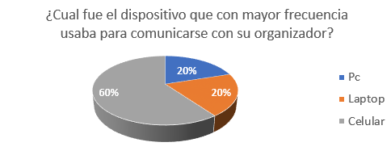
    Los resultados muestran que el 60% de anfitriones utilizan celular para comunicarse con su organizador, mientras que el 40% restante se equilibra en Pc y laptop  

  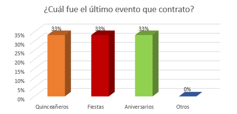
      Gráfico acerca del tipo de evento que contrataron  

  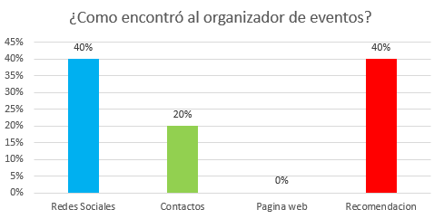
    Gráfico acerca de cómo encontraron a su organizador de eventos  

  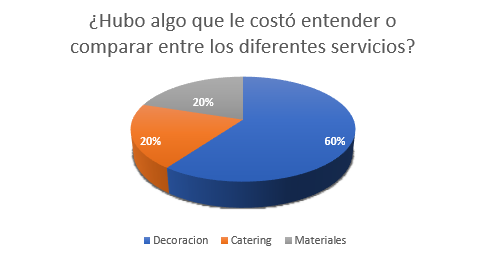
  Gráfico acerca de servicios que les costó entender o comparar  

  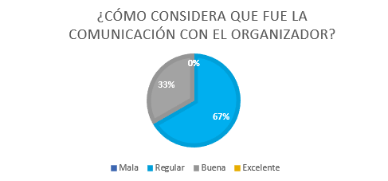
  Gráfico acerca la valoración de la comunicación con su organizador durante el proceso.  

  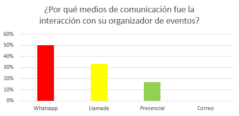
  Gráfico acerca de los medios de comunicación con la que interactuaron con su organizador  

  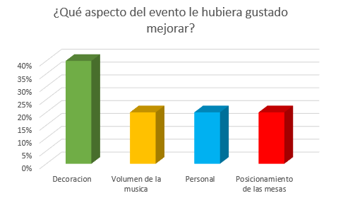

 

  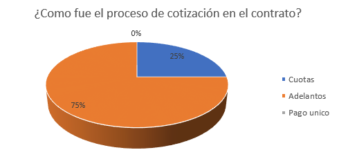

  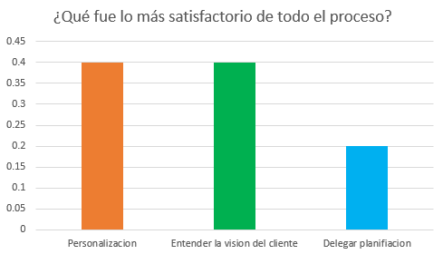

  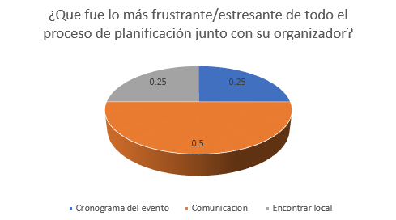

- Segmento Objetivo 2: Oreganizadores de Eventos

  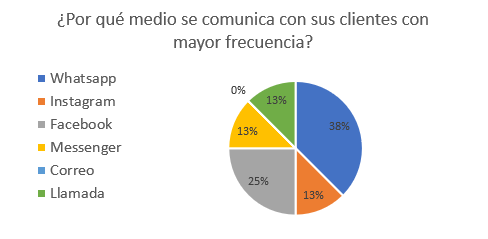

  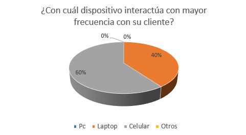

  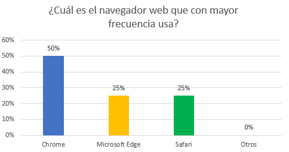

  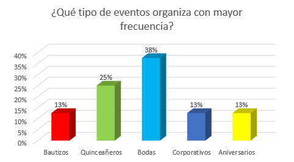

  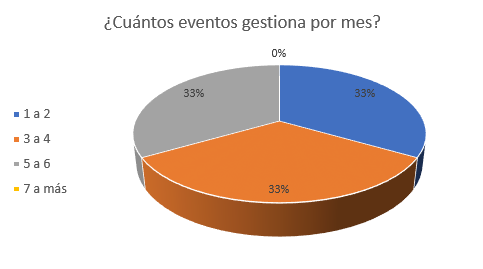

  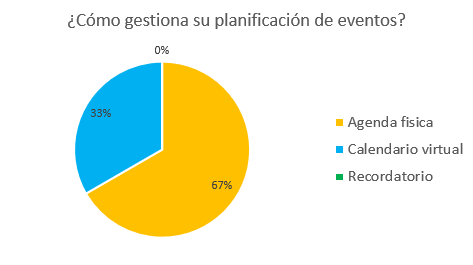

  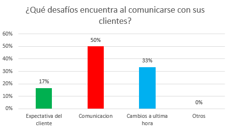

  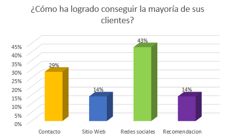

  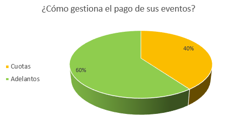

  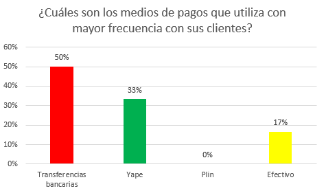

  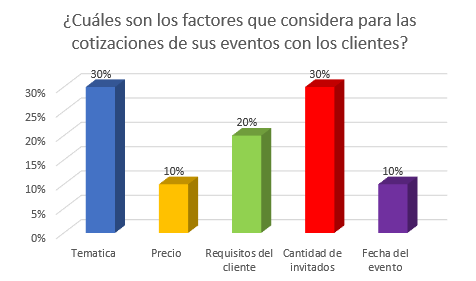

  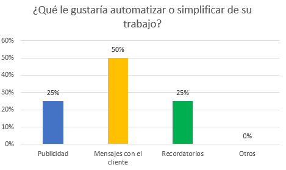

  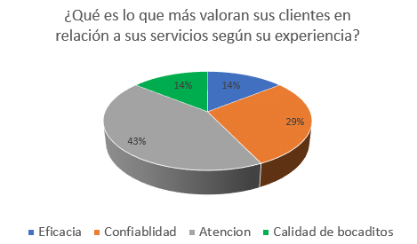

  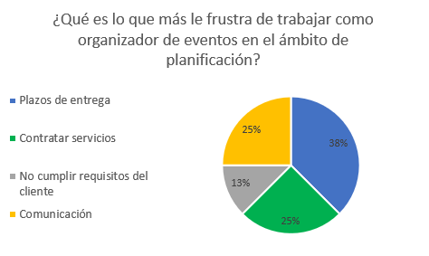

## 2.3. Needfinding

### 2.3.1. User Personas

En esta sección se presentarán los User Personas de cada segmento objetivo. Estos artefactos fueron diseñados a partir de la información obtenida en las entrevistas.
 

**Segmento Objetivo: Organizadores de eventos sociales no masivos**

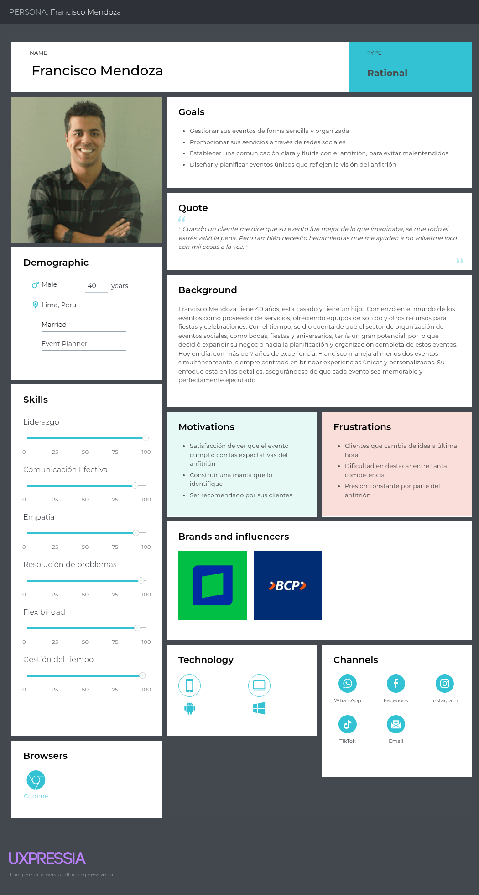

  

**Segmento Objetivo: Anfitriones de eventos**
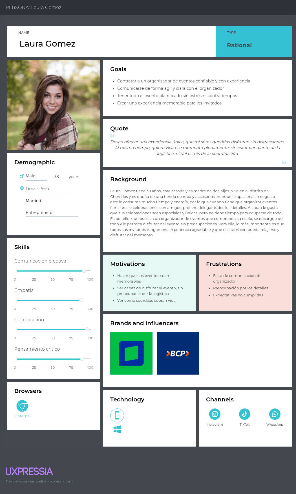

### 2.3.2. User Task Matrix

En este análisis, estamos considerando dos segmentos de usuarios: Organizadores de eventos sociales no masivos y Anfitriones de eventos.

## Indicadores de Importancia y Frecuencia

**Indicadores de Importancia:**
- ALTA
- MEDIA
- BAJA

**Indicadores de Frecuencia:**
- ALTA
- MEDIA
- BAJA

## Tabla de Matriz de Tareas de Usuario

| Tareas | Organizadores de eventos sociales no masivos | | Anfitriones de eventos | |
|-------|---------------------|------------|-------------|------------|
| | **Frecuencia** | **Importancia** | **Frecuencia** | **Importancia** |
| Planificación del evento | Alta | Alta | Alta | Alta |
| Coordinación con proveedores | Alta | Alta | Media | Alta |
| Gestión de invitados | Alta | Alta | Alta | Alta |
| Promoción del evento | Media | Alta | Baja | Baja |
| Supervisión durante el evento | Alta | Alta | Alta | Alta |
| Post-evento | Media | Media | Alta | Media |

## Análisis de Tareas

### Tareas con mayor frecuencia e importancia:

Ambos segmentos de usuarios muestran alta frecuencia e importancia para **Planificación del evento** y **Gestión de invitados**. Para los Organizadores de eventos sociales no masivos, la **Coordinación con proveedores** también tiene alta frecuencia e importancia, mientras que para los Anfitriones de eventos esta tarea tiene frecuencia media pero alta importancia.

### Principales diferencias entre segmentos de usuarios:

1. **Promoción del evento**: Para los Organizadores, esto tiene frecuencia media y alta importancia, mientras que para los Anfitriones tiene baja frecuencia e importancia.
2. **Post-evento**: Los Anfitriones de eventos realizan esto con alta frecuencia, mientras que los Organizadores lo hacen con frecuencia media. Ambos segmentos lo consideran de importancia media.

### Principales similitudes:

Ambos segmentos coinciden en la alta frecuencia e importancia de la **Planificación del evento**, **Gestión de invitados** y **Supervisión durante el evento**.

### Enfoques de los segmentos:

Los Organizadores de eventos sociales no masivos se concentran principalmente en la **planificación y logística** del evento, garantizando que todo funcione correctamente y según lo esperado. Su enfoque está más relacionado con la ejecución técnica y la coordinación de recursos.

Los Anfitriones de eventos se centran en la **experiencia de los invitados** y en la **gestión del ambiente** durante el evento, asegurándose de que los asistentes se sientan cómodos, atendidos y disfruten del evento.

Aunque las tareas varían, ambos segmentos coinciden en la importancia de la **organización eficiente** y el **bienestar de los participantes**. Sin embargo, los Organizadores tienen un enfoque más técnico y operativo, mientras que los Anfitriones se enfocan en la interacción social y la satisfacción personal de los invitados.
### 2.3.3. User Journey Mapping

En esta sección se presentan los User Journey Maps, que ilustran el end-to-end journey que experimentan nuestros segmentos objetivo sin la intervención de nuestra solución propuesta.

#### User Journey Mapping - Segmento Organizador de eventos no masivos

#### User Journey Mapping - Segmento Anfitrion

### 2.3.4. Empathy Mapping

El empathy mapping es una herramienta que nos permite comprender en profundidad a nuestros usuarios, explorando no solo lo que hacen o necesitan, sino también lo que piensan, sienten, ven, escuchan y dicen. A través de este esquema, podemos identificar sus frustraciones, motivaciones y comportamientos para desarrollar soluciones más alineadas con sus necesidades reales.

**Segmento Objetivo: Organizadores de eventos sociales no masivos**  

Este mapa se enfoca en Francisco Mendoza, un organizador de eventos experimentado que desea gestionar sus procesos de forma más eficiente y destacarse en un mercado competitivo. A través de esta herramienta, identificamos sus motivaciones, necesidades operativas y los principales desafíos que enfrenta en su día a día.

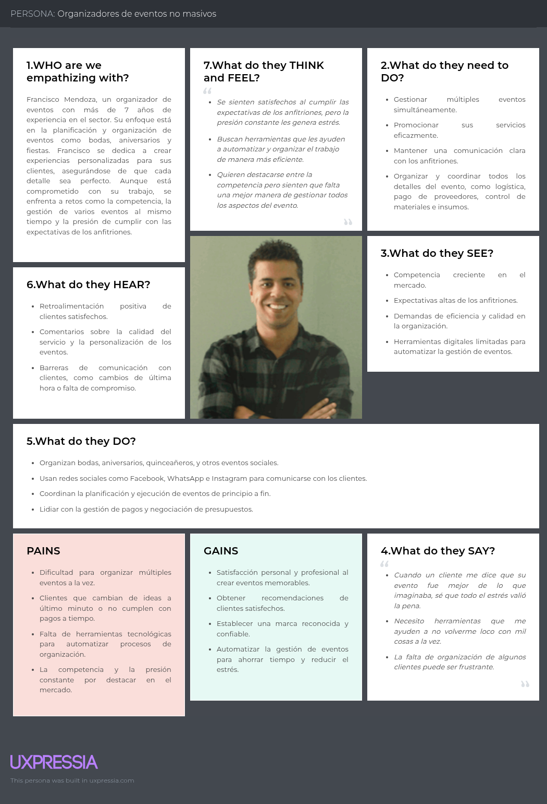
**Segmento Objetivo: Anfitriones de eventos**  

En este mapa de empatía exploramos la perspectiva de Laura Gómez, una anfitriona que busca ofrecer experiencias únicas a sus invitados sin tener que lidiar con el estrés de la logística. Aquí entendemos sus deseos, frustraciones y la manera en que se relaciona con los organizadores de eventos.

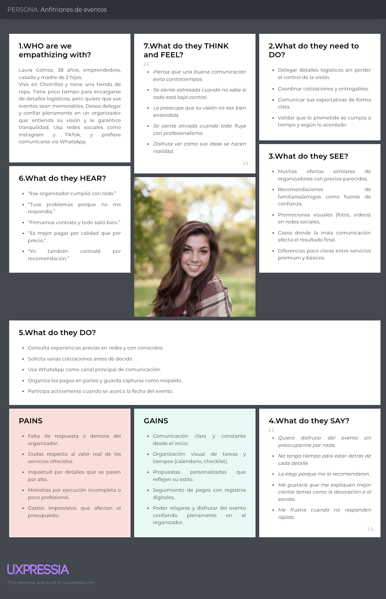

### 2.3.5. Big Picture Event Storming

### 2.3.6. Ubiquitous Language

**Capacity**: number of people a space can hold.

**Attendees**: people who will attend and participate in an event.

**Event usher**: staff who supports with registration, service, and other logistical tasks.

**break**: recess where coffee and snacks are served.

**Catering**: service providing food and beverages at an event.

**Ceremony**: formal act within the event.

**Check-list**: list for systematic verification of activities or resources.

**Host**: person who hires the organizer to conduct an event.

**Concert**: live musical performance.

**Conference**: meeting where topics are presented to an audience.

**Timing**: detailed planning of event activities.

**Decoration**: visual elements that set the atmosphere for the event.

**Production team**: group of people working together to produce an event, such as technicians, assistants, and any other person additional to the base staff who is involved in the event.

**Event**: planned activity with a specific date, time, and place.

**Event Planner**: person in charge of planning the entire event.

**Exhibitor**: person or company presenting products or ideas at the event.

**Pro-forma invoice**: a type of invoice issued by suppliers that must be paid prior to the execution of the event.

**Keynote**: initial speech of a presentation or series of conferences that points to the general topic to be discussed and is designed to motivate the audience.

**Venue**: physical location where the event takes place.

**Partition**: movable wall to adapt and set up spaces according to the needs of the event.

**Organizer**: person or company responsible for planning and executing the event.

**Sponsor**: company or person who supports or finances the event.

**Event floor plan**: document that shows the space of the event hall designated for the exhibition. It also shows in detail the space that each stand can occupy, the registration area, entrances and exits, etc.

**Program**: agenda of event activities.

**Protocol**: set of norms, customs, and traditions through which any act, public, private, or official event is organized.

**Staff**: personnel who are part of the event organization.

**Stand**: installation used to display products or provide information.

**Transfer**: transportation of attendees (e.g., from hotel to event).

## 2.4. Requirements specification

### 2.4.1. User Stories
En esta sección del informe se presentarán las épicas (EP), user stories (US) y technical stories (TS) definidas para el desarrollo tanto de la aplicación web como del landing page. Las user stories abordarán las funcionalidades orientadas al usuario final, mientras que las technical stories estarán enfocadas en los requerimientos técnicos del backend.

<table border="1" style="border-collapse: collapse; width:100%;">
<tr>
<th>Story ID</th><th>User</th><th>Priority</th><th>Epic</th>
</tr>
<tr>
<td>EP01</td><td>Visitante</td><td>High</td><td>-</td>
</tr>

<tr>
<th>Title</th>
<td colspan="3">Diseño y Desarrollo de Landing Page</td>
</tr>

<tr>
<th colspan="4">Description</th>
</tr>
<tr>
<td colspan="4">
Como visitante quiere acceder a una landing page clara y atractiva  
para entender el propósito de la aplicación y evaluar su utilidad.
</td>
</tr>

<tr>
<th colspan="4">Acceptance Criteria</th>
</tr>
<tr>
<td colspan="4">
Regla: El contenido describe claramente la propuesta del producto. 
Regla: La información es comprensible y estructurada.
</td>
</tr>
</table>

<table border="1" style="border-collapse: collapse; width:100%;">
<tr>
<th>Story ID</th><th>User</th><th>Priority</th><th>Epic</th>
</tr>
<tr>
<td>EP02</td><td>Usuario (Organizador / Anfitrión)</td><td>High</td><td>-</td>
</tr>

<tr>
<th>Title</th>
<td colspan="3">Comunicación Organizador - Anfitrión</td>
</tr>

<tr>
<th colspan="4">Description</th>
</tr>
<tr>
<td colspan="4">
Como usuario quiere contar con un canal de comunicación dentro de la plataforma  
para coordinar detalles del evento de manera eficiente.
</td>
</tr>

<tr>
<th colspan="4">Acceptance Criteria</th>
</tr>
<tr>
<td colspan="4">
Regla: La comunicación se realiza dentro del sistema. 
Regla: Las conversaciones quedan registradas. 
Regla: La comunicación es bidireccional entre usuarios.
</td>
</tr>
</table>

<table border="1" style="border-collapse: collapse; width:100%;">
<tr>
<th>Story ID</th><th>User</th><th>Priority</th><th>Epic</th>
</tr>
<tr>
<td>EP03</td><td>Organizador</td><td>High</td><td>-</td>
</tr>

<tr>
<th>Title</th>
<td colspan="3">Gestión de eventos personalizada</td>
</tr>

<tr>
<th colspan="4">Description</th>
</tr>
<tr>
<td colspan="4">
Como organizador quiere gestionar eventos dentro de la plataforma  
para facilitar la planificación y seguimiento.
</td>
</tr>

<tr>
<th colspan="4">Acceptance Criteria</th>
</tr>
<tr>
<td colspan="4">
Regla: El sistema permite registrar eventos. 
Regla: El sistema permite modificar información del evento. 
Regla: El sistema muestra el estado del evento.
</td>
</tr>
</table>

<table border="1" style="border-collapse: collapse; width:100%;">
<tr>
<th>Story ID</th><th>User</th><th>Priority</th><th>Epic</th>
</tr>
<tr>
<td>EP04</td><td>Developer</td><td>High</td><td>-</td>
</tr>

<tr>
<th>Title</th>
<td colspan="3">Gestión de eventos (API)</td>
</tr>

<tr>
<th colspan="4">Description</th>
</tr>
<tr>
<td colspan="4">
Como developer quiere desarrollar endpoints para la gestión de eventos  
para permitir operaciones CRUD en la aplicación.
</td>
</tr>

<tr>
<th colspan="4">Acceptance Criteria</th>
</tr>
<tr>
<td colspan="4">
Regla: El sistema expone endpoints RESTful. 
Regla: Permite crear, leer, actualizar y eliminar eventos. 
Regla: Maneja códigos de estado HTTP correctamente.
</td>
</tr>
</table>

<table border="1" style="border-collapse: collapse; width:100%;">
<tr>
<th>Story ID</th><th>User</th><th>Priority</th><th>Epic</th>
</tr>
<tr>
<td>EP05</td><td>Anfitrión</td><td>High</td><td>-</td>
</tr>

<tr>
<th>Title</th>
<td colspan="3">Contratación y gestión de organizadores</td>
</tr>

<tr>
<th colspan="4">Description</th>
</tr>
<tr>
<td colspan="4">
Como anfitrión quiere buscar y contratar organizadores  
para asegurar el éxito del evento.
</td>
</tr>

<tr>
<th colspan="4">Acceptance Criteria</th>
</tr>
<tr>
<td colspan="4">
Regla: El sistema permite visualizar organizadores. 
Regla: Permite solicitar cotizaciones. 
Regla: Permite contratar organizadores. 
Regla: Permite calificar servicios.
</td>
</tr>
</table>

<table border="1" style="border-collapse: collapse; width:100%;">
<tr>
<th>Story ID</th><th>User</th><th>Priority</th><th>Epic</th>
</tr>
<tr>
<td>EP06</td><td>Developer</td><td>High</td><td>-</td>
</tr>

<tr>
<th>Title</th>
<td colspan="3">Gestión de usuarios (API)</td>
</tr>

<tr>
<th colspan="4">Description</th>
</tr>
<tr>
<td colspan="4">
Como developer quiere gestionar usuarios mediante endpoints  
para permitir registro, autenticación y administración de cuentas.
</td>
</tr>

<tr>
<th colspan="4">Acceptance Criteria</th>
</tr>
<tr>
<td colspan="4">
Regla: El sistema permite crear usuarios. 
Regla: Permite consultar usuarios. 
Regla: Permite actualizar datos. 
Regla: Permite eliminar cuentas.
</td>
</tr>
</table>

<table border="1" style="border-collapse: collapse; width: 100%;">
  <tr>
    <th>Story ID</th>
    <th>User</th>
    <th>Priority</th>
    <th>Epic</th>
  </tr>
  <tr>
    <td>US01</td>
    <td>Visitante</td>
    <td>High</td>
    <td>EP01</td>
  </tr>

  <tr>
    <th>Title</th>
    <td colspan="3">Navegación sencilla</td>
  </tr>

  <tr>
    <th colspan="4">Description</th>
  </tr>
  <tr>
    <td colspan="4">
      Como visitante quiero navegar fácilmente entre secciones para acceder rápidamente a la información relevante.
    </td>
  </tr>

  <tr>
    <th colspan="4">Acceptance Criteria</th>
  </tr>
  <tr>
    <td colspan="4">
      <b>Escenario 1:</b> 
      Dado que el visitante accede al sitio 
      Cuando busca información de uso 
      Entonces el sistema muestra la sección correspondiente  
      <b>Escenario 2:</b> 
      Dado que el visitante accede al sitio 
      Cuando busca funcionalidades 
      Entonces el sistema muestra la información correspondiente
    </td>
  </tr>
</table>

<table border="1" style="border-collapse: collapse; width:100%;">
<tr>
<th>Story ID</th><th>User</th><th>Priority</th><th>Epic</th>
</tr>
<tr>
<td>US02</td><td>Visitante</td><td>High</td><td>EP01</td>
</tr>

<tr>
<th>Title</th>
<td colspan="3">Propuesta de valor clara</td>
</tr>

<tr>
<th colspan="4">Description</th>
</tr>
<tr>
<td colspan="4">
Como visitante quiere entender rápidamente el valor del producto  
para determinar si es relevante.
</td>
</tr>

<tr>
<th colspan="4">Acceptance Criteria</th>
</tr>
<tr>
<td colspan="4">

<b>Escenario 1</b> 
Dado que el visitante accede al sitio 
Cuando revisa el contenido principal 
Entonces identifica la propuesta de valor  

<b>Escenario 2</b> 
Dado que el visitante navega el sitio 
Cuando revisa la información 
Entonces percibe lenguaje claro y comprensible

</td>
</tr>
</table>

<table border="1" style="border-collapse: collapse; width:100%;">
<tr><th>Story ID</th><th>User</th><th>Priority</th><th>Epic</th></tr>
<tr><td>US03</td><td>Visitante</td><td>High</td><td>EP01</td></tr>

<tr><th>Title</th><td colspan="3">Información segmentada</td></tr>

<tr><th colspan="4">Description</th></tr>
<tr><td colspan="4">
Como visitante quiere ver información según su rol  
para identificar cómo la aplicación puede ayudarle.
</td></tr>

<tr><th colspan="4">Acceptance Criteria</th></tr>
<tr><td colspan="4">
<b>Escenario 1</b> 
Dado que el visitante accede al sitio 
Cuando revisa beneficios 
Entonces visualiza información segmentada  

<b>Escenario 2</b> 
Dado que el visitante accede al sitio 
Cuando revisa funcionalidades 
Entonces visualiza contenido según su tipo de usuario
</td></tr>
</table>

<table border="1" style="border-collapse: collapse; width:100%;">
<tr><th>Story ID</th><th>User</th><th>Priority</th><th>Epic</th></tr>
<tr><td>US04</td><td>Visitante</td><td>High</td><td>EP01</td></tr>

<tr><th>Title</th><td colspan="3">Funcionalidades de la aplicación</td></tr>

<tr><th colspan="4">Description</th></tr>
<tr><td colspan="4">
Como visitante quiere conocer las funcionalidades  
para validar si cubren sus necesidades.
</td></tr>

<tr><th colspan="4">Acceptance Criteria</th></tr>
<tr><td colspan="4">
<b>Escenario 1</b> 
Dado que el visitante accede 
Cuando revisa funcionalidades 
Entonces observa funcionalidades relevantes  

<b>Escenario 2</b> 
Dado que el visitante accede 
Cuando revisa contenido 
Entonces la información se presenta de forma organizada
</td></tr>
</table>

<table border="1" style="border-collapse: collapse; width:100%;">
<tr><th>Story ID</th><th>User</th><th>Priority</th><th>Epic</th></tr>
<tr><td>US05</td><td>Visitante</td><td>High</td><td>EP01</td></tr>

<tr><th>Title</th><td colspan="3">Llamada a la acción</td></tr>

<tr><th colspan="4">Description</th></tr>
<tr><td colspan="4">
Como visitante quiere acceder a la aplicación  
para comenzar a utilizarla.
</td></tr>

<tr><th colspan="4">Acceptance Criteria</th></tr>
<tr><td colspan="4">
<b>Escenario 1</b> 
Dado que el visitante conoce la información 
Cuando decide continuar 
Entonces accede directamente  

<b>Escenario 2</b> 
Dado que el visitante analiza contenido 
Cuando finaliza 
Entonces el sistema ofrece acceso  

<b>Escenario 3</b> 
Dado que el visitante interactúa 
Cuando muestra interés 
Entonces se le presentan accesos disponibles
</td></tr>
</table>

<table border="1" style="border-collapse: collapse; width:100%;">
<tr><th>Story ID</th><th>User</th><th>Priority</th><th>Epic</th></tr>
<tr><td>US06</td><td>Visitante</td><td>High</td><td>EP01</td></tr>

<tr><th>Title</th><td colspan="3">Visualización de tutorial</td></tr>

<tr><th colspan="4">Description</th></tr>
<tr><td colspan="4">
Como visitante quiere ver cómo funciona la aplicación  
para entender su uso.
</td></tr>

<tr><th colspan="4">Acceptance Criteria</th></tr>
<tr><td colspan="4">
<b>Escenario 1</b> 
Dado que el visitante accede 
Cuando revisa contenido 
Entonces visualiza una demostración  

<b>Escenario 2</b> 
Dado que el visitante reproduce contenido 
Cuando interactúa 
Entonces puede controlar la reproducción
</td></tr>
</table>

<table border="1" style="border-collapse: collapse; width:100%;">
<tr><th>Story ID</th><th>User</th><th>Priority</th><th>Epic</th></tr>
<tr><td>US07</td><td>Visitante</td><td>High</td><td>EP01</td></tr>

<tr><th>Title</th><td colspan="3">Confianza y seguridad</td></tr>

<tr><th colspan="4">Description</th></tr>
<tr><td colspan="4">
Como visitante quiere conocer al equipo  
para validar confianza.
</td></tr>

<tr><th colspan="4">Acceptance Criteria</th></tr>
<tr><td colspan="4">
<b>Escenario 1</b> 
Dado que el visitante accede 
Cuando revisa equipo 
Entonces visualiza información detallada  

<b>Escenario 2</b> 
Dado que el visitante consulta perfiles 
Cuando selecciona uno 
Entonces accede a información externa
</td></tr>
</table>

<table border="1" style="border-collapse: collapse; width:100%;">
<tr><th>Story ID</th><th>User</th><th>Priority</th><th>Epic</th></tr>
<tr><td>US08</td><td>Visitante</td><td>High</td><td>EP01</td></tr>

<tr><th>Title</th><td colspan="3">Velocidad de carga</td></tr>

<tr><th colspan="4">Description</th></tr>
<tr><td colspan="4">
Como visitante quiere que el sitio cargue rápido  
para no perder interés.
</td></tr>

<tr><th colspan="4">Acceptance Criteria</th></tr>
<tr><td colspan="4">
<b>Escenario 1</b> 
Dado que el visitante accede 
Cuando solicita contenido 
Entonces carga en máximo 3 segundos  

<b>Escenario 2</b> 
Dado que hay conexión limitada 
Cuando accede 
Entonces el sistema optimiza carga
</td></tr>
</table>

<table border="1" style="border-collapse: collapse; width:100%;">
<tr><th>Story ID</th><th>User</th><th>Priority</th><th>Epic</th></tr>
<tr><td>US09</td><td>Visitante</td><td>High</td><td>EP01</td></tr>

<tr><th>Title</th><td colspan="3">Visualización de precios</td></tr>

<tr><th colspan="4">Description</th></tr>
<tr><td colspan="4">
Como visitante quiere ver precios  
para evaluar opciones.
</td></tr>

<tr><th colspan="4">Acceptance Criteria</th></tr>
<tr><td colspan="4">
<b>Escenario 1</b> 
Dado que accede 
Cuando revisa planes 
Entonces visualiza precios claramente
</td></tr>
</table>

<table border="1" style="border-collapse: collapse; width:100%;">
<tr><th>Story ID</th><th>User</th><th>Priority</th><th>Epic</th></tr>
<tr><td>US10</td><td>Visitante</td><td>High</td><td>EP01</td></tr>

<tr><th>Title</th><td colspan="3">Diseño responsive</td></tr>

<tr><th colspan="4">Description</th></tr>
<tr><td colspan="4">
Como visitante quiere usar el sitio en cualquier dispositivo  
para tener buena experiencia.
</td></tr>

<tr><th colspan="4">Acceptance Criteria</th></tr>
<tr><td colspan="4">
<b>Escenario 1</b> 
Dado que accede desde PC 
Cuando visualiza 
Entonces se adapta correctamente  

<b>Escenario 2</b> 
Dado que accede desde móvil 
Cuando visualiza 
Entonces se adapta sin errores
</td></tr>
</table>

<table border="1" style="border-collapse: collapse; width:100%;">
<tr><th>Story ID</th><th>User</th><th>Priority</th><th>Epic</th></tr>
<tr><td>US10</td><td>Visitante</td><td>High</td><td>EP01</td></tr>

<tr><th>Title</th><td colspan="3">Diseño responsive</td></tr>

<tr><th colspan="4">Description</th></tr>
<tr><td colspan="4">
Como visitante quiere usar el sitio en cualquier dispositivo  
para tener buena experiencia.
</td></tr>

<tr><th colspan="4">Acceptance Criteria</th></tr>
<tr><td colspan="4">
<b>Escenario 1</b> 
Dado que accede desde PC 
Cuando visualiza 
Entonces se adapta correctamente  

<b>Escenario 2</b> 
Dado que accede desde móvil 
Cuando visualiza 
Entonces se adapta sin errores
</td></tr>
</table>

<table border="1" style="border-collapse: collapse; width:100%;">
<tr><th>Story ID</th><th>User</th><th>Priority</th><th>Epic</th></tr>
<tr><td>US11</td><td>Usuario</td><td>High</td><td>EP02</td></tr>

<tr><th>Title</th><td colspan="3">Chat integrado</td></tr>

<tr><th colspan="4">Description</th></tr>
<tr><td colspan="4">
Como usuario quiere comunicarse mediante chat  
para coordinar eventos dentro de la plataforma.
</td></tr>

<tr><th colspan="4">Acceptance Criteria</th></tr>
<tr><td colspan="4">
<b>Escenario 1</b> 
Dado que el usuario accede a un perfil 
Cuando inicia comunicación 
Entonces el sistema habilita un chat asociado  

<b>Escenario 2</b> 
Dado que el usuario accede a su cuenta 
Cuando revisa mensajes 
Entonces visualiza conversaciones activas
</td></tr>
</table>

<table border="1" style="border-collapse: collapse; width:100%;">
<tr><th>Story ID</th><th>User</th><th>Priority</th><th>Epic</th></tr>
<tr><td>US12</td><td>Usuario</td><td>High</td><td>EP02</td></tr>

<tr><th>Title</th><td colspan="3">Historial de mensajes</td></tr>

<tr><th colspan="4">Description</th></tr>
<tr><td colspan="4">
Como usuario quiere revisar conversaciones anteriores  
para recordar acuerdos importantes.
</td></tr>

<tr><th colspan="4">Acceptance Criteria</th></tr>
<tr><td colspan="4">
<b>Escenario 1</b> 
Dado que el usuario accede al chat 
Cuando existen mensajes previos 
Entonces visualiza el historial completo  

<b>Escenario 2</b> 
Dado que el usuario accede al chat 
Cuando carga la conversación 
Entonces el historial se muestra automáticamente
</td></tr>
</table>

<table border="1" style="border-collapse: collapse; width:100%;">
<tr><th>Story ID</th><th>User</th><th>Priority</th><th>Epic</th></tr>
<tr><td>US13</td><td>Usuario</td><td>High</td><td>EP02</td></tr>

<tr><th>Title</th><td colspan="3">Notificaciones de mensajes</td></tr>

<tr><th colspan="4">Description</th></tr>
<tr><td colspan="4">
Como usuario quiere recibir notificaciones  
para estar al tanto de nuevos mensajes.
</td></tr>

<tr><th colspan="4">Acceptance Criteria</th></tr>
<tr><td colspan="4">
<b>Escenario 1</b> 
Dado que el usuario está activo 
Cuando recibe un mensaje 
Entonces visualiza una notificación  

<b>Escenario 2</b> 
Dado que el usuario está conectado 
Cuando llega un mensaje 
Entonces recibe una alerta visual
</td></tr>
</table>

<table border="1" style="border-collapse: collapse; width:100%;">
<tr><th>Story ID</th><th>User</th><th>Priority</th><th>Epic</th></tr>
<tr><td>US14</td><td>Usuario</td><td>High</td><td>EP02</td></tr>

<tr><th>Title</th><td colspan="3">Envío de archivos</td></tr>

<tr><th colspan="4">Description</th></tr>
<tr><td colspan="4">
Como usuario quiere enviar archivos  
para compartir información relevante del evento.
</td></tr>

<tr><th colspan="4">Acceptance Criteria</th></tr>
<tr><td colspan="4">

<b>Escenario 1</b> 
Dado que el usuario accede al chat 
Cuando adjunta un archivo 
Entonces el sistema lo envía correctamente  

<b>Escenario 2</b> 
Dado que el usuario recibe un archivo 
Cuando accede al chat 
Entonces puede visualizarlo o descargarlo  

<b>Escenario 3</b> 
Dado que el usuario desea compartir información 
Cuando adjunta documentos 
Entonces estos se envían correctamente
</td></tr>
</table>

<table border="1" style="border-collapse: collapse; width:100%;">
<tr><th>Story ID</th><th>User</th><th>Priority</th><th>Epic</th></tr>
<tr><td>US15</td><td>Usuario</td><td>High</td><td>EP02</td></tr>

<tr><th>Title</th><td colspan="3">Estado de mensajes</td></tr>

<tr><th colspan="4">Description</th></tr>
<tr><td colspan="4">
Como usuario quiere conocer el estado de los mensajes  
para saber si fueron leídos.
</td></tr>

<tr><th colspan="4">Acceptance Criteria</th></tr>
<tr><td colspan="4">
<b>Escenario 1</b> 
Dado que el usuario envía un mensaje 
Cuando se procesa 
Entonces se marca como enviado  

<b>Escenario 2</b> 
Dado que el mensaje es recibido 
Cuando el destinatario lo visualiza 
Entonces el estado se actualiza
</td></tr>
</table>

<table border="1" style="border-collapse: collapse; width:100%;">
<tr><th>Story ID</th><th>User</th><th>Priority</th><th>Epic</th></tr>
<tr><td>US16</td><td>Usuario</td><td>High</td><td>EP02</td></tr>

<tr><th>Title</th><td colspan="3">Notificación por email</td></tr>

<tr><th colspan="4">Description</th></tr>
<tr><td colspan="4">
Como usuario quiere recibir notificaciones por correo  
para no perder mensajes importantes.
</td></tr>

<tr><th colspan="4">Acceptance Criteria</th></tr>
<tr><td colspan="4">
<b>Escenario 1</b> 
Dado que el usuario no está conectado 
Cuando recibe un mensaje 
Entonces recibe un correo  

<b>Escenario 2</b> 
Dado que el usuario recibe el correo 
Cuando lo revisa 
Entonces identifica el mensaje pendiente
</td></tr>
</table>

<table border="1" style="border-collapse: collapse; width:100%;">
<tr><th>Story ID</th><th>User</th><th>Priority</th><th>Epic</th></tr>
<tr><td>US17</td><td>Organizador</td><td>High</td><td>EP03</td></tr>

<tr><th>Title</th><td colspan="3">Registro de evento</td></tr>

<tr><th colspan="4">Description</th></tr>
<tr><td colspan="4">
Como organizador quiere registrar eventos  
para iniciar su planificación.
</td></tr>

<tr><th colspan="4">Acceptance Criteria</th></tr>
<tr><td colspan="4">
<b>Escenario 1</b> 
Dado que el organizador accede 
Cuando registra datos 
Entonces el evento se guarda  

<b>Escenario 2</b> 
Dado que completa datos 
Cuando confirma 
Entonces se registra correctamente
</td></tr>
</table>

<table border="1" style="border-collapse: collapse; width:100%;">
<tr><th>Story ID</th><th>User</th><th>Priority</th><th>Epic</th></tr>
<tr><td>US18</td><td>Usuario</td><td>High</td><td>EP03</td></tr>

<tr><th>Title</th><td colspan="3">Lista de tareas</td></tr>

<tr><th colspan="4">Description</th></tr>
<tr><td colspan="4">
Como usuario quiere gestionar tareas  
para no olvidar actividades importantes.
</td></tr>

<tr><th colspan="4">Acceptance Criteria</th></tr>
<tr><td colspan="4">
<b>Escenario 1</b> 
Dado que gestiona evento 
Cuando agrega tarea 
Entonces se registra  

<b>Escenario 2</b> 
Dado que completa tarea 
Cuando actualiza estado 
Entonces se refleja el cambio
</td></tr>
</table>

<table border="1" style="border-collapse: collapse; width:100%;">
<tr><th>Story ID</th><th>User</th><th>Priority</th><th>Epic</th></tr>
<tr><td>US19</td><td>Organizador</td><td>High</td><td>EP03</td></tr>

<tr><th>Title</th><td colspan="3">Gestión de presupuesto</td></tr>

<tr><th colspan="4">Description</th></tr>
<tr><td colspan="4">
Como organizador quiere controlar presupuesto  
para gestionar gastos.
</td></tr>

<tr><th colspan="4">Acceptance Criteria</th></tr>
<tr><td colspan="4">
<b>Escenario 1</b> 
Dado que define presupuesto 
Cuando registra monto 
Entonces se guarda  

<b>Escenario 2</b> 
Dado que registra gasto 
Cuando actualiza datos 
Entonces se calcula saldo
</td></tr>
</table>

<table border="1" style="border-collapse: collapse; width:100%;">
<tr><th>Story ID</th><th>User</th><th>Priority</th><th>Epic</th></tr>
<tr><td>US20</td><td>Organizador</td><td>High</td><td>EP03</td></tr>

<tr><th>Title</th><td colspan="3">Asignación de roles</td></tr>

<tr><th colspan="4">Description</th></tr>
<tr><td colspan="4">
Como organizador quiere asignar responsabilidades  
para delegar tareas.
</td></tr>

<tr><th colspan="4">Acceptance Criteria</th></tr>
<tr><td colspan="4">
<b>Escenario 1</b> 
Dado que invita colaborador 
Cuando envía invitación 
Entonces el sistema notifica  

<b>Escenario 2</b> 
Dado que asigna tarea 
Cuando define responsable 
Entonces se notifica
</td></tr>
</table>

<table border="1" style="border-collapse: collapse; width:100%;">
<tr><th>Story ID</th><th>User</th><th>Priority</th><th>Epic</th></tr>
<tr><td>US21</td><td>Usuario</td><td>High</td><td>EP03</td></tr>

<tr><th>Title</th><td colspan="3">Cronograma del evento</td></tr>

<tr><th colspan="4">Description</th></tr>
<tr><td colspan="4">
Como usuario quiere visualizar actividades  
para entender la secuencia del evento.
</td></tr>

<tr><th colspan="4">Acceptance Criteria</th></tr>
<tr><td colspan="4">
<b>Escenario 1</b> 
Dado que planifica 
Cuando agrega actividades 
Entonces se genera cronograma  

<b>Escenario 2</b> 
Dado que modifica actividad 
Cuando actualiza horario 
Entonces el cronograma se ajusta
</td></tr>
</table>

<table border="1" style="border-collapse: collapse; width:100%;">
<tr><th>Story ID</th><th>User</th><th>Priority</th><th>Epic</th></tr>
<tr><td>US22</td><td>Usuario</td><td>High</td><td>EP03</td></tr>

<tr><th>Title</th><td colspan="3">Resumen del evento</td></tr>

<tr><th colspan="4">Description</th></tr>
<tr><td colspan="4">
Como usuario quiere ver resumen del evento  
para conocer el estado general.
</td></tr>

<tr><th colspan="4">Acceptance Criteria</th></tr>
<tr><td colspan="4">
<b>Escenario 1</b> 
Dado que accede al panel 
Cuando visualiza información 
Entonces observa progreso y estado  

<b>Escenario 2</b> 
Dado que hay incidencias 
Cuando revisa 
Entonces visualiza alertas
</td></tr>
</table>

<table border="1" style="border-collapse: collapse; width:100%;">
<tr><th>Story ID</th><th>User</th><th>Priority</th><th>Epic</th></tr>
<tr><td>US23</td><td>Anfitrión</td><td>High</td><td>EP05</td></tr>

<tr><th>Title</th><td colspan="3">Visualizar perfiles de organizadores</td></tr>

<tr><th colspan="4">Description</th></tr>
<tr><td colspan="4">
Como anfitrión quiere visualizar perfiles de organizadores  
para evaluar su experiencia antes de contratarlos.
</td></tr>

<tr><th colspan="4">Acceptance Criteria</th></tr>
<tr><td colspan="4">

<b>Escenario 1</b> 
Dado que el anfitrión busca organizadores 
Cuando selecciona uno 
Entonces visualiza su perfil con información relevante  

<b>Escenario 2</b> 
Dado que el anfitrión desea filtrar 
Cuando aplica criterios 
Entonces el sistema muestra resultados acordes

</td></tr>
</table>

<table border="1" style="border-collapse: collapse; width:100%;">
<tr><th>Story ID</th><th>User</th><th>Priority</th><th>Epic</th></tr>
<tr><td>US24</td><td>Anfitrión</td><td>High</td><td>EP05</td></tr>

<tr><th>Title</th><td colspan="3">Solicitar cotización</td></tr>

<tr><th colspan="4">Description</th></tr>
<tr><td colspan="4">
Como anfitrión quiere solicitar cotizaciones  
para comparar opciones disponibles.
</td></tr>

<tr><th colspan="4">Acceptance Criteria</th></tr>
<tr><td colspan="4">

<b>Escenario 1</b> 
Dado que el anfitrión encuentra un organizador 
Cuando solicita cotización 
Entonces el sistema envía la solicitud  

<b>Escenario 2</b> 
Dado que el organizador responde 
Cuando el anfitrión revisa 
Entonces visualiza las ofertas recibidas

</td></tr>
</table>

<table border="1" style="border-collapse: collapse; width:100%;">
<tr><th>Story ID</th><th>User</th><th>Priority</th><th>Epic</th></tr>
<tr><td>US25</td><td>Anfitrión</td><td>High</td><td>EP05</td></tr>

<tr><th>Title</th><td colspan="3">Contratar organizador</td></tr>

<tr><th colspan="4">Description</th></tr>
<tr><td colspan="4">
Como anfitrión quiere contratar un organizador  
para formalizar el servicio del evento.
</td></tr>

<tr><th colspan="4">Acceptance Criteria</th></tr>
<tr><td colspan="4">

<b>Escenario 1</b> 
Dado que el anfitrión recibe una cotización 
Cuando decide contratar 
Entonces el sistema registra la contratación  

<b>Escenario 2</b> 
Dado que el anfitrión accede a su panel 
Cuando revisa el evento 
Entonces visualiza los datos del organizador contratado

</td></tr>
</table>

<table border="1" style="border-collapse: collapse; width:100%;">
<tr><th>Story ID</th><th>User</th><th>Priority</th><th>Epic</th></tr>
<tr><td>US26</td><td>Anfitrión</td><td>High</td><td>EP05</td></tr>

<tr><th>Title</th><td colspan="3">Calificar organizador</td></tr>

<tr><th colspan="4">Description</th></tr>
<tr><td colspan="4">
Como anfitrión quiere calificar al organizador  
para aportar información a otros usuarios.
</td></tr>

<tr><th colspan="4">Acceptance Criteria</th></tr>
<tr><td colspan="4">

<b>Escenario 1</b> 
Dado que el evento finaliza 
Cuando el anfitrión califica 
Entonces el sistema registra la calificación  

<b>Escenario 2</b> 
Dado que otros usuarios consultan perfiles 
Cuando revisan reseñas 
Entonces visualizan las calificaciones publicadas

</td></tr>
</table>

<table border="1" style="border-collapse: collapse; width:100%;">
<tr><th>Story ID</th><th>User</th><th>Priority</th><th>Epic</th></tr>
<tr><td>US27</td><td>Anfitrión</td><td>High</td><td>EP05</td></tr>

<tr><th>Title</th><td colspan="3">Editar reseña</td></tr>

<tr><th colspan="4">Description</th></tr>
<tr><td colspan="4">
Como anfitrión quiere editar una reseña  
para actualizar su opinión.
</td></tr>

<tr><th colspan="4">Acceptance Criteria</th></tr>
<tr><td colspan="4">

<b>Escenario 1</b> 
Dado que el anfitrión tiene una reseña 
Cuando accede a editar 
Entonces puede modificarla  

<b>Escenario 2</b> 
Dado que guarda cambios 
Cuando se actualiza 
Entonces la reseña se refleja en el perfil

</td></tr>
</table>

<table border="1" style="border-collapse: collapse; width:100%;">
<tr><th>Story ID</th><th>User</th><th>Priority</th><th>Epic</th></tr>
<tr><td>TS01</td><td>Developer</td><td>High</td><td>EP04</td></tr>

<tr><th>Title</th><td colspan="3">Crear evento (POST)</td></tr>

<tr><th colspan="4">Description</th></tr>
<tr><td colspan="4">
Como developer quiere implementar un endpoint para crear eventos  
para registrar eventos en el sistema.
</td></tr>

<tr><th colspan="4">Acceptance Criteria</th></tr>
<tr><td colspan="4">
<b>Escenario 1</b> 
Dado que el endpoint está disponible 
Cuando recibe una solicitud válida 
Entonces responde con código 201 y el recurso creado  

<b>Escenario 2</b> 
Dado que el endpoint está disponible 
Cuando recibe datos duplicados 
Entonces responde con código 400
</td></tr>
</table>

<table border="1" style="border-collapse: collapse; width:100%;">
<tr><th>Story ID</th><th>User</th><th>Priority</th><th>Epic</th></tr>
<tr><td>TS02</td><td>Developer</td><td>High</td><td>EP04</td></tr>

<tr><th>Title</th><td colspan="3">Leer evento (GET)</td></tr>

<tr><th colspan="4">Description</th></tr>
<tr><td colspan="4">
Como developer quiere implementar un endpoint para consultar eventos  
para recuperar información del sistema.
</td></tr>

<tr><th colspan="4">Acceptance Criteria</th></tr>
<tr><td colspan="4">
<b>Escenario 1</b> 
Dado que el endpoint está disponible 
Cuando recibe un ID válido 
Entonces responde con código 200 y el recurso  

<b>Escenario 2</b> 
Dado que el endpoint está disponible 
Cuando recibe un ID inválido 
Entonces responde con código 404
</td></tr>
</table>

<table border="1" style="border-collapse: collapse; width:100%;">
<tr><th>Story ID</th><th>User</th><th>Priority</th><th>Epic</th></tr>
<tr><td>TS03</td><td>Developer</td><td>High</td><td>EP04</td></tr>

<tr><th>Title</th><td colspan="3">Actualizar evento (PUT)</td></tr>

<tr><th colspan="4">Description</th></tr>
<tr><td colspan="4">
Como developer quiere actualizar eventos  
para modificar información existente.
</td></tr>

<tr><th colspan="4">Acceptance Criteria</th></tr>
<tr><td colspan="4">
<b>Escenario 1</b> 
Dado que el endpoint está disponible 
Cuando recibe datos válidos 
Entonces responde con código 200  

<b>Escenario 2</b> 
Dado que el endpoint está disponible 
Cuando recibe un ID inválido 
Entonces responde con código 404
</td></tr>
</table>

<table border="1" style="border-collapse: collapse; width:100%;">
<tr><th>Story ID</th><th>User</th><th>Priority</th><th>Epic</th></tr>
<tr><td>TS04</td><td>Developer</td><td>High</td><td>EP04</td></tr>

<tr><th>Title</th><td colspan="3">Eliminar evento (DELETE)</td></tr>

<tr><th colspan="4">Description</th></tr>
<tr><td colspan="4">
Como developer quiere eliminar eventos  
para mantener actualizado el sistema.
</td></tr>

<tr><th colspan="4">Acceptance Criteria</th></tr>
<tr><td colspan="4">
<b>Escenario 1</b> 
Dado que el endpoint está disponible 
Cuando recibe ID válido 
Entonces responde con código 200  

<b>Escenario 2</b> 
Dado que el endpoint está disponible 
Cuando recibe ID inválido 
Entonces responde con código 404
</td></tr>
</table>

<table border="1" style="border-collapse: collapse; width:100%;">
<tr><th>Story ID</th><th>User</th><th>Priority</th><th>Epic</th></tr>
<tr><td>TS05</td><td>Developer</td><td>High</td><td>EP06</td></tr>

<tr><th>Title</th><td colspan="3">Crear usuario</td></tr>

<tr><th colspan="4">Description</th></tr>
<tr><td colspan="4">
Como developer quiere crear usuarios  
para registrar cuentas en el sistema.
</td></tr>

<tr><th colspan="4">Acceptance Criteria</th></tr>
<tr><td colspan="4">
<b>Escenario 1</b> 
Dado que el endpoint está disponible 
Cuando recibe datos válidos 
Entonces responde con 201  

<b>Escenario 2</b> 
Dado que recibe datos duplicados 
Cuando procesa 
Entonces responde con 400
</td></tr>
</table>

<table border="1" style="border-collapse: collapse; width:100%;">
<tr><th>Story ID</th><th>User</th><th>Priority</th><th>Epic</th></tr>
<tr><td>TS06</td><td>Developer</td><td>High</td><td>EP06</td></tr>

<tr><th>Title</th><td colspan="3">Leer usuario</td></tr>

<tr><th colspan="4">Description</th></tr>
<tr><td colspan="4">
Como developer quiere consultar usuarios  
para obtener información del sistema.
</td></tr>

<tr><th colspan="4">Acceptance Criteria</th></tr>
<tr><td colspan="4">
<b>Escenario 1</b> 
Dado que el endpoint está disponible 
Cuando recibe ID válido 
Entonces responde con 200  

<b>Escenario 2</b> 
Dado que recibe ID inválido 
Cuando procesa 
Entonces responde con 404
</td></tr>
</table>

<table border="1" style="border-collapse: collapse; width:100%;">
<tr><th>Story ID</th><th>User</th><th>Priority</th><th>Epic</th></tr>
<tr><td>TS07</td><td>Developer</td><td>High</td><td>EP06</td></tr>

<tr><th>Title</th><td colspan="3">Actualizar usuario</td></tr>

<tr><th colspan="4">Description</th></tr>
<tr><td colspan="4">
Como developer quiere actualizar usuarios  
para modificar información.
</td></tr>

<tr><th colspan="4">Acceptance Criteria</th></tr>
<tr><td colspan="4">
<b>Escenario 1</b> 
Dado que recibe datos válidos 
Cuando procesa 
Entonces responde con 200  

<b>Escenario 2</b> 
Dado que ID no existe 
Cuando procesa 
Entonces responde con 404
</td></tr>
</table>

<table border="1" style="border-collapse: collapse; width:100%;">
<tr><th>Story ID</th><th>User</th><th>Priority</th><th>Epic</th></tr>
<tr><td>TS08</td><td>Developer</td><td>High</td><td>EP06</td></tr>

<tr><th>Title</th><td colspan="3">Eliminar usuario</td></tr>

<tr><th colspan="4">Description</th></tr>
<tr><td colspan="4">
Como developer quiere eliminar usuarios  
para gestionar cuentas.
</td></tr>

<tr><th colspan="4">Acceptance Criteria</th></tr>
<tr><td colspan="4">
<b>Escenario 1</b> 
Dado que recibe ID válido 
Cuando procesa 
Entonces responde con 200  

<b>Escenario 2</b> 
Dado que ID no existe 
Cuando procesa 
Entonces responde con 404
</td></tr>
</table>

<table border="1" style="border-collapse: collapse; width:100%;">
<tr><th>Story ID</th><th>User</th><th>Priority</th><th>Epic</th></tr>
<tr><td>TS09</td><td>Developer</td><td>High</td><td>EP06</td></tr>

<tr><th>Title</th><td colspan="3">Filtrar eventos por estado</td></tr>

<tr><th colspan="4">Description</th></tr>
<tr><td colspan="4">
Como developer quiere filtrar eventos por estado  
para facilitar la visualización.
</td></tr>

<tr><th colspan="4">Acceptance Criteria</th></tr>
<tr><td colspan="4">
<b>Escenario 1</b> 
Dado que recibe estado válido 
Cuando consulta 
Entonces responde con lista de eventos  

<b>Escenario 2</b> 
Dado que estado no existe 
Cuando consulta 
Entonces responde con 404
</td></tr>
</table>

<table border="1" style="border-collapse: collapse; width:100%;">
<tr><th>Story ID</th><th>User</th><th>Priority</th><th>Epic</th></tr>
<tr><td>TS10</td><td>Developer</td><td>High</td><td>EP06</td></tr>

<tr><th>Title</th><td colspan="3">Buscar eventos por título</td></tr>

<tr><th colspan="4">Description</th></tr>
<tr><td colspan="4">
Como developer quiere buscar eventos por título  
para facilitar la búsqueda.
</td></tr>

<tr><th colspan="4">Acceptance Criteria</th></tr>
<tr><td colspan="4">
<b>Escenario 1</b> 
Dado que recibe título exacto 
Cuando consulta 
Entonces responde con coincidencias  

<b>Escenario 2</b> 
Dado que recibe título parcial 
Cuando consulta 
Entonces responde con coincidencias
</td></tr>
</table>

<table border="1" style="border-collapse: collapse; width:100%;">
<tr><th>Story ID</th><th>User</th><th>Priority</th><th>Epic</th></tr>
<tr><td>TS11</td><td>Developer</td><td>High</td><td>EP06</td></tr>

<tr><th>Title</th><td colspan="3">Buscar eventos por cliente</td></tr>

<tr><th colspan="4">Description</th></tr>
<tr><td colspan="4">
Como developer quiere buscar eventos por cliente  
para consultas personalizadas.
</td></tr>

<tr><th colspan="4">Acceptance Criteria</th></tr>
<tr><td colspan="4">
<b>Escenario 1</b> 
Dado que recibe nombre válido 
Cuando consulta 
Entonces responde con eventos asociados  

<b>Escenario 2</b> 
Dado que cliente no existe 
Cuando consulta 
Entonces responde con 404
</td></tr>
</table> 

### 2.4.2. Impact Mapping

El Impact Map es una herramienta que se utiliza en la planificación de proyectos, productos o iniciativas, donde su objetivo es alinear las actividades de un equipo con los objetivos de negocio. Para ello tomaremos algunas de las User Stories y como estos ayudan a los usuarios que usarán nuestra plataforma.

***Segmento: Anfitriones***

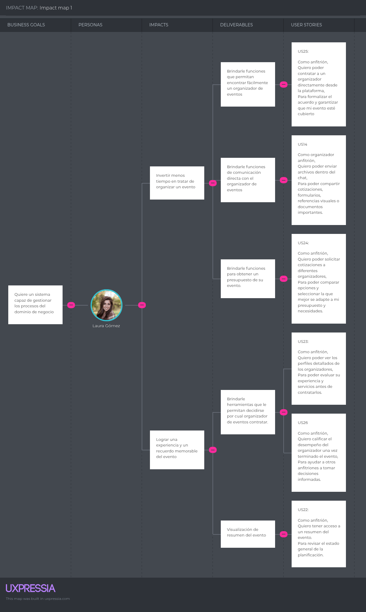

***Segmento: Organizador***

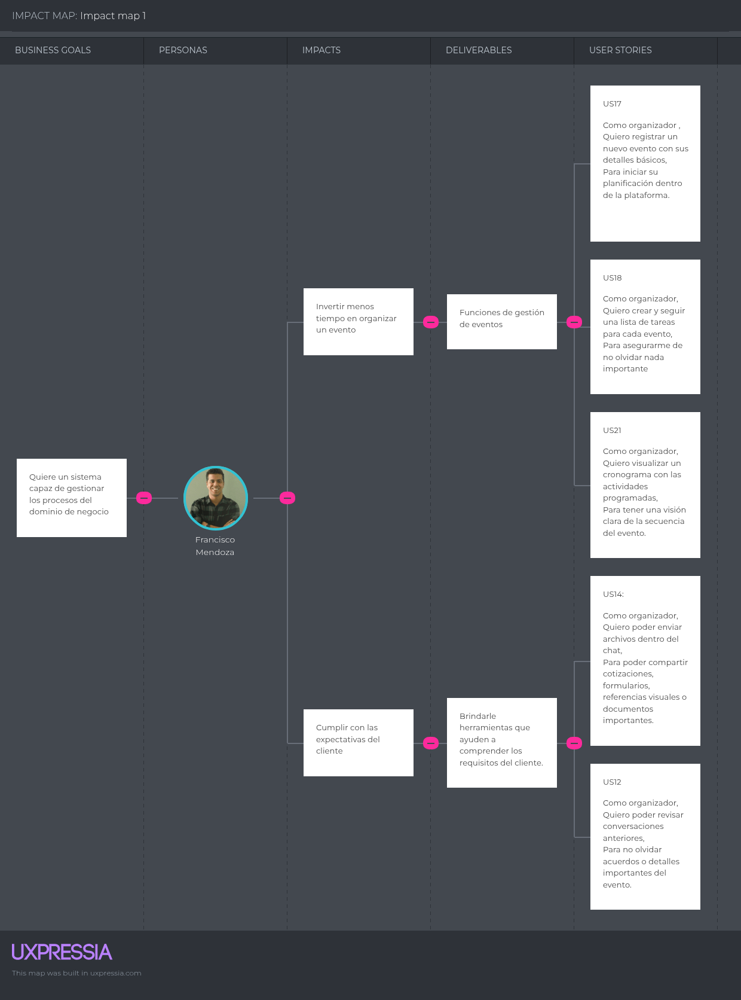

### 2.4.3. Product Backlog

En este segmento del informe otorgaremos a las historias de usuario un peso basándonos en la complejidad, riesgo y esfuerzo. Utilizaremos este método para darle la relevancia adecuada a cada historia de usuario. <b>Enlace a Trello: </b>https://trello.com/b/NknfxMfU/product-backlog

| #Orden | User Story Id | Titulo                                      | Descripción                                                                                                                                                                        | StoryPoints (1 / 2 / 3 / 5/ 8) |
|--------|---------------|---------------------------------------------|------------------------------------------------------------------------------------------------------------------------------------------------------------------------------------|--------------------------------|
| 1      | US11          | Chat integrado en la plataforma               | Como usuario (organizador o anfitrión), quiero acceder a un chat dentro de la plataforma, para comunicarme directamente con la otra parte sin salir de la aplicación.                                             | 8                              |
| 2      | US12          | Historial de mensajes   | Como usuario (organizador o anfitrión), quiero poder revisar conversaciones anteriores, para no olvidar acuerdos o detalles importantes del evento.                | 8                              |
| 3      | US15          | Estado del mensaje (enviado, recibido, leído)                    | Como organizador o anfitrión, quiero ver el estado de mis mensajes enviados, para saber si han sido leídos por la otra persona.                             | 8                              |
| 4      | US14          | Envío de archivos (PDF, imágenes, etc.)                 |Como organizador o anfitrión, quiero poder enviar y recibir archivos dentro del chat, para compartir cotizaciones, formularios, referencias visuales o documentos importantes.                                                                       | 8                              |
| 5      | US13          | Notificaciones de nuevos mensajes                   | Como usuario (organizador o anfitrión), quiero recibir notificaciones cuando tengo un nuevo mensaje, para mantenerme al tanto de la conversación sin retrasos. mí.                                      | 5                              |
| 6      | US16          | Notificación por email si no estoy conectado      | Como organizador o anfitrión, quiero recibir notificaciones fuera de la app si tengo mensajes sin leer, para no perderme nada importante cuando no estoy conectado. | 5                              |
| 7      | US19          | Gestión de presupuesto del evento                       | Como organizador, quiero definir un presupuesto y registrar los gastos del evento, para mantener el control financiero.                                  | 5                              |
| 8      | US17          | Registro de nuevo evento                     |Como organizador, quiero registrar un nuevo evento con sus detalles básicos, para iniciar su planificación dentro de la plataforma.                                                            | 5                              |
| 9      | US18          | Lista de tareas del evento                          | Como organizador o anfitrión, quiero crear y seguir una lista de tareas para cada evento para asegurarme de no olvidar nada importante.                                              | 5                              |
| 10     | US20          | Asignación de roles dentro del evento      | Como organizador, quiero asignar tareas o funciones a otros colaboradores, para delegar responsabilidades específicas.                              | 5                              |
| 11     | US21          | Vista de cronograma del evento                         | Como organizador o anfitrión, quiero visualizar un cronograma con las actividades programadas, para tener una visión clara de la secuencia del evento.                                | 5                              |
| 12     | US25          | Contratar organizador                 | Como anfitrión, quiero poder contratar a un organizador directamente desde la plataforma, para formalizar el acuerdo y garantizar que mi evento esté cubierto.         | 3                              |
| 13     | US23          | 	Visualizar perfiles de organizadores         | Como anfitrión, quiero poder ver los perfiles detallados de los organizadores, para evaluar su experiencia y servicios antes de contratarlos.                                                    | 3                              |
| 14     | US22          | Visualización de resumen del evento                 | Como organizador o anfitrión, quiero tener acceso a un resumen del evento, para revisar el estado general de la planificación.                                       | 3                              |
| 15     | US24          | Solicitar cotización a un organizador | Como anfitrión, quiero poder solicitar cotizaciones a diferentes organizadores, para comparar opciones y seleccionar la que mejor se adapte a mi presupuesto y necesidades.              | 3                              |
| 16     | US26          | Calificar organizador tras evento       | Como anfitrión, quiero calificar el desempeño del organizador una vez terminado el evento, para ayudar a otros anfitriones a tomar decisiones informadas.                                                            | 3                              |
| 17     | US27          | Editar reseña publicada                   | Como anfitrión, quiero poder editar una reseña que haya dejado sobre un organizador para corregir o actualizar mi opinión si es necesario.                                 | 3                              |
| 18     | US10          | Diseño responsive                  |Como visitante quiero que el landing page se vea y funcione correctamente desde cualquier dispositivo para tener una experiencia fluida y consistente en todo momento.                                                   |      3                          |
| 19     | US01          | Navegación sencilla               | Como visitante quiero que la landing page me permita navegar fácilmente entre secciones, para acceder directamente a la sección que me interesa, sin tener que desplazarme por todo el contenido.                                 | 2                              |
| 20     | US02          | Propuesta de valor clara                            | Como visitante quiero entender rápidamente que ofrece la aplicación para saber si es relevante para mi (organizador o anfitrión)                         | 2                              |
| 21     | US03          | Información segmentada             | Como visitante quiero ver información relacionada con mi rol (organizador o anfitrión) para identificar como puede ayudarme la aplicación                                          | 2                              |
| 22     | US04          | Funcionalidades de la aplicación             | Como visitante quiero que el landing page me muestre una lista de las funcionalidades que ofrece la aplicación para saber si cubre mis necesidades.                                          | 2                              |
| 23     | US06          | Visualización de tutorial de la aplicación   |Como visitant quiero que el landing page me muestre visualmente como funciona la aplicación para tener una idea concreta de como debo usarla.                                         | 2                              |
| 24     | US07          | 	Confianza y seguridad             | Como visitante, quiero que el landing page me muestre quienes fueron los encargados en desarrollar la aplicación para verificar que es segura y confiable.                                         | 2                              |
| 25     | US09          | Visualización de precios             | Como visitante quiero ver claramente los planes de los productos ofrecidos en la landing page para evaluar si se ajustan a mi presupuesto.                                          | 2                              |
| 26     | US05          | Llamada a la acción             | Como visitante quiero que el landing page me de la opción de acceder directamente a la aplicación para comenzar a utilizarla                                          | 1                              |
| 27     | US08          | Velocidad de carga             | Como visitante quiero que el landing page cargue rápidamente para no perder el interés.                                          | 1                              |

## 2.5. Strategic-Level Domain-Driven Design

En esta sección se detalla el proceso de diseño estratégico aplicando Domain-Driven Design (DDD) para descomponer la complejidad del sistema Eventify en subconjuntos con límites naturales. Se utilizaron herramientas como Miro para el EventStorming y Lucidchart para el mapeo de contextos.

### 2.5.1. EventStorming

Se llevó a cabo una sesión de **Big Picture EventStorming** donde el equipo identificó los eventos significativos del dominio, sus disparadores y las consecuencias en el estado del negocio. Este proceso permitió alinear el entendimiento técnico con los procesos de negocio reales de un organizador de eventos.

**Eventos de Dominio Clave:**
- `UserRegistered`: Un nuevo usuario se une a la plataforma.
- `QuoteRequested`: Un anfitrión solicita un presupuesto a un organizador.
- `QuoteAccepted`: Se formaliza el acuerdo financiero.
- `SocialEventCreated`: Se inicia la planificación formal de un evento.
- `TaskAssigned`: Se delega una responsabilidad operativa.
- `SubscriptionPurchased`: Un organizador adquiere herramientas avanzadas.

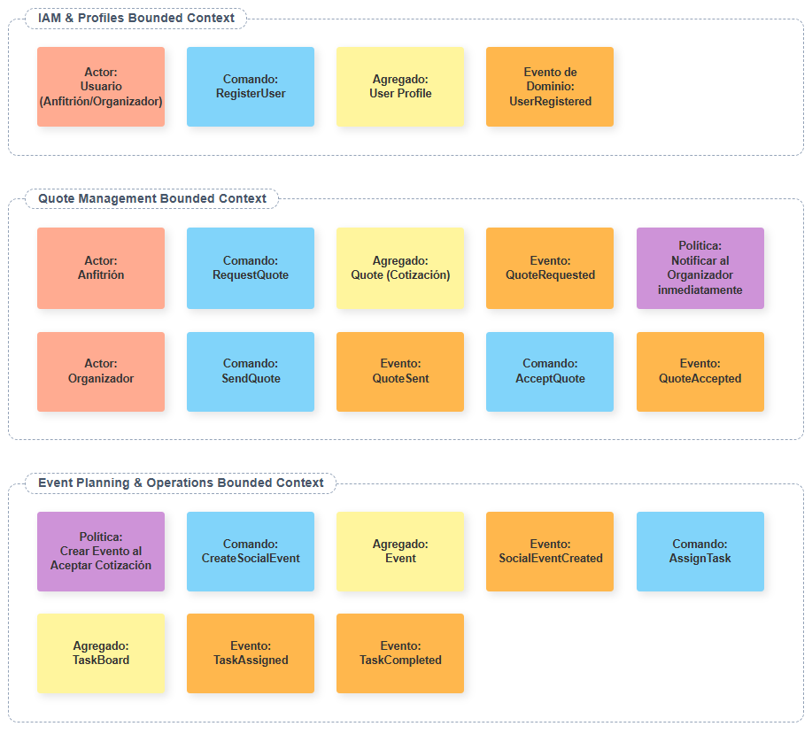

#### 2.5.1.1. Candidate Context Discovery

Mediante la técnica de *look-for-pivotal-events*, identificamos los límites donde el lenguaje y las responsabilidades cambian:

1.  **Identity and Access Management (IAM):** Autenticación y roles.
2.  **Profiles and Preferences:** Identidad profesional y del cliente.
3.  **Quote Management:** Negociación y proformas.
4.  **Event Design and Planning:** Estructura conceptual del evento.
5.  **Event Operations and Monitoring:** Ejecución (Kanban, tareas).
6.  **Direct Communication:** Mensajería y alertas.
7.  **Payments and Subscriptions:** Monetización.

#### 2.5.1.2. Domain Message Flows Modeling

Modelamos el flujo de mensajes para garantizar que los contextos colaboren sin acoplamientos innecesarios. Por ejemplo, cuando se dispara `QuoteAccepted` en el contexto de **Quotes**, el contexto de **Planning** reacciona creando una entidad `Event` base, heredando los servicios pactados en la proforma.

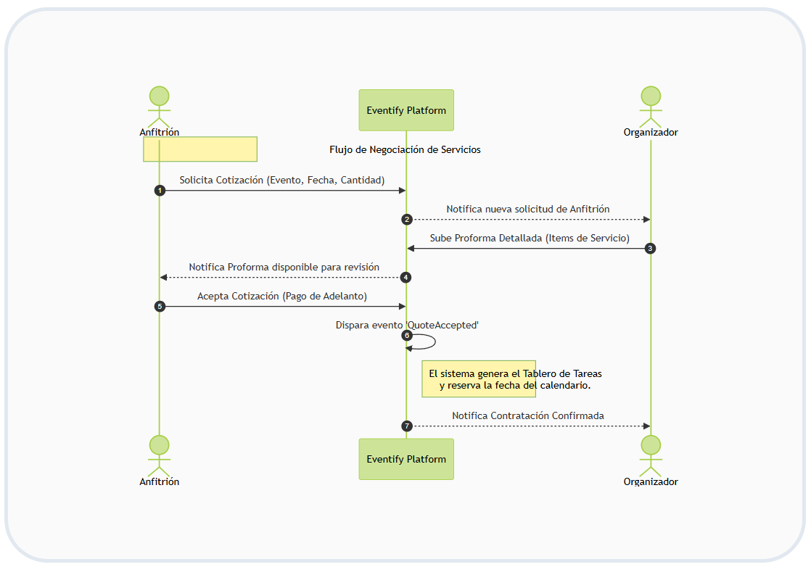

#### 2.5.1.3. Bounded Context Canvases

A continuación, se detallan los canvaces de los contextos core de la solución:

**Canvas: Quote Management**
- **Propósito:** Facilitar la negociación transparente de costos entre anfitriones y organizadores.
- **Business Rules:** 
    - Toda cotización debe tener una fecha de validez.
    - El precio total se calcula automáticamente sumando los items de servicio.
- **Ubiquitous Language:** `Proforma`, `ServiceItem`, `ValidUntil`, `QuoteStatus`.

**Canvas: Event Operations and Monitoring**
- **Propósito:** Optimizar la ejecución logística del organizador en tiempo real.
- **Business Rules:**
    - No se pueden marcar tareas como completadas si dependen de una tarea previa activa.
    - El progreso del evento se calcula en base al porcentaje de tareas en estado `Done`.
- **Ubiquitous Language:** `TaskBoard`, `KanbanColumn`, `Hito`, `TaskPriority`.

### 2.5.2. Context Mapping

El mapa de contextos visualiza cómo se comunican estos sub-sistemas, utilizando patrones estratégicos para proteger la integridad del modelo.

| Relación | Tipo de Patrón | Justificación Técnica |
| :--- | :--- | :--- |
| **IAM -> Todos los Contextos** | Upstream/Downstream (OHS) | IAM provee un *Open Host Service* para que todos los contextos validen identidades de forma estandarizada. |
| **Quotes -> Planning** | Customer/Supplier (ACL) | El contexto de Planificación actúa como *Supplier*. Implementamos una *Anti-Corruption Layer (ACL)* para que los cambios en la lógica de proformas no afecten el diseño del evento. |
| **Planning <-> Operations** | Shared Kernel | Ambos contextos comparten la entidad `EventID` y metadatos básicos de fecha/local, ya que son el núcleo operativo común. |

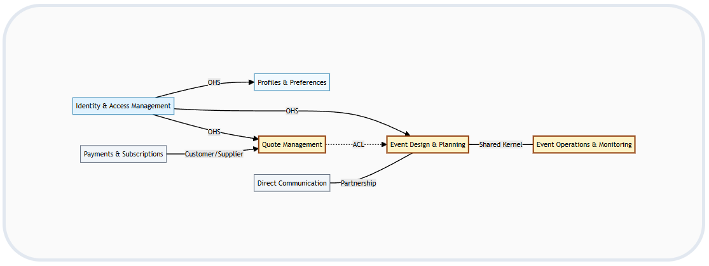

### 2.5.3. Software Architecture

Aplicamos el modelo C4 para documentar la arquitectura desde el contexto general hasta el despliegue físico.

#### 2.5.3.1. Software Architecture Context Level Diagrams

El sistema **Eventify** se sitúa como el orquestador central que interactúa con el **Organizador** (usuario profesional) y el **Anfitrión** (usuario cliente). Se apoya en sistemas externos de **Notificaciones Push** y **Pasarelas de Pago** para completar su propuesta de valor.

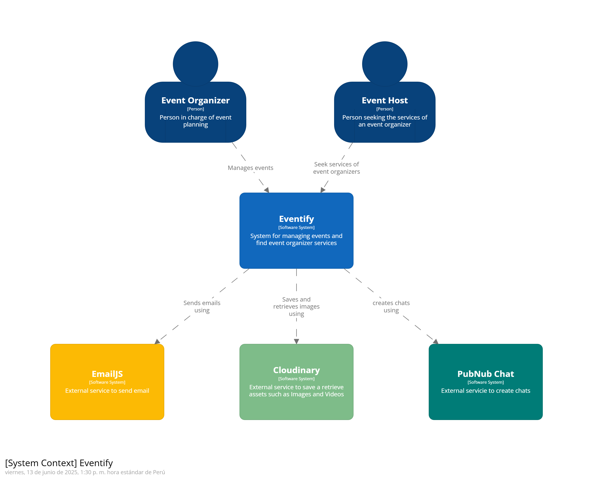

#### 2.5.3.2. Software Architecture Container Level Diagrams

Descomponemos la solución en cinco contenedores principales para asegurar escalabilidad independiente:

1.  **Web Applications (SPA - Vue.js):** Provee la interfaz de usuario reactiva para ambos roles.
2.  **Landing Page:** Sitio optimizado para SEO que actúa como punto de entrada.
3.  **API Platform (.NET Core):** Implementa los microservicios organizados por Bounded Contexts.
4.  **Database (PostgreSQL):** Gestiona la persistencia con esquemas separados por contexto para evitar acoplamiento de datos.
5.  **Firebase Services:** Utilizado para la autenticación rápida (Auth) y almacenamiento de imágenes (Storage).

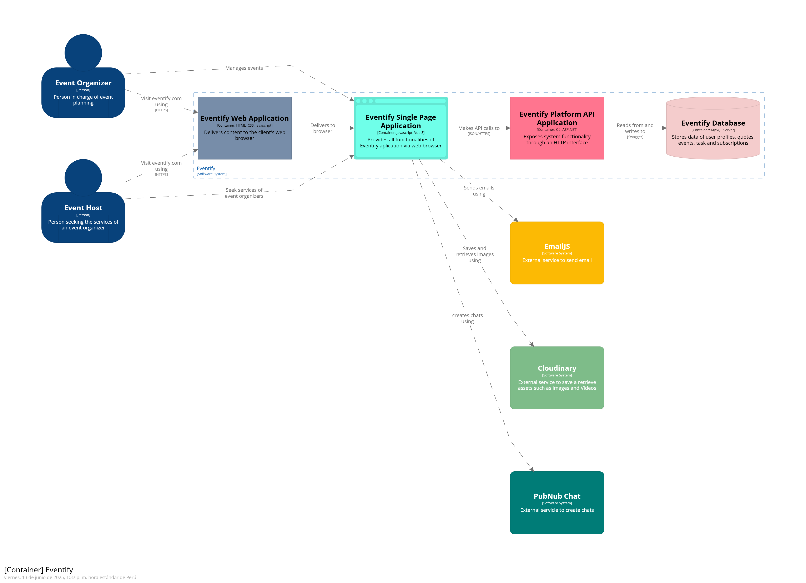

#### 2.5.3.3. Software Architecture Deployment Diagrams

La arquitectura de despliegue garantiza que la aplicación sea resiliente y accesible globalmente:

- **Frontend:** Alojado en **Firebase Hosting** con CDN para minimizar la latencia.
- **Backend:** Desplegado en **Render** mediante contenedores Docker, permitiendo despliegues continuos (CI/CD) desde GitHub.
- **Base de Datos:** Instancia gestionada en **Render PostgreSQL** con backups automáticos y alta disponibilidad.

## 2.6. Tactical-Level Domain-Driven Design

Siguiendo el modelo de arquitectura "Clean Architecture" y el patrón de diseño táctico de DDD con CQRS (Command Query Responsibility Segregation), el proyecto se ha dividido en capas que garantizan la separación de responsabilidades. A continuación, se detallan los Bounded Contexts principales del sistema Eventify.

---

### 2.6.1. Bounded Context: IAM (Identity and Access Management)

Este contexto gestiona la autenticación, el registro y la seguridad de los usuarios de la plataforma.

#### 2.6.1.1. Domain Layer

**Sub-capa Model - Aggregates:**
| Tipo | Nombre | Descripción | Responsabilidad Principal | Relación con otros elementos |
| :--- | :--- | :--- | :--- | :--- |
| Aggregate | User | Clase para definir el Usuario de la aplicación. | Punto de entrada para modificar y mantener la integridad del usuario como entidad del dominio de identidad. | Relacionado con Profile y Event Management. |

**Sub-capa Model - Commands:**
| Tipo | Nombre | Descripción | Responsabilidad Principal | Relación con otros elementos |
| :--- | :--- | :--- | :--- | :--- |
| Command | RegisterUserCommand | Comando para el registro de nuevos usuarios. | Representar la intención de crear una nueva cuenta. | Usado por el UserCommandService. |
| Command | LoginUserCommand | Comando para la autenticación. | Representar la intención de iniciar sesión en el sistema. | Usado en el flujo de seguridad. |
| Command | UpdateUserCommand | Comando para actualizar credenciales. | Representa la intención de cambiar contraseña o email. | Usado en la actualización de seguridad. |

**Sub-capa Model - Queries:**
| Tipo | Nombre | Descripción | Responsabilidad Principal | Relación con otros elementos |
| :--- | :--- | :--- | :--- | :--- |
| Query | GetAllUsersQuery | Consulta para obtener todos los usuarios. | Representar la intención de obtener la lista de usuarios. | Usado en el servicio de consultas. |
| Query | GetUserByEmailQuery | Consulta para obtener usuario por correo. | Buscar un usuario específico mediante su dirección de email. | Usado en el servicio de consultas y validación. |
| Query | GetUserByIdQuery | Consulta para obtener un usuario por ID. | Buscar un usuario mediante su identificador único. | Usado para recuperación de datos de sesión. |

**Sub-capa Model - Value Objects:**
| Tipo | Nombre | Descripción | Responsabilidad Principal | Relación con otros elementos |
| :--- | :--- | :--- | :--- | :--- |
| Value Object | UserRole | Rol del usuario en el sistema. | Representar los diferentes roles (ORGANIZER, HOST). | Atributo esencial de la entidad User. |

**Sub-capa Services:**
| Tipo | Nombre | Descripción | Responsabilidad Principal | Relación con otros elementos |
| :--- | :--- | :--- | :--- | :--- |
| Interface | IUserCommandService | Servicio para métodos de escritura. | Definir la estructura clara para registro y actualización. | Implementado en la capa Application. |
| Interface | IUserQueryService | Servicio para métodos de consulta. | Definir la estructura para lectura de datos de usuario. | Implementado en la capa Application. |

**Sub-capa Repositories:**
| Tipo | Nombre | Descripción | Responsabilidad Principal | Relación con otros elementos |
| :--- | :--- | :--- | :--- | :--- |
| Interface | IUserRepository | Repositorio de persistencia del User. | Definir contratos para operaciones CRUD del usuario. | Implementado en la capa Infrastructure. |

#### 2.6.1.2. Interface Layer

**Sub-capa REST - Resources:**
| Tipo | Nombre | Descripción | Responsabilidad Principal | Relación con otros elementos |
| :--- | :--- | :--- | :--- | :--- |
| Resource | SignInResource | DTO para iniciar sesión. | Representar datos estructurados de login desde el cliente. | Uso en AuthenticationController. |
| Resource | SignUpResource | DTO para registrar usuario. | Representar datos de registro iniciales. | Uso en AuthenticationController. |
| Resource | UserResource | Estructura de datos del usuario. | Representar y exponer datos del dominio de forma segura. | Uso en el UsersController. |
| Resource | AuthenticatedUserResource| Respuesta para usuario autenticado. | Representar datos y tokens tras un login exitoso. | Usado en AuthenticationController. |

**Sub-capa REST - Transform:**
| Tipo | Nombre | Descripción | Responsabilidad Principal | Relación con otros elementos |
| :--- | :--- | :--- | :--- | :--- |
| Assembler | UserResourceFromEntityAssembler | Transformador REST. | Convertir entidad User a UserResource. | Usado en UsersController. |
| Assembler | SignInCommandFromResourceAssembler | Transformador Comando. | Convertir SignInResource a LoginUserCommand. | Usado en AuthController. |
| Assembler | SignUpCommandFromResourceAssembler | Transformador Comando. | Convertir SignUpResource a RegisterUserCommand. | Usado en AuthController. |

**Sub-capa REST - Controllers:**
| Tipo | Nombre | Descripción | Responsabilidad Principal | Relación con otros elementos |
| :--- | :--- | :--- | :--- | :--- |
| Controller | AuthenticationController | Controlador de Auth. | Manejar peticiones HTTP de inicio de sesión y registro. | Usa CommandServices y Assemblers. |
| Controller | UsersController | Controlador de usuarios. | Manejar peticiones HTTP para consultar usuarios. | Usa QueryServices y Assemblers. |

#### 2.6.1.3. Application Layer

**Sub-capa Internal:**
| Tipo | Nombre | Descripción | Responsabilidad Principal | Relación con otros elementos |
| :--- | :--- | :--- | :--- | :--- |
| CommandHandler | UserCommandService | Implementación de comandos. | Ejecutar lógica de negocio para crear/modificar usuarios. | Implementa IUserCommandService. |
| QueryHandler | UserQueryService | Implementación de consultas. | Ejecutar lógica para buscar usuarios (login/validación). | Implementa IUserQueryService. |
| Service | TokenService | Interfaz para tokens. | Definir contratos para generación de JWT. | Implementado en Infra. |

#### 2.6.1.4. Infrastructure Layer

**Sub-capa Persistence & Security:**
| Tipo | Nombre | Descripción | Responsabilidad Principal | Relación con otros elementos |
| :--- | :--- | :--- | :--- | :--- |
| Repository | UserRepository | Implementación de DB. | Acceder y manipular datos persistidos en Entity Framework. | Implementa IUserRepository. |
| Service | HashingService | Cifrado de contraseñas. | Hashear contraseñas usando BCrypt. | Usado por UserCommandService. |
| Service | JwtTokenService | Implementación JWT. | Generar y validar tokens de sesión móviles. | Usado en AuthController. |

#### 2.6.1.5. Bounded Context Software Architecture Component Level Diagrams

#### 2.6.1.6. Bounded Context Software Architecture Code Level Diagrams

**2.6.1.6.1. Bounded Context Domain Layer Class Diagrams**

**2.6.1.6.2. Bounded Context Database Design Diagram**

**Tabla: Users**
| Campo | Tipo | Nulo | Descripción |
| :--- | :--- | :--- | :--- |
| id | UUID (PK) | N-N | Identificador único del usuario. |
| email | String | N-N | Correo electrónico único. |
| password | String | N-N | Contraseña encriptada. |
| name | String | N-N | Nombre completo del usuario. |
| role | Enum | N-N | Rol asignado (ORGANIZER, HOST). |
| is_active | Boolean | N-N | Estado de la cuenta. |
| created_at | Date | N-N | Fecha de registro. |

---

### 2.6.2. Bounded Context: Event Management

Este contexto centraliza la planificación y el seguimiento operativo de los eventos y sus tareas asociadas.

#### 2.6.2.1. Domain Layer

**Sub-capa Model - Aggregates & Entities:**
| Tipo | Nombre | Descripción | Responsabilidad Principal | Relación con otros elementos |
| :--- | :--- | :--- | :--- | :--- |
| Aggregate | Event | Entidad que representa un evento gestionado. | Mantener el estado y reglas de negocio del evento (fechas, presupuesto). | Controla las entidades Task. |
| Entity | Task | Tarea relacionada a un evento. | Gestionar actividades específicas logísticas. | Pertenece a un Event. |
| Entity | GuestList | Lista de invitados. | Gestionar la capacidad y asistentes al evento. | Pertenece a un Event. |

**Sub-capa Model - Commands:**
| Tipo | Nombre | Descripción | Responsabilidad Principal | Relación con otros elementos |
| :--- | :--- | :--- | :--- | :--- |
| Command | CreateEventCommand | Intención de crear un evento. | Transportar datos de planificación inicial hacia el dominio. | Ejecutado por EventCommandService. |
| Command | UpdateEventCommand | Comando de actualización. | Transportar cambios de presupuesto o estado. | Ejecutado por EventCommandService. |
| Command | DeleteEventCommand | Comando de eliminación. | Indicar la cancelación y borrado lógico de un evento. | Ejecutado por EventCommandService. |
| Command | CreateTaskCommand | Intención de crear una tarea. | Definir nuevas tareas con plazos y responsables. | Relacionado con un EventID. |

**Sub-capa Model - Queries:**
| Tipo | Nombre | Descripción | Responsabilidad Principal | Relación con otros elementos |
| :--- | :--- | :--- | :--- | :--- |
| Query | GetAllEventsQuery | Consulta general de eventos. | Obtener la lista completa de eventos para el dashboard. | Usado en EventQueryService. |
| Query | GetEventByIdQuery | Consulta de evento único. | Recuperar la información detallada de un evento. | Usado en EventQueryService. |
| Query | GetTasksByEventIdQuery| Consulta de tareas. | Recuperar todas las tareas asignadas a un Kanban. | Usado en EventQueryService. |

**Sub-capa Model - Value Objects:**
| Tipo | Nombre | Descripción | Responsabilidad Principal | Relación con otros elementos |
| :--- | :--- | :--- | :--- | :--- |
| Value Object | EventStatus | Estados del evento. | Controlar el ciclo de vida (PLANNING, CONFIRMED, CANCELLED).| Atributo de Event. |
| Value Object | TaskStatus | Estados de la tarea. | Controlar el flujo (TODO, IN_PROGRESS, DONE). | Atributo de Task. |
| Value Object | TaskPriority | Prioridades. | Clasificar la urgencia (LOW, MEDIUM, HIGH). | Atributo de Task. |

**Sub-capa Services & Repositories:**
| Tipo | Nombre | Descripción | Responsabilidad Principal | Relación con otros elementos |
| :--- | :--- | :--- | :--- | :--- |
| Interface | IEventCommandService | Servicio de comandos. | Coordinar operaciones de escritura sobre eventos. | Implementado en Application. |
| Interface | IEventQueryService | Servicio de consultas. | Coordinar lectura y filtrado de eventos y tareas. | Implementado en Application. |
| Interface | IEventRepository | Repositorio de eventos. | Definir contratos CRUD para el aggregate Event. | Implementado en Infra. |
| Interface | ITaskRepository | Repositorio de tareas. | Definir contratos CRUD para la entidad Task. | Implementado en Infra. |

#### 2.6.2.2. Interface Layer

**Sub-capa REST - Resources:**
| Tipo | Nombre | Descripción | Responsabilidad Principal | Relación con otros elementos |
| :--- | :--- | :--- | :--- | :--- |
| Resource | CreateEventResource | DTO de creación. | Recibir datos del cliente móvil para armar un evento. | Usado en EventsController. |
| Resource | EventResource | DTO de salida de evento. | Exponer datos del evento de forma estructurada. | Usado en EventsController. |
| Resource | TaskResource | DTO de salida de tarea. | Exponer datos de logística y tareas del Kanban. | Usado en TasksController. |

**Sub-capa REST - Transform:**
| Tipo | Nombre | Descripción | Responsabilidad Principal | Relación con otros elementos |
| :--- | :--- | :--- | :--- | :--- |
| Assembler | EventResourceFromEntityAssembler | Transformador REST. | Convertir entidad Event a EventResource. | Usado en EventsController. |
| Assembler | TaskResourceFromEntityAssembler | Transformador REST. | Convertir entidad Task a TaskResource. | Usado en TasksController. |
| Assembler | CreateEventCommandFromResourceAssembler | Transformador Comando. | Convertir CreateEventResource a Comando. | Usado en EventsController. |

**Sub-capa REST - Controllers:**
| Tipo | Nombre | Descripción | Responsabilidad Principal | Relación con otros elementos |
| :--- | :--- | :--- | :--- | :--- |
| Controller | EventsController | Controlador REST principal. | Exponer endpoints CRUD para Eventos a la app móvil. | Depende de Services. |
| Controller | TasksController | Controlador de tareas. | Exponer endpoints para actualizar el tablero de tareas. | Depende de Services. |

#### 2.6.2.3. Application Layer

**Sub-capa Internal:**
| Tipo | Nombre | Descripción | Responsabilidad Principal | Relación con otros elementos |
| :--- | :--- | :--- | :--- | :--- |
| CommandHandler | EventCommandService | Orquestador de escritura. | Validar reglas de negocio y delegar guardado al Repositorio. | Implementa IEventCommandService. |
| QueryHandler | EventQueryService | Orquestador de lectura. | Ejecutar Queries y devolver colecciones de eventos/tareas. | Implementa IEventQueryService. |

#### 2.6.2.4. Infrastructure Layer

**Sub-capa Persistence:**
| Tipo | Nombre | Descripción | Responsabilidad Principal | Relación con otros elementos |
| :--- | :--- | :--- | :--- | :--- |
| Repository | EventRepository | Repositorio físico. | Acceder a la tabla Events mediante el ORM (EF Core). | Implementa IEventRepository. |
| Repository | TaskRepository | Repositorio físico. | Acceder a la tabla Tasks mediante el ORM. | Implementa ITaskRepository. |

#### 2.6.2.5. Bounded Context Software Architecture Component Level Diagrams

#### 2.6.2.6. Bounded Context Software Architecture Code Level Diagrams

**2.6.2.6.1. Bounded Context Domain Layer Class Diagrams**

**2.6.2.6.2. Bounded Context Database Design Diagram**

**Tabla: Events**
| Campo | Tipo | Nulo | Descripción |
| :--- | :--- | :--- | :--- |
| id | UUID (PK) | N-N | Identificador único del evento. |
| organizer_id | UUID (FK) | N-N | Referencia al organizador responsable. |
| host_id | UUID (FK) | N-N | Referencia al anfitrión del evento. |
| title | String | N-N | Nombre oficial del evento. |
| budget | Float | N-N | Monto máximo presupuestado. |
| max_attendees | Int | N-N | Capacidad máxima de invitados. |
| status | Enum | N-N | Estado (PLANNING, CONFIRMED, etc.). |

**Tabla: Tasks**
| Campo | Tipo | Nulo | Descripción |
| :--- | :--- | :--- | :--- |
| id | UUID (PK) | N-N | Identificador único de tarea. |
| event_id | UUID (FK) | N-N | Referencia al evento padre. |
| title | String | N-N | Nombre o resumen de la tarea. |
| status | Enum | N-N | Estado en el tablero (TODO, IN_PROGRESS, DONE). |
| priority | Enum | N-N | Prioridad logística (LOW, MEDIUM, HIGH). |
| assigned_to | String | N-Y | Persona responsable asignada. |

---

### 2.6.3. Bounded Context: Communication

Gestiona la interacción en tiempo real entre los participantes mediante chats y notificaciones del sistema.

#### 2.6.3.1. Domain Layer

**Sub-capa Model - Aggregates & Entities:**
| Tipo | Nombre | Descripción | Responsabilidad Principal | Relación con otros elementos |
| :--- | :--- | :--- | :--- | :--- |
| Aggregate | Chat | Conversación entre usuarios. | Mantener el historial y participantes de una sala de chat. | Contiene múltiples Messages. |
| Aggregate | Notification | Notificación del sistema. | Alertar a los usuarios sobre eventos, pagos o cotizaciones. | Relacionado con UserId. |
| Entity | Message | Mensaje unitario. | Encapsular el contenido, remitente y estado de lectura. | Pertenece a un Chat. |

**Sub-capa Model - Commands & Queries:**
| Tipo | Nombre | Descripción | Responsabilidad Principal | Relación con otros elementos |
| :--- | :--- | :--- | :--- | :--- |
| Command | CreateChatCommand | Comando de creación. | Instanciar un nuevo canal de comunicación entre usuarios. | Usado en CommunicationService. |
| Command | SendMessageCommand| Comando de envío. | Adjuntar un nuevo mensaje al historial de un chat. | Afecta a la entidad Message. |
| Query | GetChatByIdQuery | Consulta de sala. | Recuperar la metadata de una conversación. | Usado en QueryService. |
| Query | GetMessagesByChatIdQuery | Consulta de historial. | Cargar los mensajes previos para mostrarlos en la UI. | Usado en QueryService. |

**Sub-capa Model - Value Objects:**
| Tipo | Nombre | Descripción | Responsabilidad Principal | Relación con otros elementos |
| :--- | :--- | :--- | :--- | :--- |
| Value Object | MessageStatus | Estado del mensaje. | Indicar si fue enviado, entregado o leído (SENT, DELIVERED, READ). | Atributo de Message. |
| Value Object | NotificationType| Tipo de alerta. | Diferenciar alertas de sistema, recordatorios o mensajes. | Atributo de Notification. |

#### 2.6.3.2. Interface Layer

**Sub-capa REST - Resources & Transform:**
| Tipo | Nombre | Descripción | Responsabilidad Principal | Relación con otros elementos |
| :--- | :--- | :--- | :--- | :--- |
| Resource | MessageResource | DTO de mensaje. | Exponer el contenido del mensaje y su estado a la app. | Usado en CommunicationController. |
| Resource | NotificationResource| DTO de notificación. | Transportar alertas al panel de notificaciones del móvil. | Usado en NotificationsController. |
| Assembler | MessageResourceFromEntityAssembler | Transformador REST. | Convertir la entidad Message al DTO correspondiente. | Usado en Controladores. |

**Sub-capa REST - Controllers:**
| Tipo | Nombre | Descripción | Responsabilidad Principal | Relación con otros elementos |
| :--- | :--- | :--- | :--- | :--- |
| Controller | CommunicationController | API de Chats. | Exponer endpoints para recuperar y enviar mensajes. | Depende de los Application Services. |
| Controller | NotificationsController | API de Alertas. | Exponer endpoints para listar y marcar alertas como leídas. | Depende de los Application Services. |

#### 2.6.3.3. Application Layer
Implementa el `CommunicationCommandService` para procesar el envío y recepción de mensajes, y orquesta servicios de mensajería push (ej. Firebase Cloud Messaging) para notificar al dispositivo móvil en tiempo real.

#### 2.6.3.4. Infrastructure Layer
Utiliza el `ChatRepository` y `MessageRepository` para persistir el historial en la base de datos relacional y asegurar que los mensajes no se pierdan.

#### 2.6.3.5. Bounded Context Software Architecture Component Level Diagrams

#### 2.6.3.6. Bounded Context Software Architecture Code Level Diagrams

**2.6.3.6.1. Bounded Context Domain Layer Class Diagrams**

**2.6.3.6.2. Bounded Context Database Design Diagram**

**Tabla: Messages**
| Campo | Tipo | Nulo | Descripción |
| :--- | :--- | :--- | :--- |
| id | UUID (PK) | N-N | Identificador único del mensaje. |
| chat_id | UUID (FK) | N-N | Relación con la sala de chat. |
| sender_id | UUID (FK) | N-N | Remitente del mensaje (Referencia a User). |
| content | Text | N-N | Cuerpo del mensaje de texto. |
| sent_at | Date | N-N | Marca de tiempo del envío. |
| status | Enum | N-N | Estado (SENT, DELIVERED, READ). |
