# Capítulo III: Solution UI/UX Design

## 3.1. Product design

### 3.1.1. Style Guidelines
En esta sección, se expone nuestra proposición de diseño para el landing page y la aplicación web. Las directrices de estilo de Eventify establecen las pautas visuales y de comunicación, garantizando una experiencia de usuario coherente, intuitiva y accesible. Su propósito es asegurar la consistencia en todos los puntos de interacción, desde la interfaz hasta las notificaciones y mensajes del sistema.

#### 3.1.1.1. General Style Guidelines
Esta sección presenta las decisiones visuales y comunicativas que definen la identidad de Eventify. Se explican aspectos clave como el uso del logo, la tipografía elegida, la paleta de colores, el sistema de espaciado y el tono de comunicación aplicado.

**Brand Overview**

La identidad visual de Eventify transmite claridad, organización y confianza desde el primer vistazo. El logo está compuesto por un ícono de calendario con un check en el centro, que representa la idea de tener un evento agendado y confirmado con éxito. A la derecha del ícono aparece el nombre de la marca en mayúsculas: EVENTIFY.

El color principal del logo es un tono azul intenso y moderno que destaca claramente sobre el fondo, transmitiendo confianza, seguridad y tecnología. Su diseño está compuesto por líneas gruesas y redondeadas que forman una figura hexagonal, lo que aporta una sensación de estructura, orden y protección. En el centro se observa un ícono similar a un documento o formulario con un check, acompañado de un pequeño destello amarillo, lo cual transmite validación, eficiencia, calidad y cumplimiento de procesos. En conjunto, el logo proyecta una imagen profesional, digital y confiable, ideal para representar soluciones tecnológicas, gestión documental, automatización o servicios de verificación.

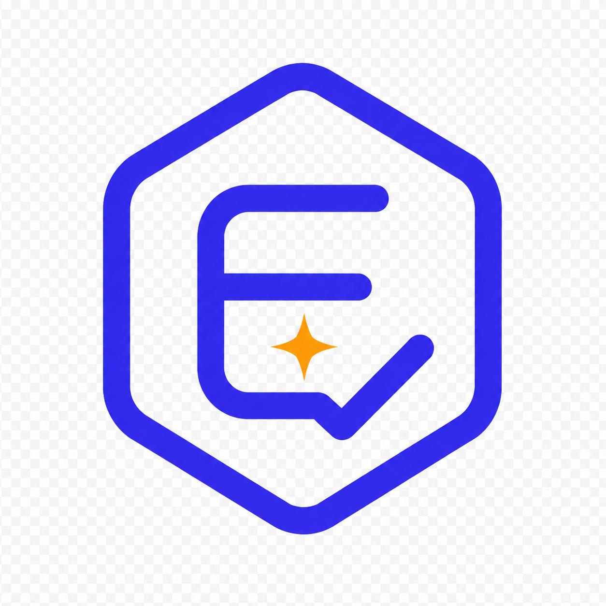

**Typography**

La tipografía principal de Eventify es Poppins, una fuente sans-serif moderna y amigable que aporta claridad, equilibrio visual y un toque contemporáneo a la experiencia del usuario.

Elegida por su legibilidad y estética geométrica, Poppins permite mantener un diseño limpio, funcional y coherente en todos los tamaños de pantalla.

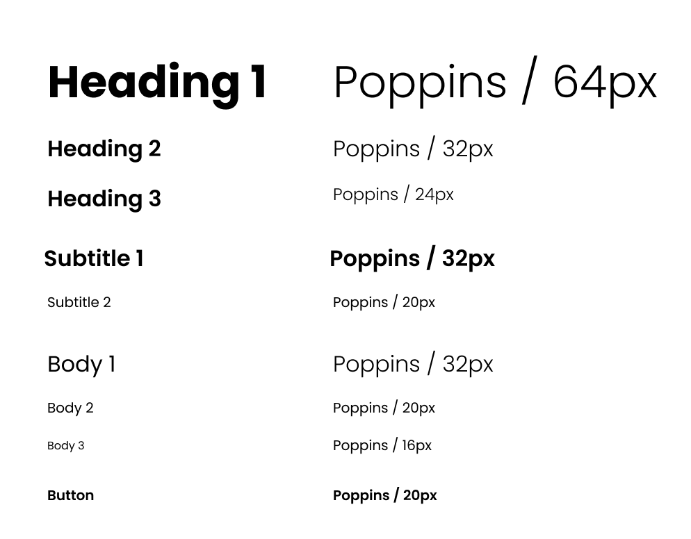

**Colors**

La paleta de colores de Eventify combina profesionalismo, frescura y dinamismo, reforzando el enfoque moderno y accesible de la plataforma.

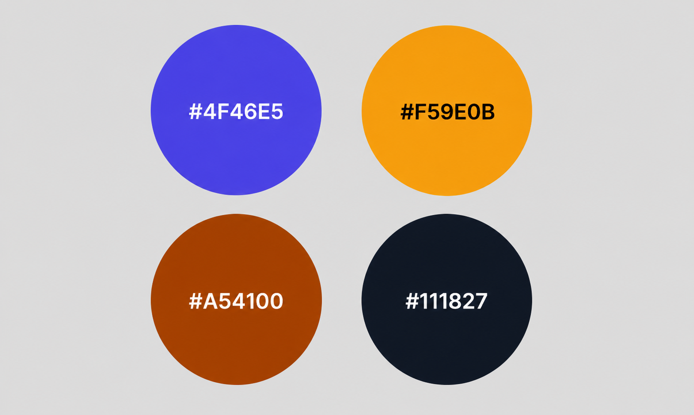

* **Morado claro (#4F46E5):**

Este color es utilizado en encabezados y elementos destacados. Su tono vibrante transmite creatividad, innovación y dinamismo, lo cual es ideal para interfaces modernas y tecnologías disruptivas.

* **Naranja brillante** (#F59E0B):

Aplicado en botones de llamada a la acción, resaltando interacciones clave dentro de la interfaz. Este tono cálido y energético transmite urgencia y entusiasmo, impulsando a los usuarios a realizar acciones rápidas y decididas.

* **Rojizo oscuro** (#A54100):

Usado en áreas que requieren énfasis, como barras laterales o cuadros de información. Este color cálido y terroso proyecta confianza, calidez y fiabilidad, adecuado para mensajes importantes o información crítica.

* **Negro oscuro** (#111827):

Ideal para el texto principal y fondos secundarios, este color otorga un contraste fuerte que mejora la legibilidad y otorga un aire de sofisticación y profesionalismo. Es perfecto para contenidos y secciones donde se desea claridad sin distracciones.

#### Tono de Comunicación:

* Profesional y confiable, dirigido a anfitriones de eventos que buscan servicios de calidad.
* Accesible y amigable, para proporcionar simpleza a la vez que profundidad.
* Orientado al servicio, enfocado en resolver problemas y brindar comodidad.

#### Tipografía:

* **Inter:** Fuente legible y cuidadosamente elaborada, diseñada por Rasmus Andersson, ideal para interfaces digitales.

#### Paleta de Colores: 

- Primary: 
- Secondary: 
- Tertiary: 
- Neutral: 

### 3.1.2. Information Architecture

Se realizó la landing page teniendo en mente el comunicar el valor de la solución de manera simplificada para organizadores y anfitriones de eventos.

Orden vertical de las secciones:
* Hero: Primer impacto visual con propuesta de valor clara.
* Presentación del equipo: Construcción de confianza a través de perfiles profesionales.
* Misión y visión: Establecimiento de credibilidad y valores.
* Beneficios: Refuerzo de la propuesta de valor.
* Contacto: Información para establecer comunicación.

#### 3.1.2.1. Organization Systems
**Arquitectura de la Información de Eventify**

Para estructurar la arquitectura de la información de **Eventify**, se ha adoptado un sistema de organización jerárquico tanto en la Landing Page como en la Aplicación Web. Este sistema facilita la navegación intuitiva y garantiza que los usuarios puedan encontrar fácilmente la información y las funciones que necesitan.

**Landing Page**

La Landing Page de **Eventify** se organiza de manera jerárquica para que los usuarios puedan acceder rápidamente a la información más relevante y a las acciones necesarias para interactuar con la plataforma:

**Barra de Navegación Principal**

Situada en la parte superior de la página, proporciona accesos rápidos a las secciones clave:

- **Inicio (Home):** La página de inicio que da la bienvenida a los usuarios y proporciona una visión general de los servicios de Eventify. Incluye un banner destacado con un mensaje central y botones de llamada a la acción para el registro e inicio de sesión.
- **Servicios (Services):** Presenta los servicios ofrecidos tanto para anfitriones de eventos como para organizadores profesionales. Esta sección está organizada para que cada tipo de usuario pueda identificar rápidamente cómo Eventify puede beneficiarles.
- **Planes (Plans):** Explica las diferentes opciones de planes disponibles para usuarios y organizadores, incluyendo características y beneficios de cada uno. Esta sección facilita la comparación y selección de la mejor opción.
- **Contáctanos (Contact Us):** Proporciona información de contacto, un formulario de consulta y enlaces a redes sociales, facilitando la comunicación entre los usuarios y el equipo de soporte de Eventify.
- **Nosotros (About Us):** Describe la misión, visión y el equipo detrás de Eventify, generando confianza y transparencia con los usuarios.

**Estructura de Contenido Jerárquica**

- **Encabezados y Subencabezados:** Organizan el contenido dentro de cada sección, permitiendo a los usuarios explorar más a fondo según sus intereses.
- **Botones de Llamada a la Acción (CTAs):** Colocados estratégicamente para guiar a los usuarios hacia acciones deseadas como crear un evento, contratar un organizador o contactar al equipo de Eventify.

**Footer**

Incluye enlaces a secciones importantes como políticas de privacidad, términos de servicio, contacto y enlaces a redes sociales. El footer proporciona una navegación adicional para usuarios que desean explorar más sobre Eventify.

### Aplicación Móvil

La **Aplicación Móvil** de **Eventify** está pensada para ofrecer una experiencia fluida y personalizada para dos segmentos principales de usuarios: **Anfitriones de Eventos** y **Organizadores Profesionales**. La organización del contenido permite que cada tipo de usuario navegue de manera eficiente y realice las acciones necesarias desde la comodidad de su dispositivo móvil.

### Para Anfitriones de Eventos

- **Buscar Organizador (Search Organizer):** Los anfitriones pueden buscar organizadores de eventos según diferentes filtros como tipo de evento, ubicación y presupuesto, todo desde su dispositivo móvil.
- **Mis Eventos (My Events):** Una vista simplificada de los eventos programados, permitiendo acceder a detalles, asistentes y organizadores asignados de manera rápida.
- **Cotizaciones (Quotes):** Los anfitriones pueden recibir y gestionar cotizaciones directamente desde la app, facilitando la comparación de precios y servicios ofrecidos por los organizadores.
- **Mensajes (Messages):** Comunicación directa con los organizadores a través de un chat, permitiendo el intercambio de información y actualizaciones sobre el progreso del evento.
- **Reseñas (Reviews):** Los anfitriones pueden dejar reseñas y calificaciones sobre los organizadores, ayudando a otros usuarios a tomar decisiones informadas al seleccionar proveedores.
- **Perfil (Profile):** Los anfitriones pueden gestionar su perfil personal, preferencias de notificación y configurar su cuenta directamente desde la app.
- **Configuración (Settings):** Permite ajustar las preferencias de privacidad, notificaciones y otros aspectos personales desde el móvil.

### Para Organizadores Profesionales

- **Mensajes (Messages):** Facilita la comunicación directa entre organizadores y anfitriones, permitiendo intercambiar información y mantener a los clientes actualizados.
- **Cotizaciones (Quotes):** Los organizadores pueden gestionar cotizaciones y recibir solicitudes, facilitando el proceso de oferta y negociación.
- **Perfil (Profile):** Los organizadores pueden gestionar su perfil profesional, personalizar preferencias y mantener su información actualizada.
- **Suscripción (Subscription):** Muestra el estado de la suscripción, permitiendo gestionar pagos, renovaciones y ver opciones de suscripción disponibles.
- **Tareas (Tasks):** Herramienta para gestionar las tareas relacionadas con cada evento, asignando responsabilidades y fechas de entrega.
- **Eventos (Events):** Los organizadores pueden visualizar todos los eventos programados, ver detalles, asistentes y responsables asignados, asegurando una planificación eficiente.
- **Calendario (Calendar):** Una vista organizada en formato calendario con todos los eventos programados, facilitando la visualización de fechas y horarios.
- **Dashboard:** Una interfaz de resumen que muestra los eventos activos, tareas pendientes, cotizaciones y mensajes recientes para un acceso rápido y organizado a la información más relevante.

### Interacción y Flujo de Trabajo

- La interfaz móvil está diseñada para ser completamente intuitiva, adaptándose a la experiencia de navegación táctil, permitiendo a los usuarios completar sus tareas con el menor esfuerzo posible.
- Cada sección dentro de la aplicación está claramente identificada y utiliza una combinación de texto, íconos y ayudas visuales, mejorando la experiencia de usuario y facilitando la comprensión de las opciones.

* Jerárquico: El contenido se organiza desde el impacto inicial hasta el detalle de servicios.
* Centrado en personas: La presentación del equipo es prominente para generar confianza.
* Orientado a beneficios: El mensaje está adaptado a organizadores y anfitriones de eventos que necesitan entablar negociaciones de manera ordenada y confiable.

#### 3.1.2.2. Labelling Systems

#### Sistemas de Etiquetado en Eventify (Aplicación Móvil)

En este apartado se describen los sistemas de etiquetado utilizados en la **Aplicación Móvil** de **Eventify**, desarrollada con tecnologías nativas y frameworks móviles para garantizar fluidez, accesibilidad y un diseño adaptado a pantallas táctiles.

#### Etiquetas de Encabezados (Headings)

Los encabezados principales están estructurados para ofrecer una navegación intuitiva y rápida:

- **Inicio / Home:**  
  Pantalla de bienvenida con barra de navegación superior fija, donde se presenta el contenido principal a través de tarjetas (como `mat-card` en la versión web) adaptadas al formato móvil.

- **Eventos / Events:**  
  Vista de lista de eventos, organizada en tarjetas o secciones deslizables, permitiendo a los usuarios visualizar los eventos y acceder a más detalles de manera rápida.

- **Planes y Precios / Pricing Plans:**  
  Cards dinámicas adaptadas para la vista móvil, presentando las suscripciones disponibles en una interfaz optimizada para pantalla táctil.

- **Contáctanos / Contact Us:**  
  Formulario de contacto optimizado para la experiencia móvil, con campos adaptables como `mat-form-field` y botones `mat-button`, todo accesible con un solo toque.

- **Sobre Nosotros / About Us:**  
  Información organizacional presentada de manera compacta en un diseño plegable (`mat-expansion-panel`), permitiendo la navegación eficiente desde un dispositivo móvil.

#### Etiquetas Textuales (Text Labels)

Las acciones son representadas en botones y campos de entrada optimizados para el toque táctil:

- **Buscar Eventos / Find Events:**  
  Barra de búsqueda accesible en la parte superior de la pantalla, con un campo de entrada y un ícono de búsqueda integrados en el diseño móvil.

- **Registrarse / Register:**  
  Botón destacado y de gran tamaño para facilitar el registro, con un diseño de `mat-raised-button` para una acción clara y visible.

- **Mis Eventos / My Events:**  
  Acceso directo a los eventos del usuario desde un menú de navegación lateral o barra inferior, asegurando una transición rápida entre pantallas.

- **Historial / History:**  
  Listado de eventos anteriores accesible mediante un deslizador o lista vertical que se adapta perfectamente a la pantalla del dispositivo móvil.

- **Configuraciones / Settings:**  
  Ajustes de cuenta y notificaciones accesibles desde el menú lateral o desde una sección de configuraciones dentro de la app, optimizado para navegación móvil.

#### Etiquetas Icónicas (Iconic Labels)

La aplicación móvil emplea íconos diseñados para pantallas táctiles, optimizando la interacción de los usuarios con símbolos claros y reconocibles:

- **Icono de Búsqueda (search):** Un ícono táctil que facilita la búsqueda de eventos.
- **Icono de Calendario (event):** Icono para acceder al calendario de eventos, organizado de manera clara.
- **Icono de Estrella (star):** Utilizado para destacar eventos favoritos o importantes.
- **Icono de Ticket (confirmation_number):** Para acceder a entradas y detalles de los eventos.
- **Icono de Notificación (notifications):** Acceso a alertas y notificaciones importantes dentro de la app.

Este enfoque optimizado para la **Aplicación Móvil** garantiza una experiencia dinámica, interactiva y completamente adaptada a la navegación táctil, permitiendo a los usuarios gestionar sus eventos de manera eficiente y cómoda desde sus dispositivos móviles.

#### 3.1.2.3. SEO Tags and Meta Tags

En el desarrollo de **Eventify**, la optimización para dispositivos móviles juega un papel crucial para mejorar la visibilidad y la accesibilidad de la plataforma en los dispositivos de los usuarios. Aunque en las aplicaciones móviles no se aplican los mismos SEO tags y meta tags utilizados en las aplicaciones web, los conceptos de optimización para la búsqueda dentro de la app (app store optimization o ASO) y el rendimiento en dispositivos móviles son esenciales para asegurar que los usuarios encuentren y disfruten de Eventify de manera eficiente.

Los ASO tags, junto con los metadatos específicos de las aplicaciones móviles, son herramientas clave que permiten optimizar el contenido en las tiendas de aplicaciones (Google Play Store, Apple App Store), asegurando que los usuarios puedan encontrar Eventify de manera rápida y con facilidad. Además, los elementos como el título de la app, la descripción, las palabras clave y las capturas de pantalla son vitales para atraer a los usuarios adecuados y mejorar la visibilidad.

A continuación, exploramos los elementos clave de optimización para la **Aplicación Móvil** de **Eventify**:

## Meta Datos y Optimización Móvil

- **Título de la Aplicación / App Title:**  
  El título de la aplicación es uno de los factores más importantes para la visibilidad en las tiendas de aplicaciones. Es fundamental que sea claro, breve y que incluya palabras clave relevantes para mejorar la visibilidad de Eventify.  
  *Ejemplo:* "Eventify - La plataforma ideal para gestionar tu evento"

- **Descripción de la Aplicación / App Description:**  
  La descripción de la app proporciona un resumen conciso de sus características y beneficios, siendo atractiva y clara para el usuario. Además, debe incluir palabras clave que ayuden a la clasificación en las tiendas.  
  *Ejemplo:* "Con Eventify puedes organizar, coordinar y conectar todos los detalles de tu evento, todo en un solo lugar."

- **Palabras Clave / Keywords:**  
  En la optimización para aplicaciones móviles, las palabras clave ayudan a que la app sea más fácil de encontrar en los resultados de búsqueda dentro de las tiendas de aplicaciones.  
  *Ejemplo:* "gestión de eventos, planificación, anfitriones, organizadores, eventos de bodas"

- **Autor de la Aplicación / App Author:**  
  Se especifica el nombre del desarrollador o equipo detrás de la app, proporcionando credibilidad y transparencia.  
  *Ejemplo:* "Desarrollado por el Equipo Eventify"

- **Meta Viewport Tag:**  
  Aunque en aplicaciones móviles no usamos directamente el tag de viewport como en aplicaciones web, la optimización de la experiencia móvil es crucial para garantizar que la app se vea correctamente en diferentes tamaños de pantalla y dispositivos.  
  *Recomendación:* Asegúrate de que la app sea completamente responsiva, adaptándose a diferentes pantallas de smartphones y tablets.

- **Icono de la Aplicación / App Icon:**  
  El icono de la aplicación es una de las primeras impresiones que el usuario tendrá de Eventify. Es fundamental que sea atractivo y fácil de reconocer.  
  *Ejemplo:* "Icono con el logo de Eventify, diseñado de manera simple y visualmente atractivo."

## Mejores Prácticas para la Optimización de la Aplicación Móvil

- **Optimización para la App Store (ASO):**  
  La optimización para las tiendas de aplicaciones es esencial para mejorar la visibilidad y atraer a más usuarios. Algunas buenas prácticas incluyen el uso de capturas de pantalla atractivas, una descripción clara y concisa, y el uso de palabras clave relevantes.

- **Rendimiento de la Aplicación:**  
  Asegúrate de que la app tenga un rendimiento fluido, con tiempos de carga rápidos y sin errores técnicos, lo que garantiza una mejor experiencia de usuario y más valoraciones positivas en las tiendas.

- **Reseñas y Calificaciones:**  
  Fomenta las reseñas positivas dentro de la app, ya que esto ayuda a mejorar su clasificación en las tiendas de aplicaciones y a atraer a nuevos usuarios.

La optimización de **Eventify** para dispositivos móviles garantiza que los usuarios puedan gestionar sus eventos de manera eficiente y fluida desde sus teléfonos, mejorando tanto la experiencia como la visibilidad en las plataformas de distribución de aplicaciones.

#### 3.1.2.4. Searching Systems

#### Sistema de Búsqueda en Eventify (Aplicación Móvil)

El sistema de búsqueda en la **Aplicación Móvil** de **Eventify** ha sido diseñado para ofrecer una experiencia de usuario fluida, permitiendo encontrar contenido relevante de manera rápida y eficiente dentro de las diversas secciones de la app.

El sistema de búsqueda está disponible en las siguientes áreas clave:

- **Calendario:** Los usuarios pueden buscar reuniones y eventos programados, filtrando por fecha o nombre del evento para acceder rápidamente a lo que necesitan.

- **Cotizaciones:** Los usuarios pueden buscar cotizaciones específicas y aplicar filtros, permitiendo ordenar por fecha, desde la más reciente hasta la más antigua, directamente desde la pantalla móvil.

- **Eventos:** Los usuarios pueden buscar eventos por nombre o nombre del organizador, con la opción de aplicar filtros por fecha, facilitando la navegación entre eventos activos y próximos.

- **Mensajes:** Los usuarios pueden localizar conversaciones específicas mediante un campo de búsqueda, permitiendo acceder rápidamente a las interacciones previas con anfitriones o organizadores.

- **Perfil del Organizador:** Los organizadores pueden buscar dentro de sus propios eventos en la sección “Mis eventos” para gestionar tareas y detalles de manera eficiente.

#### Funcionamiento de la Búsqueda

En todos los casos, la búsqueda se activa mediante una acción explícita del usuario: los resultados se muestran una vez que se presiona el botón "Buscar". Este enfoque permite a los usuarios tener un control total sobre el momento en que desean visualizar los resultados filtrados, ofreciendo una experiencia más personalizada y eficiente.

Con este sistema de búsqueda optimizado, tanto anfitriones como organizadores pueden encontrar lo que necesitan de manera ágil y centrada, mejorando la experiencia general dentro de la **Aplicación Móvil** de **Eventify**.

#### 3.1.2.5. Navigation Systems

#### Sistema de Navegación en Eventify (Aplicación Móvil)

En la **Aplicación Móvil** de **Eventify**, el sistema de navegación ha sido diseñado para ofrecer una experiencia de usuario intuitiva y eficiente, guiando a los usuarios hacia las funciones clave de la plataforma de manera clara y accesible.

El sistema de navegación está compuesto por:

- **Menú Inferior de Navegación (Bottom Navigation Bar):**  
  Se ha implementado un menú inferior que permite a los usuarios acceder rápidamente a las secciones principales de la aplicación, como Dashboard, Calendario, Eventos, Tareas, Cotizaciones, Mensajes, Perfil y Suscripción. Este menú asegura que las opciones clave estén siempre a mano, facilitando una navegación eficiente en dispositivos móviles.

- **Menú Hamburguesa (Hamburger Menu):**  
  En pantallas pequeñas, el menú lateral tradicional es reemplazado por un menú hamburguesa, permitiendo una navegación compacta y responsiva. Este menú desplegable ofrece un acceso rápido a todas las secciones importantes sin sobrecargar la interfaz móvil.

- **Botones Flotantes (Floating Action Buttons):**  
  Dentro de cada sección, se incluyen botones flotantes que permiten a los usuarios realizar acciones específicas, como crear eventos, enviar mensajes o cargar cotizaciones, sin salir de su flujo de trabajo. Esta funcionalidad mejora la eficiencia al realizar tareas de manera rápida e inmediata.

- **Enlaces Internos y Accesos Rápidos:**  
  Además de los botones flotantes, se incluyen enlaces internos que guían a los usuarios hacia acciones clave en cada pantalla, asegurando que las funcionalidades sean fáciles de encontrar y usar.

Este sistema de navegación optimizado para dispositivos móviles garantiza que tanto anfitriones como organizadores puedan acceder a las funcionalidades necesarias para gestionar y planificar eventos de manera ágil y sin complicaciones, manteniendo la aplicación organizada y fácil de usar en todo momento.

### 3.1.3. Landing Page UI Design

Esta sección expone el diseño de la Landing Page de Eventify, con el objetivo de atraer a los usuarios objetivo desde el primer momento. El enfoque del diseño es transmitir de forma clara el valor del producto, generar confianza e impulsar a la acción a través de una interfaz moderna, intuitiva y basada en principios de usabilidad.

#### 3.1.3.1. Landing Page Wireframe

En esta sección se presentan las representaciones de bajo nivel **(wireframes)** del landing page, diseñadas para dispositivos móviles y de escritorio. [Wireframe - Eventify](https://www.figma.com/design/uPtLATLNkVL8P5xY7wBOc2/Eventify---Landing-page?node-id=0-1&t=yRuZCtcaOfFtQUmB-1)

**Desktop Web Browser**

**Header Section**: Encabezado de la landing page.

**Hero Section**: Sección principal de la landing page.

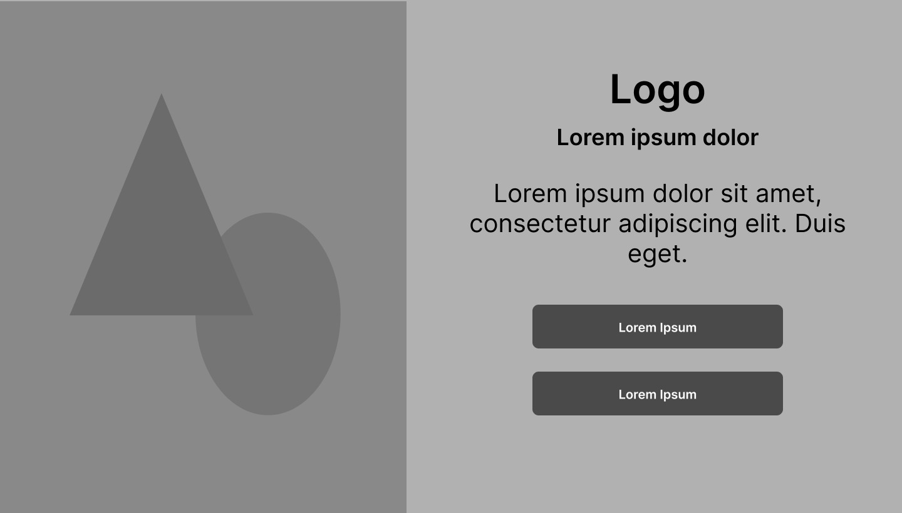

**About the product Section** : Sección donde se presentará información del producto.

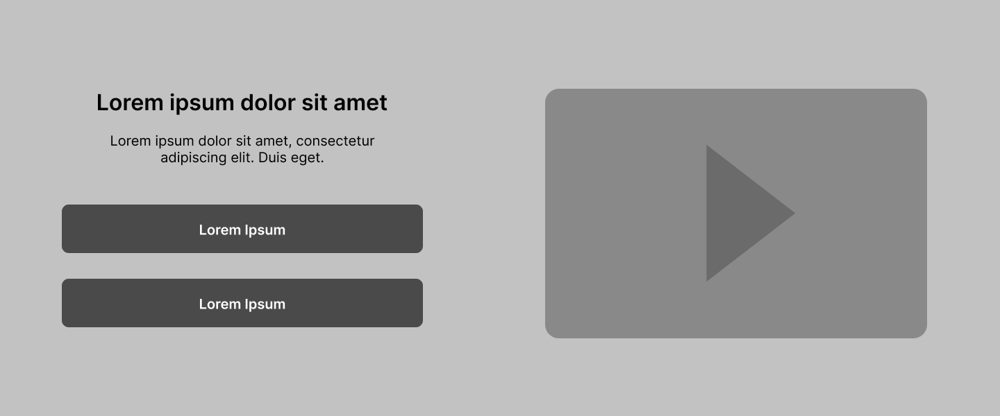

**Functionalities Section**: Sección donde se mostrarán las funcionalidades ofrecidas.

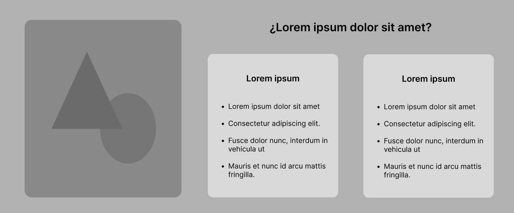

**Benefits Section**: Se mostrarán los beneficios de usar Eventify.

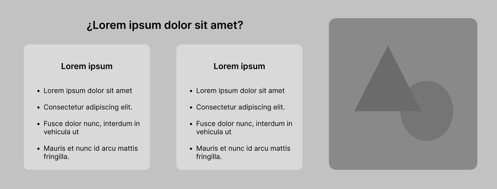

**Plans Section**: Se mostrará información de los planes ofrecidos.

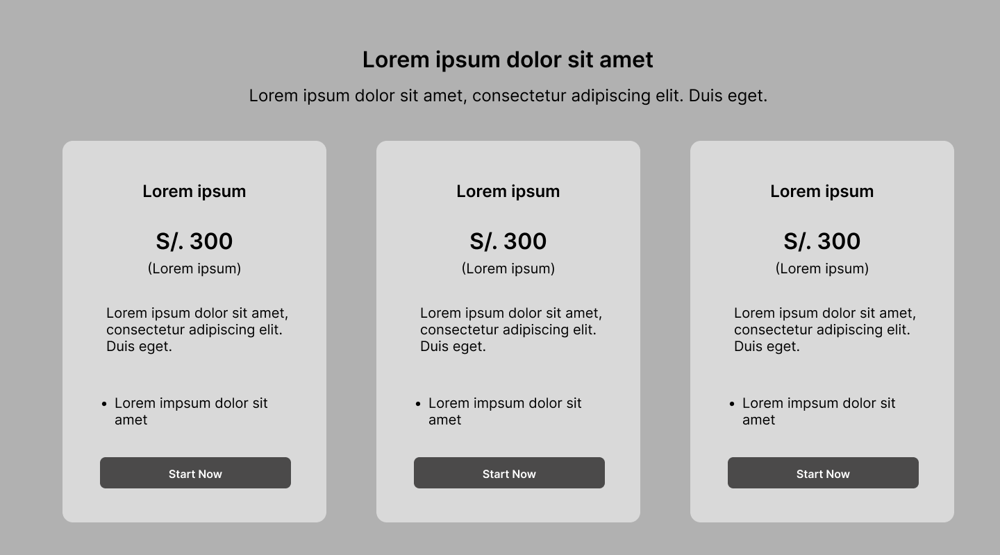

**About us Section**: Sección donde se presentan a los integrantes que desarrollaron Eventify.

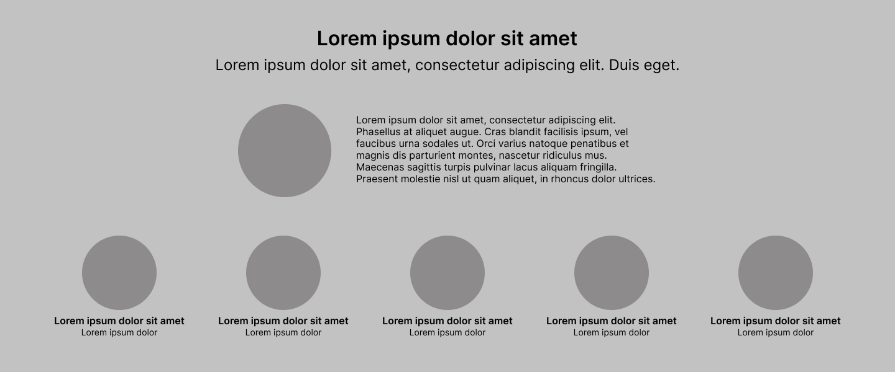

**About the team Section**: Sección que contiene un video donde se resume el proceso del trabajo realizado por el equipo.

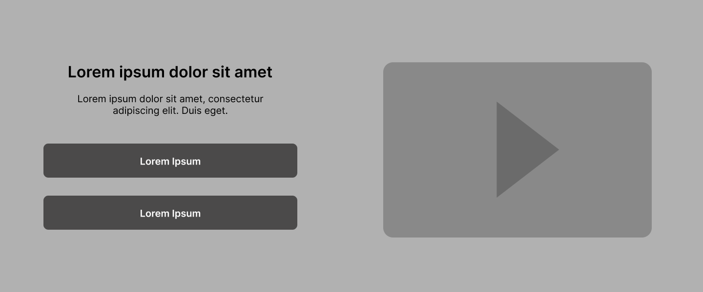

**Footer Section** : Pie de página de la landing page

 

**Mobile Web Browser**

**Header Section**: Encabezado de la landing page.

**Hero Section**: Sección principal de la landing page.

**About the product Section**: Sección donde se presentará información del producto.

**Functionalities Section**: Sección donde se mostrarán las funcionalidades ofrecidas.

**Benefits Section**: Se mostrarán los beneficios de usar Eventify.

**Plans Section**: Se mostrará información de los planes ofrecidos.

**About us Section**: Sección donde se presentan a los integrantes que desarrollaron Eventify.

**About the team Section**: Sección que contiene un video donde se resume el proceso del trabajo realizado por el equipo.

**Footer Section**: Pie de página de la landing page

#### 3.1.3.2. Landing Page Mock-up

En esta sección se muestran los mock-ups del landing page, que sirven como una representación visual de alta fidelidad para anticipar cómo se verá y funcionará la interfaz final. Están diseñados tanto para dispositivos móviles como para escritorio. [Mock Ups - Eventify](https://www.figma.com/design/uPtLATLNkVL8P5xY7wBOc2/Eventify---Landing-page?node-id=0-1&t=yRuZCtcaOfFtQUmB-1)

**Desktop Web Browser**

**Header Section**: Encabezado de la landing page. Donde irán los botones para dirigirse directamente a alguna de las secciones de la landing page

**Hero Section**: Sección principal de la landing page. Dirigido para nuestros dos segmentos objetivos con una imagen referencial.

**About the product Section**: Sección donde se presentará información del producto. Cuenta con un video informativo.

**Functionalities Section**: Sección donde se mostrarán las funcionalidades ofrecidas.

**Benefits Section**: Se mostrarán los beneficios de usar Eventify.

**Plans Section**: Se mostrará información de los planes ofrecidos.

**About us Section**: Sección donde se presentan a los integrantes que desarrollaron Eventify.

**About the team Section**: Sección que contiene un video donde se resume el proceso del trabajo realizado por el equipo.

**Footer Section**: Pie de página de la landing page

 

**Mobile Web Browser**

**Header Section**: Encabezado de la landing page. Donde irán los botones para dirigirse directamente a alguna de las secciones de la landing page

**Hero Section**: Sección principal de la landing page. Dirigido para nuestros dos segmentos objetivos con una imagen referencial.

**About the product Section**: Sección donde se presentará información del producto. Cuenta con un video informativo.

**Functionalities Section**: Sección donde se mostrarán las funcionalidades ofrecidas.

**Benefits Section**: Se mostrarán los beneficios de usar Eventify.

**Plans Section**: Se mostrará información de los planes ofrecidos.

**About us Section**: Sección donde se presentan a los integrantes que desarrollaron Eventify.

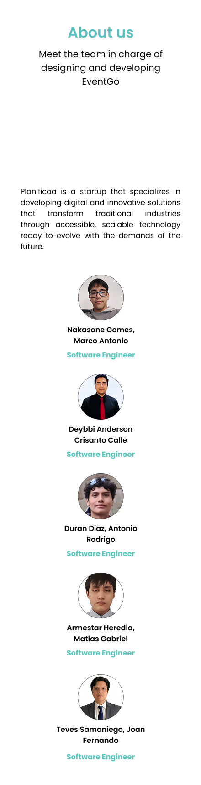

**About the team Section**: Sección que contiene un video donde se resume el proceso del trabajo realizado por el equipo.

**Footer Section**: Pie de página de la landing page

### 3.1.4. Mobile Applications UX/UI Design

Esta sección describe los apartados específicos que detallan la propuesta visual y de interacción de la **Aplicación Móvil** de **Eventify**, los cuales conforman la experiencia del usuario al interactuar con la aplicación. La propuesta tiene como objetivo proporcionar una experiencia fluida, intuitiva y agradable, adaptada a las necesidades tanto de anfitriones como de organizadores de eventos.

#### 3.1.4.1. Mobile Applications Wireframes

Esta sección presenta el diseño de los wireframes para **Eventify**, los cuales permiten planificar la estructura de la interfaz y la navegación antes de comenzar el desarrollo de la aplicación móvil. Los wireframes fueron creados utilizando la herramienta **Figma**, lo que facilitó una elaboración colaborativa y eficiente, permitiendo iterar rápidamente sobre las ideas y estructuras.

#### Segmento Organizadores de Eventos

Para el **Segmento Organizadores de Eventos**, los wireframes se diseñaron con el objetivo de facilitar una experiencia fluida y eficiente, permitiendo a los organizadores gestionar sus eventos y tareas de manera intuitiva.

#### 3.1.4.2. Mobile Applications Wireflow Diagrams

#### 3.1.4.3. Mobile Applications Mock-ups

#### 3.1.4.4. Mobile Applications User Flow Diagrams

#### 3.1.4.5. Mobile Applications Prototyping

