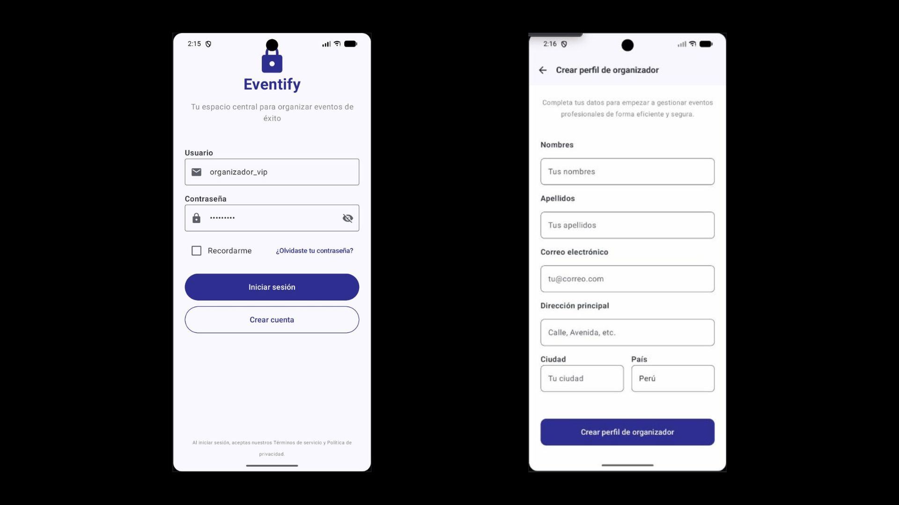
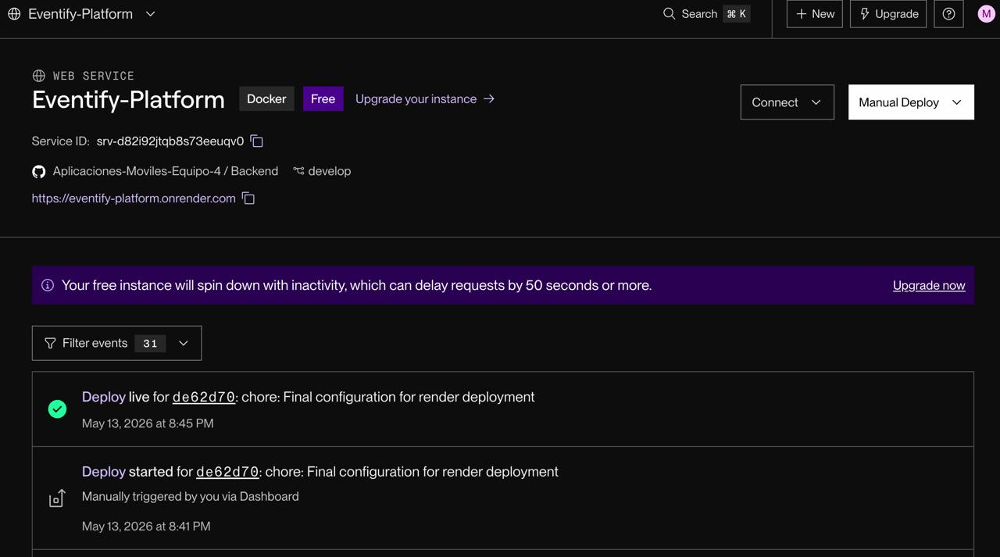
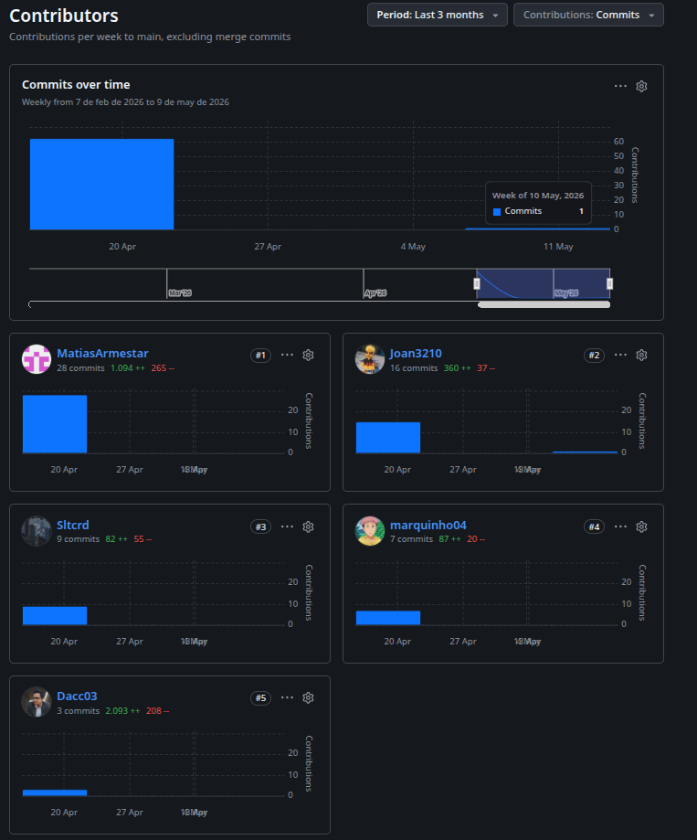
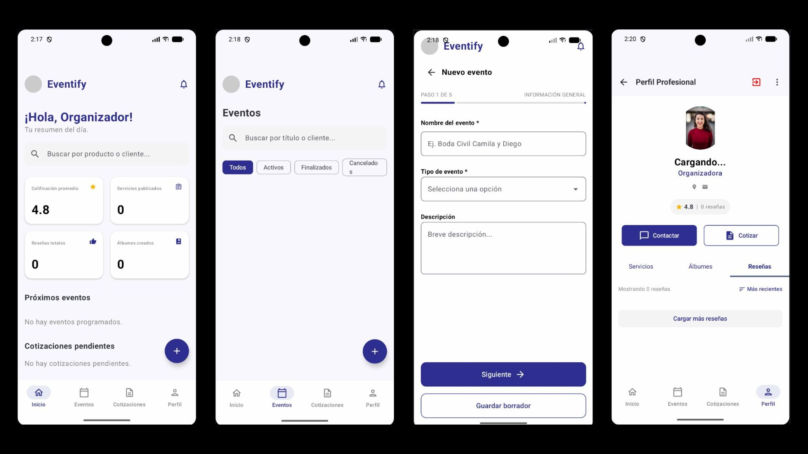
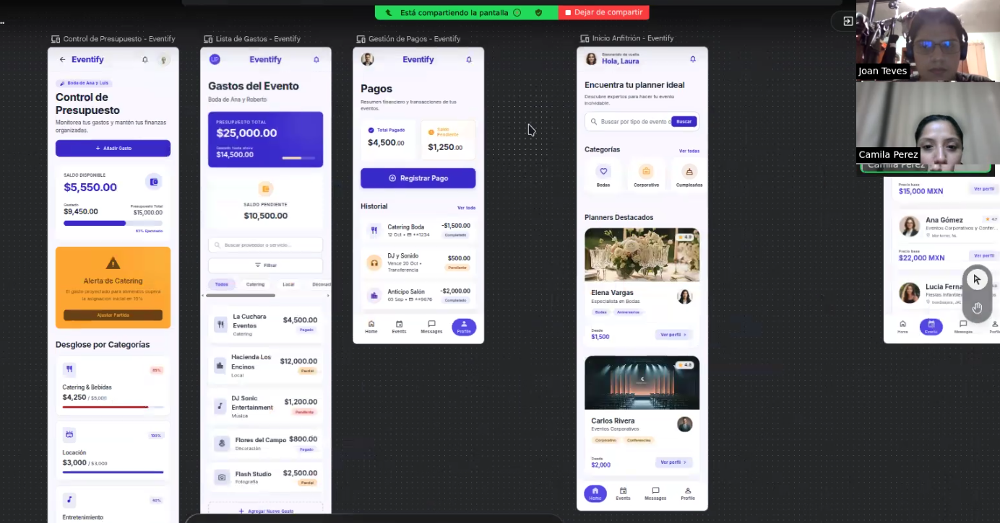

# Capítulo IV: Product Implementation & Validation

## 4.1. Software Configuration Management

En esta sección se describen las herramientas y configuraciones utilizadas para gestionar el desarrollo del software, incluyendo el entorno de desarrollo, el control de versiones, las convenciones de estilo de código y la configuración del despliegue.

### 4.1.1. Software Development Environment Configuration

En esta sección, se incluirá los productos de software que se usaron en el proyecto.

#### Project Management:

* Trello: Herramienta de gestión de proyectos basada en tableros Kanban. Permite organizar tareas, asignar responsabilidades y hacer seguimiento del progreso del proyecto.

#### Product UX/UI Design:

* Figma: Herramienta de diseño colaborativo para crear prototipos, wireframes y diseños de interfaces de usuario.
* Uxpressia: Plataforma para crear mapas de experiencia de usuario, customer journey maps y user personas.
* Visual Paradigm: Herramienta de modelado UML y diseño de arquitectura de software.

#### Software Development:

* Intellij IDEA: Entorno de desarrollo integrado (IDE) para Java, Kotlin y lenguajes basados en JVM.
* Webstorm: IDE para desarrollo web, soporta HTML, CSS, JavaScript y frameworks modernos.
* GitHub: Plataforma de alojamiento de código fuente y control de versiones utilizando Git.
* Visual Studio Code: Editor utilizado únicamente para la exportación del reporte de formato markdown a PDF.

#### Software Deployment:

* GitHub Pages: Servicio de alojamiento web estático proporcionado por GitHub, ideal para desplegar sitios web y documentación.

### 4.1.2. Source Code Management

Para la gestion del código fuente se utilizó GitHub, una plataforma de alojamiento de código fuente y control de versiones utilizando Git.
Se creó un repositorio en la organización de GitHub, donde se almacenó todo el código fuente del proyecto. 
El repositorio se estructuró de la siguiente manera:

* Organización en Github: [https://github.com/Aplicaciones-Moviles-Equipo-4](https://github.com/Aplicaciones-Moviles-Equipo-4)
* Repositorio de el informe: [https://github.com/Aplicaciones-Moviles-Equipo-4/report](https://github.com/Aplicaciones-Moviles-Equipo-4/report)  
* Repositorio de la Landing Page: [https://github.com/Aplicaciones-Moviles-Equipo-4/eventify-landing-page-realtec](https://github.com/Aplicaciones-Moviles-Equipo-4/eventify-landing-page-realtec)
* Repositorio del Frontend: [https://github.com/Aplicaciones-Moviles-Equipo-4/Frontend](https://github.com/Aplicaciones-Moviles-Equipo-4/Frontend)
* Repositorio del Backend: [https://github.com/Aplicaciones-Moviles-Equipo-4/Backend](https://github.com/WASwarm1/Backend)

### 4.1.3. Source Code Style Guide & Conventions

Se adoptaron las siguientes guías y convenciones de estilo de código para asegurar la calidad y consistencia del código fuente, el idioma estándar para el desarrollo fue el **inglés**.

#### Principios generales:

* **Idioma estándar**: Inglés
* **Legibilidad ante todo**: El código debe ser fácil de leer y entender.
* **Consistencia**: Seguir las mismas convenciones en todo el proyecto.
* **Nombres semánticos**: Utilizar nombres descriptivos para variables, funciones y clases. 
Se usan **sustantivos** para clases y **verbos** para funciones.

#### HTML:

* Archivos HTML deben tener la extensión `.html`.
* Se incluye `alt` en todas las imágenes.
* Usar comillas dobles para atributos.
* Usar etiquetas semánticas (`<header>`, `<nav>`, `<main>`, `<footer>`, etc.).

#### CSS:

* Archivos CSS deben tener la extensión `.css`.
* Usar guiones para nombres de clases y IDs (e.g., `.main-header`).
* Se agrupan estilos relacionados y se separan con comentarios.

#### JavaScript:

* Archivos JS deben tener la extensión `.js`.
* Usar camelCase para nombres de variables y funciones.
* Usar `const` y `let` en lugar de `var`.
* Usar funciones flecha y nombres explícitos.
* Los archivos deben tener una unica responsabilidad (Single Responsibility Principle).

#### Java:

* Archivos Java deben tener la extensión `.java`.
* Usar `PascalCase` para nombres de clases, métodos y propiedades.
* Usar `camelCase` para nombres de variables y parámetros.

#### Kotlin:

* Archivos Kotlin deben tener la extensión `.kt`.
* Usar `PascalCase` para nombres de clases, métodos y propiedades.
* Usar `camelCase` para nombres de variables y parámetros.
* Usar Jetpack Compose como kit de desarrollo.
* Usar Material 3.

### 4.1.4. Software Deployment Configuration

En esta sección se describen las configuraciones y herramientas utilizadas para el despliegue del software desarrollado.
El objetivo es asegurar que el proceso de despliegue sea eficiente, automatizado y confiable.

#### Despliegue de la Landing Page:

La **Landing Page** fue desarrollada utilizando tecnologías web estándar como HTML, CSS y JavaScript. Y fue desplegada utilizando **GitHub Pages**, un servicio de alojamiento web estático proporcionado por GitHub.

#### Pasos para el despliegue:

1. **Creación del repositorio**: Se creó un repositorio en la organización de GitHub llamado `Landing-Page`.
2. **Desarrollo del sitio**: El código fuente de la landing page se desarrolló y organizó en el repositorio.
3. **Configuración de GitHub Pages**: En la configuración del repositorio, se habilitó GitHub Pages seleccionando la rama `main` como fuente.
4. **Despliegue automático**: Cada vez que se realiza un push a la rama `main`, GitHub Pages actualiza automáticamente el sitio web.

**URL de la Landing Page desplegada**: https://aplicaciones-moviles-equipo-4.github.io/eventify-landing-page-realtec/

## 4.2. Landing Page & Mobile Application Implementation

### 4.2.1. Sprint 1

En este primer sprint para el desarrollo móvil, el equipo se enfocó en establecer la arquitectura base de la aplicación en Android utilizando Kotlin y Jetpack Compose. Simultáneamente, se integraron los servicios expuestos por nuestro backend desarrollado en Spring Boot, abarcando los *Bounded Contexts* principales como `iam` (Autenticación), `profiles` (Gestión de perfiles), `planning` (Cotizaciones y Eventos) y `operation` (Reseñas). El objetivo fue lograr una primera versión funcional navegable desde dispositivos móviles que consuma datos reales de nuestra API desplegada.

#### 4.2.1.1. Sprint Planning 1

| Sprint # | Sprint 1 (Mobile Implementation) |
| :--- | :--- |
| **Sprint Planning Background** | Este sprint marca el inicio del desarrollo nativo móvil. Se priorizó la configuración del proyecto en Android Studio bajo Clean Architecture y la conexión mediante Retrofit con los endpoints de Spring Boot previamente desarrollados y documentados. |
| **Date** | 04/05/2026 |
| **Time** | 21:00 horas |
| **Location** | Reunión virtual - Discord |
| **Prepared By** | Joan Fernando Teves Samaniego |
| **Attendees** | - Armestar Heredia, Matias Gabriel   - Crisanto Calle, Deybbi Anderson   - Duran Diaz, Antonio Rodrigo   - Nakasone Gomes, Marco Antonio   - Teves Samaniego, Joan Fernando |
| **Sprint n-1 Review Summary** | Se finalizó la configuración de los bounded contexts del backend (`iam`, `profiles`, `planning`, `operation`), dejando los controladores REST listos para ser consumidos por los clientes. |
| **Sprint n-1 Retrospective Summary**| Se acordó mantener una comunicación constante para asegurar que los DTOs y modelos móviles coincidan perfectamente con los *Resources* (ej. `QuoteResource`, `ProfileResource`, `SocialEventResource`) enviados por el backend. |
| **Sprint Goal & User Stories** | Establecer la arquitectura móvil, implementar la autenticación de usuarios (IAM) y desarrollar las pantallas principales de gestión de perfiles, eventos y bandeja de cotizaciones consumiendo los servicios REST de la plataforma. |
| **Sprint 1 Velocity** | Velocidad de 24 Story Points |
| **Sum of Story Points** | Sprint 1 - 24 Story Points |

#### 4.2.1.2. Sprint Backlog 1

El siguiente backlog refleja la distribución de tareas, enfocándose en la integración del backend con las interfaces móviles construidas en Jetpack Compose para los 5 integrantes del equipo.

| ID | Title | Task ID | Task Title | Description | Estimation (Hours) | Assigned To | Status |
| :---: | :--- | :---: | :--- | :--- | :---: | :--- | :---: |
| US01 | Autenticación de Usuario | TA01 | IAM Mobile Integration | Configurar Retrofit e implementar el login consumiendo `AuthenticationController`. Manejo de JWT Bearer Token. | 4 | Armestar Heredia, Matias Gabriel | Done |
| US02 | Gestión de Cotizaciones | TA02 | QuoteScreen UI & API | Maquetar pantalla de Cotizaciones y conectar con `OrganizerQuotesController` y `QuotesController`. | 5 | Teves Samaniego, Joan Fernando | Done |
| US03 | Visualizar Perfiles | TA03 | Profile UI | Crear la vista de perfiles de organizadores y consumir `ProfilesController` y `ServiceCatalogsController`. | 4 | Crisanto Calle, Deybbi Anderson | Done |
| US04 | Gestión de Eventos | TA04 | Social Events View | Implementar la lista de eventos activos consumiendo `CustomerSocialEventsController` y `SocialEventsController`. | 4 | Duran Diaz, Antonio Rodrigo | Done |
| US05 | Gestión de Reseñas | TA05 | Reviews Integration | Desarrollar la pantalla para visualizar y publicar reseñas conectando con `ReviewsController`. | 4 | Nakasone Gomes, Marco Antonio | Done |
| US06 | Catálogo de Servicios | TA06 | Quote Service Items | Conectar la vista de ítems de servicio dentro de una cotización usando `QuoteServiceItemsController`. | 3 | Teves Samaniego, Joan Fernando | Done |

#### 4.2.1.3. Development Evidence for Sprint Review

A continuación, se detallan los commits más relevantes en el repositorio correspondiente al desarrollo móvil, demostrando la integración con las entidades y ensambladores del backend:

| Repository | Branch | Commit ID | Commit message | Commit Message body | Commit on (date) |
| :--- | :--- | :--- | :--- | :--- | :--- |
| `eventify-mobile` | `feature/planning` | `a1b2c3d` | `feat(planning): implement QuoteScreen mapping QuoteResource from API` | --- | 07/05/2026 |
| `eventify-mobile` | `feature/planning` | `b2c3d4e` | `feat(planning): integrate Retrofit for OrganizerQuotesController endpoints` | --- | 08/05/2026 |
| `eventify-mobile` | `feature/iam` | `c3d4e5f` | `feat(iam): add LoginScreen consuming SignInResource and BearerToken` | --- | 06/05/2026 |
| `eventify-mobile` | `feature/profiles` | `d4e5f6g` | `feat(profile): add ProfileScreen UI fetching from ProfilesContext` | --- | 09/05/2026 |
| `eventify-mobile` | `feature/operation` | `e5f6g7h` | `feat(reviews): add reviews list calling ReviewsController` | --- | 10/05/2026 |

#### 4.2.1.4. Testing Suite Evidence for Sprint Review

Durante este sprint, la validación del software se dividió en dos frentes:
1.  **Backend:** Se ejecutaron las pruebas automatizadas de Spring Boot (`EventifyPlatformApplicationTests.java`) para asegurar que la inyección de dependencias y los contextos (`iam`, `planning`, `profiles`, `operation`) carguen correctamente antes del despliegue.
2.  **Mobile:** Se empleó la herramienta `@Preview` de Jetpack Compose para realizar UI Testing visual de los componentes (Tarjetas de Eventos, Formularios de Login). Adicionalmente, se validaron los contratos de los DTOs (como `CreateQuoteResource`, `AuthenticatedUserResource`) probando las respuestas HTTP con Postman antes de integrarlas con Retrofit.

#### 4.2.1.5. Execution Evidence for Sprint Review

#### 4.2.1.6. Services Documentation Evidence for Sprint Review

La aplicación móvil consume directamente la API construida en Spring Boot. Basado en la arquitectura del backend, estos son los endpoints principales integrados en este sprint documentados en OpenAPI/Swagger:

| Action | End Point | Funciones |
| :--- | :--- | :--- |
| POST | `/api/v1/authentication/sign-in` | Autentica al usuario en la aplicación móvil y devuelve el token JWT (Bearer Token). |
| GET | `/api/v1/organizers/{organizerId}/quotes` | Obtiene la lista completa de cotizaciones de un organizador específico (`OrganizerQuotesController`). |
| GET | `/api/v1/quotes/{quoteId}/service-items` | Recupera el detalle de los servicios incluidos dentro de una cotización (`QuoteServiceItemsController`). |
| GET | `/api/v1/profiles` | Retorna el listado de perfiles públicos de organizadores disponibles en la plataforma (`ProfilesController`). |
| GET | `/api/v1/customers/{customerId}/social-events` | Recupera los eventos sociales registrados vinculados al cliente autenticado (`CustomerSocialEventsController`). |
| POST | `/api/v1/reviews` | Permite enviar una nueva reseña hacia un perfil específico (`ReviewsController`). |

#### 4.2.1.7. Software Deployment Evidence for Sprint Review

* **Backend:** El servicio RESTful en Spring Boot se encuentra desplegado de manera continua en la plataforma **Render**, utilizando la configuración de propiedades de producción (`application-prod.properties`) conectada a una base de datos PostgreSQL en la nube, la cual genera las tablas pluralizadas en `snake_case` (según `SnakeCaseWithPluralizedTablePhysicalNamingStrategy.java`).
* **Mobile:** Se generó el primer artefacto compilado (`app-debug.apk`) desde Android Studio. Este archivo fue distribuido internamente al equipo para realizar las pruebas de integración en dispositivos físicos Android.

**URL del Backend desplegado**: https://eventify-platform.onrender.com/swagger-ui/index.html#/

#### 4.2.1.8. Team Collaboration Insights during Sprint

El trabajo en equipo se gestionó utilizando ramas de características (*feature branches*) en GitHub para evitar conflictos en el código base. La asignación equitativa de los *Bounded Contexts* garantizó que cada desarrollador fuera dueño de una integración vertical desde el endpoint de Spring Boot hasta el `@Composable` en Android.

### 4.2.2. Sprint 2

En el segundo sprint, el equipo se enfocó en mejorar la experiencia móvil a partir de la retroalimentación obtenida en la validación del Sprint 1. Las prioridades fueron reducir la fricción en la revisión de cotizaciones extensas, mejorar la interacción táctil del tablero Kanban, añadir notificaciones para eventos importantes y reforzar los estados de carga, error y sesión dentro de la aplicación.

#### 4.2.2.1. Sprint Planning 2

| Sprint # | Sprint 2 (Mobile UX Improvements & Notifications) |
| :--- | :--- |
| **Sprint Planning Background** | El sprint toma como entrada los hallazgos de la entrevista de validación: exceso de scroll en cotizaciones, controles táctiles pequeños en el tablero Kanban y ausencia de avisos inmediatos sobre cambios relevantes. |
| **Date** | 18/05/2026 |
| **Time** | 21:00 horas |
| **Location** | Reunión virtual - Discord |
| **Prepared By** | Nakasone Gomes, Marco Antonio |
| **Attendees** | - Armestar Heredia, Matias Gabriel   - Crisanto Calle, Deybbi Anderson   - Duran Diaz, Antonio Rodrigo   - Nakasone Gomes, Marco Antonio   - Teves Samaniego, Joan Fernando |
| **Sprint n-2 Review Summary** | Se completó la primera integración móvil con autenticación, perfiles, eventos, cotizaciones, reseñas y catálogo de servicios consumiendo la API de Eventify. |
| **Sprint n-2 Retrospective Summary**| Se identificó la necesidad de diseñar componentes móviles más eficientes para pantallas con mucha información y de validar tempranamente los tamaños táctiles de botones, tarjetas y acciones principales. |
| **Sprint Goal & User Stories** | Optimizar la gestión móvil de cotizaciones y tareas, incorporar notificaciones de cambios relevantes y mejorar la confiabilidad de la sesión y de las respuestas de red. |
| **Sprint 2 Velocity** | Velocidad de 28 Story Points |
| **Sum of Story Points** | Sprint 2 - 28 Story Points |

#### 4.2.2.2. Sprint Backlog 2

El backlog del Sprint 2 prioriza mejoras funcionales y de usabilidad sobre la primera versión móvil, manteniendo la integración con los servicios REST de la plataforma.

| ID | Title | Task ID | Task Title | Description | Estimation (Hours) | Assigned To | Status |
| :---: | :--- | :---: | :--- | :--- | :---: | :--- | :---: |
| US07 | Cotizaciones agrupadas | TA07 | Collapsible Quote Details | Agrupar los ítems de cotización por categoría y presentarlos en secciones desplegables para reducir el scroll. | 5 | Armestar Heredia, Matias Gabriel | Done |
| US08 | Gestión táctil de tareas | TA08 | Kanban Swipe Actions | Rediseñar el tablero Kanban para permitir cambios de estado mediante gestos de deslizamiento y botones con tamaño mínimo recomendado.| 6 | Teves Samaniego, Joan Fernando | Done |
| US09 | Notificaciones móviles | TA09 | Push Notifications Setup | Implementar notificaciones para cotizaciones aprobadas, pagos pendientes y cambios de estado de eventos. | 6 | Crisanto Calle, Deybbi Anderson | Done |
| US10 | Contacto rápido | TA10 | WhatsApp Contact Action | Añadir acceso directo a WhatsApp desde el perfil del organizador cuando exista un número de contacto registrado. | 3| Duran Diaz, Antonio Rodrigo | Done |
| US11 | Manejo de sesión | TA11 | Token Refresh & Logout States | Mejorar el manejo de token expirado, cierre de sesión y redirección segura hacia login. | 4 | Nakasone Gomes, Marco Antonio | Done |
| US12 | Estados de red | TA12 | Loading and Error UI States | Incorporar pantallas de carga, retry y mensajes de error en cotizaciones, eventos y perfiles. | 4 | Teves Samaniego, Joan Fernando | Done |

#### 4.2.2.3. Development Evidence for Sprint Review

A continuación, se detallan los commits más relevantes en el repositorio correspondiente al desarrollo móvil, demostrando la integración con las entidades y ensambladores del backend:

| Repository | Branch | Commit ID | Commit message | Commit Message body | Commit on (date) |
| :--- | :--- | :--- | :--- | :--- | :--- |
| `eventify-mobile` | `feature/quotes-ux` | `f7a8b9c` | `feat(planning): add collapsible quote service groups` | --- | 20/05/2026 |
| `eventify-mobile` | `feature/kanban-touch` | `a8b9c0d` | `feat(tasks): implement swipe actions for kanban board` | --- | 21/05/2026 |
| `eventify-mobile` | `feature/notifications` | `b9c0d1e` | `feat(notifications): add local and remote notification handlers` | --- | 22/05/2026 |
| `eventify-mobile` | `feature/profile-contact` | `c0d1e2f` | `feat(profiles): add WhatsApp quick contact action` | --- | 23/05/2026 |
| `eventify-mobile` | `feature/session-states` | `d1e2f3g` | `fix(iam): handle expired token and retry states` | --- | 24/05/2026 |

#### 4.2.2.4. Testing Suite Evidence for Sprint Review

Durante este sprint se realizaron pruebas manuales de regresión en Android Studio y pruebas de integración con la API desplegada. Se validaron los siguientes escenarios:

1. Inicio de sesión exitoso, expiración de token y redirección al login.
2. Visualización de cotizaciones con múltiples servicios agrupados por categoría.
3. Cambio de estado de tareas mediante gestos táctiles en el tablero Kanban.
4. Recepción y visualización de notificaciones asociadas a cotizaciones, pagos y eventos.
5. Respuesta de la interfaz ante errores de red, respuestas vacías y reintentos.

#### 4.2.2.5. Execution Evidence for Sprint Review

#### 4.2.2.6. Services Documentation Evidence for Sprint Review

La aplicación móvil consume directamente la API construida en Spring Boot. Basado en la arquitectura del backend, estos son los endpoints principales integrados en este sprint documentados en OpenAPI/Swagger:

| Action | End Point | Funciones |
| :--- | :--- | :--- |
| GET | `/api/v1/quotes/{quoteId}/service-items` | Recupera los ítems de una cotización para agruparlos por categoría en la aplicación móvil. |
| PATCH | `/api/v1/tasks/{taskId}/status` | Actualiza el estado de una tarea desde el tablero Kanban móvil. |
| GET | `/api/v1/notifications` | Obtiene el historial de notificaciones del usuario autenticado. |
| POST | `/api/v1/notifications/device-tokens` | Registra el token del dispositivo para recibir notificaciones móviles. |
| GET | `/api/v1/profiles/{profileId} ` | Obtiene datos de contacto del organizador para habilitar acciones rápidas desde el perfil. |

#### 4.2.2.7. Software Deployment Evidence for Sprint Review

* **Backend:** Se mantuvo el despliegue en Render y se verificó la disponibilidad de los endpoints relacionados con notificaciones, tareas y cotizaciones desde Swagger.
* **Mobile:** Se generó un nuevo artefacto app-debug-sprint-2.apk para validación interna. La compilación incluyó las mejoras de UX, manejo de sesión y módulos de notificaciones.

#### 4.2.2.8. Team Collaboration Insights during Sprint

El trabajo en equipo se gestionó utilizando ramas de características (*feature branches*) en GitHub para evitar conflictos en el código base. La asignación equitativa de los *Bounded Contexts* garantizó que cada desarrollador fuera dueño de una integración vertical desde el endpoint de Spring Boot hasta el `@Composable` en Android.

### 4.2.3. Sprint 3

#### 4.2.3.1. Sprint Planning 3

#### 4.2.3.2. Sprint Backlog 3

#### 4.2.3.3. Development Evidence for Sprint Review

#### 4.2.3.4. Testing Suite Evidence for Sprint Review

#### 4.2.3.5. Execution Evidence for Sprint Review

#### 4.2.3.6. Services Documentation Evidence for Sprint Review

#### 4.2.3.7. Software Deployment Evidence for Sprint Review

#### 4.2.3.8. Team Collaboration Insights during Sprint

## 4.3. Validation Interviews

### 4.3.1. Diseño de Entrevistas

A continuación se presentan las preguntas de validación utilizadas para las entrevistas con usuarios. El objetivo es evaluar tanto la landing page como la aplicación móvil de Eventify para asegurar que la experiencia de navegación sea clara, coherente y útil para quienes organizan y gestionan eventos desde sus dispositivos.

**Preguntas sobre la Landing Page**
*   ¿Al ingresar a la landing page, entiendes rápidamente qué es Eventify y a quién está dirigido?
*   ¿La información sobre las funcionalidades de la plataforma te resulta clara y atractiva?
*   ¿El diseño visual (colores, imágenes, tipografías) te transmite confianza y profesionalismo?
*   ¿Consideras que la estructura de la landing page está bien organizada y fácil de navegar?
*   ¿Te motivaría registrarte o saber más sobre Eventify luego de explorar la landing page?

**Preguntas sobre la Aplicación Móvil**
*   ¿Nota coherencia visual y funcional entre las distintas secciones (perfil, eventos, cotizaciones) desde la pantalla de su dispositivo móvil?
*   ¿El proceso de revisión y gestión de las cotizaciones le resulta intuitivo con la interacción táctil?
*   ¿Cómo evalúa la longitud y distribución de la información en las pantallas (ej. mucho *scroll*)?
*   ¿El tablero de tareas (Kanban) le ayuda a organizar su flujo de trabajo? ¿Es fácil cambiar el estado de las tareas?
*   ¿La velocidad de carga y transición entre las pantallas de la aplicación cumple sus expectativas?
*   ¿Qué funcionalidades adicionales agregaría para mejorar la experiencia general al usar la aplicación móvil?

### 4.3.2. Registro de Entrevistas

Para validar la usabilidad y la experiencia de usuario (UX) de la aplicación móvil de Eventify, se realizó una sesión de pruebas con un usuario representativo del público objetivo (perfil de anfitriona/organizadora junior). A continuación, se presenta el registro formal de la entrevista, omitiendo la transcripción coloquial para enfocarnos en los hallazgos técnicos.

**Ficha Técnica del Usuario**
*   **Nombre:** Camila Pérez
*   **Edad:** 25 años
*   **Ocupación:** Estudiante de Negocios Internacionales (USIL).
*   **Rol en la prueba:** Usuario de prueba (Tester UX/UI).
*   **Dispositivo utilizado:** Smartphone Android (Pantalla de 6.1 pulgadas).
*   **Fecha de la sesión:** 13 de mayo de 2026.

**Evidencia de la Entrevista**
A continuación se adjunta la captura de la sesión de validación y el enlace a la grabación correspondiente:

*   **Enlace de la grabación:** [https://tinyurl.com/Entrevista1Camila]

**Resumen de Hallazgos y Respuestas Obtenidas**
El usuario interactuó con la versión móvil de Eventify durante 15 minutos, enfocándose en las vistas de Mis Eventos, Estado Financiero (Cotizaciones) y el tablero de Tareas. 

1.  **Impresión visual y coherencia:** La usuaria destacó que la aplicación tiene una apariencia profesional, formal y moderna. Los colores y el diseño le transmitieron la sensación de ser una herramienta de negocios seria, ideal para la organización de eventos corporativos.
2.  **Gestión de Cotizaciones (Navegación y Scroll):** Encontró que las tarjetas de montos y los botones de acción ("Pagar", "Revisar") tienen un tamaño adecuado. Sin embargo, observó que cuando una cotización incluye múltiples servicios, la pantalla exige un exceso de desplazamiento (*scroll*). Sugirió agrupar los gastos por categorías (ej. catering, logística) para compactar la vista.
3.  **Tablero Kanban y Ergonomía Táctil:** Aunque el concepto visual del tablero le resultó muy útil para organizar el flujo de trabajo, reportó dificultades en la interacción táctil. Los botones/flechas para mover una tarea de "Pendiente" a "En progreso" resultaron demasiado pequeños (touch target deficiente), requiriendo varios toques. Sugirió implementar gestos de deslizamiento (*swipe*) para cambiar los estados de manera más natural.
4.  **Funcionalidades adicionales:** Solicitó la inclusión de notificaciones emergentes (*push notifications*) dentro de la app para avisos en tiempo real (ej. cuando se aprueba una cotización). Además, recomendó añadir un botón de contacto directo a WhatsApp en el perfil del organizador para agilizar la comunicación.
5.  **Rendimiento:** Destacó positivamente la velocidad de carga y la fluidez de las transiciones entre pantallas, sin experimentar bloqueos.

### 4.3.3. Evaluaciones según heurísticas

A partir del registro de la entrevista con Camila Pérez, se realizó una evaluación aplicando las Heurísticas de Usabilidad de Jakob Nielsen enfocadas en entornos móviles:

*   **Heurística 8: Diseño estético y minimalista (Aprobado):** La interfaz cumple satisfactoriamente con esta heurística. El usuario percibió un diseño limpio, profesional y sin información irrelevante que compita por su atención.
*   **Heurística 7: Flexibilidad y eficiencia de uso (Oportunidad de Mejora):** La necesidad de hacer un *scroll* excesivo en cotizaciones largas afecta la eficiencia. Se tomará la recomendación del usuario de agrupar los ítems por categorías (Acordeones o *Collapsibles*) para mejorar la navegación de usuarios expertos.
*   **Heurística 4: Consistencia y estándares (Aprobado / Observación táctil):** Aunque visualmente es consistente, el estándar de aplicaciones móviles dicta que las acciones de mover elementos en un tablero (Kanban) se realicen mediante gestos táctiles (*Drag and Drop* o *Swipe*). Los botones direccionales pequeños violan los principios de diseño de interacción táctil (Touch Targets de al menos 48x48 dp), por lo que este componente será rediseñado.
*   **Heurística 1: Visibilidad del estado del sistema (Oportunidad de Mejora):** La falta de notificaciones en tiempo real al aprobarse una cotización deja al usuario sin retroalimentación inmediata si se encuentra en otra pantalla. Se planificará la integración de notificaciones *Push* o *Snackbars* globales.

## Conclusiones

### Conclusiones Y Recomendaciones

El desarrollo de los Capítulos I y II ha permitido establecer una base sólida para la comprensión del problema, el contexto de la startup y la definición de la solución propuesta. A través del análisis inicial, se logró identificar claramente la problemática, los antecedentes y los segmentos objetivo, lo cual facilita una orientación estratégica adecuada del producto.

Asimismo, la aplicación del enfoque Lean UX permitió estructurar hipótesis, supuestos y propuestas de valor centradas en el usuario, promoviendo una visión iterativa y validable del desarrollo. En el Capítulo II, el levantamiento de información mediante entrevistas y técnicas de needfinding contribuyó a comprender mejor las necesidades reales de los usuarios, traduciéndose en artefactos clave como user personas, user journeys y empathy maps.

Se recomienda continuar con procesos de validación constante con usuarios reales, de manera que las hipótesis planteadas en Lean UX puedan confirmarse o ajustarse oportunamente. Esto permitirá mejorar la calidad del producto y su adecuación al mercado.

### Video App Validation

### Video About the product

### Video About the team

## Glosario

## Bibliografía

## Anexos
