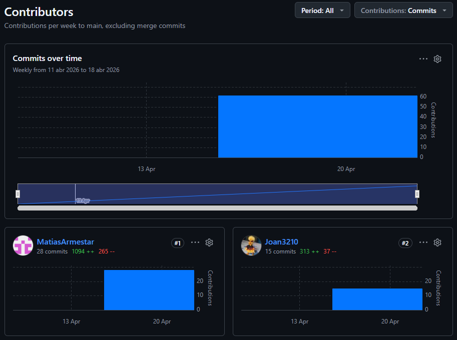
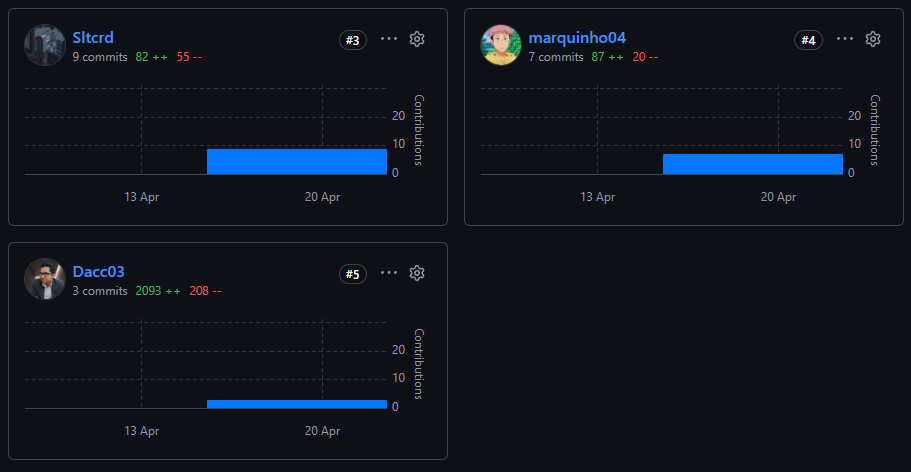

<h3>Universidad Peruana de Ciencias Aplicadas</h3>
<h4>Carrera de Ingeniería de Software</h4>
<h4>Periodo 202610</h4>
<h4>Curso: 1ACC0238 Aplicaciones para Dispositivos Móviles</h4>
<h4>NRC 3687</h4>
<h4>Docente: Quevedo Velasco, David Gerardo</h4>
<h4>Informe de Trabajo Final</h4>
<h4>Startup: RealTec</h4>
<h4>Producto: OrganiX</h4>

 

<h3 style="text-align: center;">Team members:</h3>

<table style="margin: 0 auto; text-align: center;">
  <thead>
    <tr>
      <th>Código</th>
      <th>Nombre</th>
    </tr>
  </thead>
  <tbody>
    <tr>
      <td>U20221A553</td>
      <td>Armestar Heredia, Matias Gabriel</td>
    </tr>
    <tr>
      <td>U202120569</td>
      <td>Crisanto Calle, Deybbi Anderson</td>
    </tr>
    <tr>
      <td>U202215721</td>
      <td>Duran Diaz, Antonio Rodrigo</td>
    </tr>
    <tr>
      <td>U202210790</td>
      <td>Nakasone Gomes, Marco Antonio</td>
    </tr>
    <tr>
      <td>U202117303</td>
      <td>Teves Samaniego, Joan Fernando</td>
    </tr>
  </tbody>
</table>

 
<h4 style="text-align: center;">Abril 2026</h4>

## Registro de Versiones del Informe

| Versión | Fecha       | Autor                                                                                                   | Descripción de modificación |
|---------|------------|---------------------------------------------------------------------------------------------------------|-----------------------------|
| **0.1** | 20/04/2026 | Matias Armestar | Creación de estructura principal del informe y desarrollo del capítulo 1 |
| **0.2** | 23/04/2026 | Antonio Duran | Se agregaron mejoras y correciones del capítulo 1 y carátula |
| **0.3** | 23/04/2026 | Deybbi crisanto | Se agregó Entrevistas, Competidores, Needfinding y Requirements specification |
| **0.4** | 23/04/2026 | Marco Nakasone | Se agregaron las secciones para el Strategic-Level Domain-Driven Design, EventStorming y Context Mapping |
| **0.5** | 23/04/2026 | Joan Teves | Se agregaron las secciones del Tactical-Level Domain-Driven Design, Bounded Context |

## Project Report Collaboration Insights

A continuación, se detalla el proceso de elaboración del informe para cada entrega, junto con capturas de pantalla que muestran los análisis de colaboración y commits en GitHub para el repositorio del informe:

**URL de la Organización:** https://github.com/Aplicaciones-Moviles-Equipo-4  
**URL del Repositorio del Informe:**  https://github.com/Aplicaciones-Moviles-Equipo-4/report

### Primer Hito: AV1

En esta primera entrega se desrrollaron los primeros avances del informe, abarcando el Capítulo 1: Presentación y Capítulo 2: Requirements Development and Software Solution Design.
Con el fin de evidenciar los avances realizados y demostrar la participación activa de todos los miembros del equipo en la elaboración del informe, se presentan a continuación las capturas obtenidas desde los analíticos de colaboración del repositorio GitHub del proyecto.

## Contributors

En la sección de Contributors se puede visualizar la participación individual de cada integrante del equipo en la redacción del informe correspondiente a este priemr hito. El registro muestra la cantidad de commits efectuados por cada miembro, así como el número de adiciones y eliminaciones realizadas en el documento, reflejando el nivel de contribución y trabajo colaborativo del equipo.

# Contenido

## Tabla de contenidos

### [Capítulo I: Presentación](#capítulo-i-presentación)
- [1.1. Startup Profile](#11-startup-profile)
  - [1.1.1 Descripción de la Startup](#111-descripción-de-la-startup)
  - [1.1.2 Perfiles de integrantes del equipo](#112-perfiles-de-integrantes-del-equipo)
- [1.2 Solution Profile](#12-solution-profile)
  - [1.2.1 Antecedentes y problemática](#121-antecedentes-y-problemática)
  - [1.2.2 Lean UX Process](#122-lean-ux-process)
    - [1.2.2.1. Lean UX Problem Statements](#1221-lean-ux-problem-statements)
    - [1.2.2.2. Lean UX Assumptions](#1222-lean-ux-assumptions)
    - [1.2.2.3. Lean UX Hypothesis Statements](#1223-lean-ux-hypothesis-statements)
    - [1.2.2.4. Lean UX Canvas](#1224-lean-ux-canvas)
- [1.3. Segmentos objetivo](#13-segmentos-objetivo)

### [Capítulo II: Requirements Development and Software Solution Design](#capítulo-ii-requirements-development-and-software-solution-design)
- [2.1. Competidores](#21-competidores)
  - [2.1.1. Análisis competitivo](#211-análisis-competitivo)
  - [2.1.2. Estrategias y tácticas frente a competidores](#212-estrategias-y-tácticas-frente-a-competidores)
- [2.2. Entrevistas](#22-entrevistas)
  - [2.2.1. Diseño de entrevistas](#221-diseño-de-entrevistas)
  - [2.2.2. Registro de entrevistas](#222-registro-de-entrevistas)
  - [2.2.3. Análisis de entrevistas](#223-análisis-de-entrevistas)
- [2.3. Needfinding](#23-needfinding)
  - [2.3.1. User Personas](#231-user-personas)
  - [2.3.2. User Task Matrix](#232-user-task-matrix)
  - [2.3.3. User Journey Mapping](#233-user-journey-mapping)
  - [2.3.4. Empathy Mapping](#234-empathy-mapping)
  - [2.3.5. Big Picture Event Storming](#235-big-picture-event-storming)
  - [2.3.6. Ubiquitous Language](#236-ubiquitous-language)
- [2.4. Requirements specification](#24-requirements-specification)
  - [2.4.1. User Stories](#241-user-stories)
  - [2.4.2. Impact Mapping](#242-impact-mapping)
  - [2.4.3. Product Backlog](#243-product-backlog)
- [2.5. Strategic-Level Domain-Driven Design](#25-strategic-level-domain-driven-design)
  - [2.5.1. Event Storming](#251-event-storming)
    - [2.5.1.1. Candidate Context Discovery](#2511-candidate-context-discovery)
    - [2.5.1.2. Domain Message Flows Modeling](#2512-domain-message-flows-modeling)
    - [2.5.1.3. Bounded Context Canvases](#2513-bounded-context-canvases)
  - [2.5.2. Context Mapping](#252-context-mapping)
  - [2.5.3. Software Architecture](#253-software-architecture)
    - [2.5.3.1. Software Architecture Context Level Diagrams](#2531-software-architecture-context-level-diagrams)
    - [2.5.3.2. Software Architecture Container Level Diagrams](#2532-software-architecture-container-level-diagrams)
    - [2.5.3.3. Software Architecture Deployment Diagrams](#2533-software-architecture-deployment-diagrams)
- [2.6. Tactical-Level Domain-Driven Design](#26-tactical-level-domain-driven-design)
  - [2.6.1. Bounded Context: IAM (Identity and Access Management)](#261-bounded-context-iam-identity-and-access-management)
    - [2.6.1.1. Domain Layer](#2611-domain-layer)
    - [2.6.1.2. Interface Layer](#2612-interface-layer)
    - [2.6.1.3. Application Layer](#2613-application-layer)
    - [2.6.1.4. Infrastructure Layer](#2614-infrastructure-layer)
    - [2.6.1.5. Bounded Context Software Architecture Component Level Diagrams](#2615-bounded-context-software-architecture-component-level-diagrams)
    - [2.6.1.6. Bounded Context Software Architecture Code Level Diagrams](#2616-bounded-context-software-architecture-code-level-diagrams)
        - [2.6.1.6.1. Bounded Context Domain Layer Class Diagrams](#26161-bounded-context-domain-layer-class-diagrams)
        - [2.6.1.6.2. Bounded Context Database Design Diagram](#26162-bounded-context-database-design-diagram)
  - [2.6.2. Bounded Context: Event Design and Planning](#262-bounded-context-event-design-and-planning)
    - [2.6.2.1. Domain Layer](#2621-domain-layer)
    - [2.6.2.2. Interface Layer](#2622-interface-layer)
    - [2.6.2.3. Application Layer](#2623-application-layer)
    - [2.6.2.4. Infrastructure Layer](#2624-infrastructure-layer)
    - [2.6.2.5. Bounded Context Software Architecture Component Level Diagrams](#2625-bounded-context-software-architecture-component-level-diagrams)
    - [2.6.2.6. Bounded Context Software Architecture Code Level Diagrams](#2626-bounded-context-software-architecture-code-level-diagrams)
        - [2.6.2.6.1. Bounded Context Domain Layer Class Diagrams](#26261-bounded-context-domain-layer-class-diagrams)
        - [2.6.2.6.2. Bounded Context Database Design Diagram](#26262-bounded-context-database-design-diagram)
  - [2.6.3. Bounded Context: Communication](#263-bounded-context-communication)
    - [2.6.3.1. Domain Layer](#2631-domain-layer)
    - [2.6.3.2. Interface Layer](#2632-interface-layer)
    - [2.6.3.3. Application Layer](#2633-application-layer)
    - [2.6.3.4. Infrastructure Layer](#2634-infrastructure-layer)
    - [2.6.3.5. Bounded Context Software Architecture Component Level Diagrams](#2635-bounded-context-software-architecture-component-level-diagrams)
    - [2.6.3.6. Bounded Context Software Architecture Code Level Diagrams](#2636-bounded-context-software-architecture-code-level-diagrams)
        - [2.6.3.6.1. Bounded Context Domain Layer Class Diagrams](#26361-bounded-context-domain-layer-class-diagrams)
        - [2.6.3.6.2. Bounded Context Database Design Diagram](#26362-bounded-context-database-design-diagram)

### [Capítulo III: Solution UI/UX Design](#capítulo-iii-solution-uiux-design)
- [3.1. Product design](#31-product-design)
  - [3.1.1. Style Guidelines](#311-style-guidelines)
    - [3.1.1.1. General Style Guidelines](#3111-general-style-guidelines)
  - [3.1.2. Information Architecture](#312-information-architecture)
    - [3.1.2.1. Organization Systems](#3121-organization-systems)
    - [3.1.2.2. Labelling Systems](#3122-labelling-systems)
    - [3.1.2.3. SEO Tags and Meta Tags](#3123-seo-tags-and-meta-tags)
    - [3.1.2.4. Searching Systems](#3124-searching-systems)
    - [3.1.2.5. Navigation Systems](#3125-navigation-systems)
  - [3.1.3. Landing Page UI Design](#313-landing-page-ui-design)
    - [3.1.3.1. Landing Page Wireframe](#3131-landing-page-wireframe)
    - [3.1.3.2. Landing Page Mock-up](#3132-landing-page-mock-up)
  - [3.1.4. Mobile Applications UX/UI Design](#314-mobile-applications-uxui-design)
    - [3.1.4.1. Mobile Applications Wireframes](#3141-mobile-applications-wireframes)
    - [3.1.4.2. Mobile Applications Wireflow Diagrams](#3142-mobile-applications-wireflow-diagrams)
    - [3.1.4.3. Mobile Applications Mock-ups](#3143-mobile-applications-mock-ups)
    - [3.1.4.4. Mobile Applications User Flow Diagrams](#3144-mobile-applications-user-flow-diagrams)
    - [3.1.4.5. Mobile Applications Prototyping](#3145-mobile-applications-prototyping)

### [Capítulo IV: Product Implementation & Validation](#capítulo-iv-product-implementation--validation)
- [4.1. Software Configuration Management](#41-software-configuration-management)
  - [4.1.1. Software Development Environment Configuration](#411-software-development-environment-configuration)
  - [4.1.2. Source Code Management](#412-source-code-management)
  - [4.1.3. Source Code Style Guide & Conventions](#413-source-code-style-guide--conventions)
  - [4.1.4. Software Deployment Configuration](#414-software-deployment-configuration)
- [4.2. Landing Page & Mobile Application Implementation](#42-landing-page--mobile-application-implementation)
  - [4.2.1. Sprint n](#421-sprint-n)
    - [4.2.1.1. Sprint Planning n](#4211-sprint-planning-n)
    - [4.2.1.2. Sprint Backlog n](#4212-sprint-backlog-n)
    - [4.2.1.3. Development Evidence for Sprint Review](#4213-development-evidence-for-sprint-review)
    - [4.2.1.4. Testing Suite Evidence for Sprint Review](#4214-testing-suite-evidence-for-sprint-review)
    - [4.2.1.5. Execution Evidence for Sprint Review](#4215-execution-evidence-for-sprint-review)
    - [4.2.1.6. Services Documentation Evidence for Sprint Review](#4216-services-documentation-evidence-for-sprint-review)
    - [4.2.1.7. Software Deployment Evidence for Sprint Review](#4217-software-deployment-evidence-for-sprint-review)
    - [4.2.1.8. Team Collaboration Insights during Sprint](#4218-team-collaboration-insights-during-sprint)
- [4.3. Validation Interviews](#43-validation-interviews)
  - [4.3.1. Diseño de Entrevistas](#431-diseño-de-entrevistas)
  - [4.3.2. Registro de Entrevistas](#432-registro-de-entrevistas)
  - [4.3.3. Evaluaciones según heurísticas](#433-evaluaciones-según-heurísticas)

### [Conclusiones](#conclusiones)
- [Conclusiones y recomendaciones](#conclusiones-y-recomendaciones)
- [Video App Validation](#video-app-validation)
- [Video About the product](#video-about-the-product)
- [Video About the team](#video-about-the-team)

### [Glosario](#glosario)
### [Bibliografía](#bibliografia)
### [Anexos](#anexos)

## Student Outcome

El curso contribuye al cumplimiento del Student Outcome ABET: **ABET – EAC - Student Outcome 7**   Criterio: _La capacidad de adquirir y aplicar nuevos conocimientos según sea necesario, utilizando estrategias de aprendizaje apropiadas._

En el siguiente cuadro se describe las acciones realizadas y enunciados de conclusiones por parte del grupo, que permiten sustentar el haber alcanzado el logro del ABET – EAC - Student Outcome 7.

| **Criterio específico** | **Acciones realizadas** | **Conclusiones** |
|--------------------------|----------------------------------------------------------------------------------------------------------------------------------------------------------------------------------------------------------------------------------------------------------------------------------------------------------------------------------------------------------------------------------------------------------------------------------------------------------------------------------------------------------------------------------------------------------------------------------------------------------------------------------------------------------------------------------------------------------------------------------------------------------------------------------------------------------------------------------------------------------------------------------------------------------------------------------------------------------------------------------------------------------------------------------------------------------------------------------------------------------------------------------------------------------------------------------------------------------------------------------|------------------|
| Actualiza conceptos y conocimientos necesarios para su desarrollo profesional y en especial para su proyecto en soluciones de software. | **AV1:**  • **Armestar Heredia, Matias Gabriel:** Durante el desarrollo de esta primera entrega pude conocer nuevos formatos de distintos aspectos de la presente documentación, para luego coordinar su correcto uso en coordinación con los demás integrantes del equipo.  • **Crisanto Calle, Deybbi Anderson:** Actualicé y apliqué conceptos clave de ingeniería de software como el modelado de User Stories bajo enfoque ágil, la definición de Acceptance Criteria en formato Gherkin y la estructuración de épicas, historias de usuario y technical stories. Asimismo, reforcé conocimientos en diseño de APIs RESTful, modelado de requerimientos y organización del backlog, alineando estos elementos con la arquitectura del sistema para el desarrollo de soluciones de software.  • **Duran Diaz, Antonio Rodrigo:** Para este avance del primer hito he vuelto a aplicar conceptos y conocimientos útiles para su desarrollo.  • **Nakasone Gomes, Marco Antonio:** Apliqué conceptos de Domain-Driven Design (DDD) a nivel estratégico, desarrollando EventStorming para el análisis del dominio, modelando flujos de mensajes y definiendo Bounded Contexts. Además, elaboré el Context Mapping y los diagramas de arquitectura (contexto, contenedores y despliegue).  • **Teves Samaniego, Joan Fernando:** Investigué y apliqué conceptos avanzados de Domain-Driven Design y Clean Architecture para estructurar correctamente los Bounded Contexts del proyecto. Además, actualicé mis conocimientos en el modelado de bases de datos y la definición de componentes de software, elementos fundamentales para asegurar la escalabilidad técnica de nuestras soluciones. | **AV1:**  El equipo ha demostrado capacidad para investigar, adquirir y aplicar nuevos conocimientos técnicos y metodológicos, adaptándose a los requerimientos arquitectónicos del proyecto. Se evidencia un compromiso colectivo con el aprendizaje continuo como pilar fundamental para el desarrollo de soluciones de software escalables y de calidad. |
| Reconoce la necesidad del aprendizaje permanente para el desempeño profesional y el desarrollo de proyectos en soluciones de software. | **AV1:**  • **Armestar Heredia, Matias Gabriel:** Profundicé mi conocimiento sobre conceptos aprendidos durante el desarrollo de proyectos anteriores, así pudiendo reconocer la importancia del aprendizaje continuo.  • **Crisanto Calle, Deybbi Anderson:** Reconocí la importancia del aprendizaje continuo en el desarrollo de soluciones de software, identificando la necesidad de actualizar constantemente mis conocimientos en metodologías ágiles, arquitectura de software y tecnologías emergentes. Durante el proyecto, comprendí que la evolución de herramientas, frameworks y buenas prácticas exige una formación permanente para garantizar soluciones eficientes, escalables y alineadas a estándares profesionales.  • **Duran Diaz, Antonio Rodrigo:** Realice investigación y análisis para el desarrollo del informe, es importante seguir aprendiendo y reforzando conocimientos.  • **Nakasone Gomes, Marco Antonio:** Investigué y aprendí de forma autónoma sobre EventStorming, Context Mapping y arquitectura de software para aplicarlos en el proyecto, adaptando la teoría a un caso real. • **Teves Samaniego, Joan Fernando:** Comprendí que el desarrollo de software requiere una adaptación técnica constante. La necesidad de integrar nuevos enfoques arquitectónicos y trasladar la lógica de negocio a un entorno de aplicaciones móviles me demostró que la capacitación autónoma y la exploración de nuevas herramientas son indispensables para afrontar los desafíos profesionales con éxito. | **AV1:**  Todos los integrantes reconocen que la evolución de las tecnologías y los estándares de desarrollo exige una formación permanente. El proyecto ha servido como catalizador para entender que el estudio autónomo y la actualización constante son habilidades indispensables para el éxito y la competitividad en el ámbito profesional. |

## Objetivos SMART

| Estudiante                       | Objetivos SMART                                                                                                                                                                                                                                                             |
|----------------------------------|-----------------------------------------------------------------------------------------------------------------------------------------------------------------------------------------------------------------------------------------------------------------------------|
| Armestar Heredia, Matias Gabriel | Profundizar mi conocimiento en tecnologías ya usadas anteriormente cómo también expandirlo a nuevas de ellas.  Conocer más acerca del área gerencial a través de distintos roles y experiencias para así complementar mi aprendizaje. |
| Crisanto Calle, Deybbi Anderson  | Fortalecer mis habilidades en diseño de arquitectura de software aplicando conceptos como DDD y modelado de sistemas, desarrollando diagramas de contexto, contenedores y componentes para el proyecto antes de la entrega final del curso. |
| Duran Diaz, Antonio Rodrigo      | Fortalecer continuamente mis conocimientos en Ingeniería de Software y actualizarme en tecnologías modernas para ser parte del desarrollo de proyectos acoplandome herramientas actuales.                                                                         |
| Nakasone Gomes, Marco Antonio    | Fortalecer mis competencias en ingeniería de software aplicando metodologías y herramientas modernas para diseñar soluciones alineadas a necesidades reales del negocio.                                                                                          |
| Teves Samaniego, Joan Fernando   | Diseñar e implementar la arquitectura de software del proyecto integrando los patrones de diseño táctico (DDD y Clean Architecture) de manera completa antes de finalizar el ciclo académico, asegurando una base técnica robusta que facilite el desarrollo móvil. |

