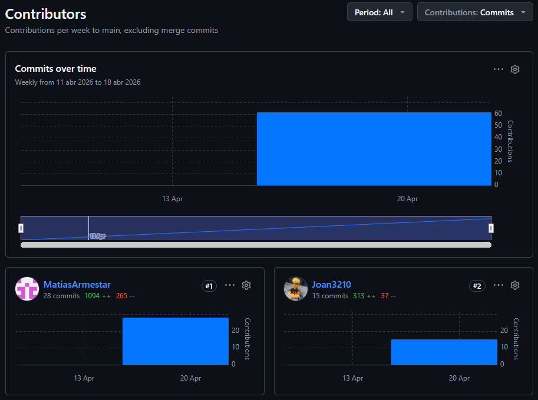
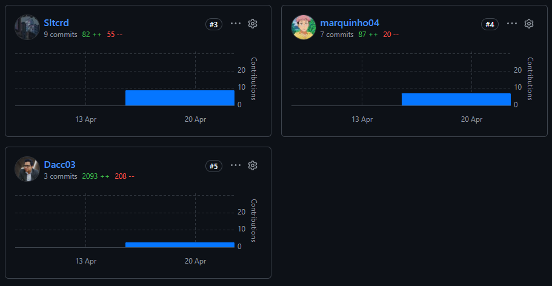
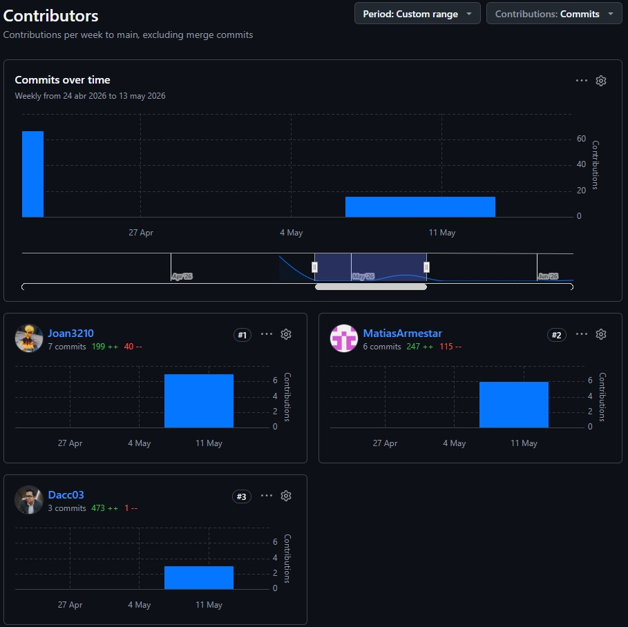
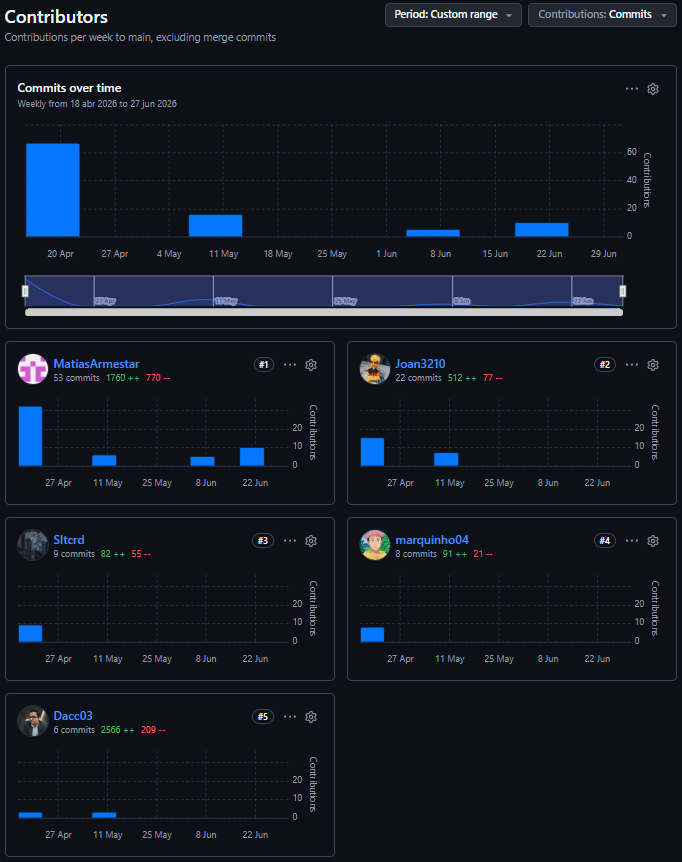

<h3>Universidad Peruana de Ciencias Aplicadas</h3>
<h4>Carrera de Ingeniería de Software</h4>
<h4>Periodo 202610</h4>
<h4>Curso: 1ACC0238 Aplicaciones para Dispositivos Móviles</h4>
<h4>NRC: 3687</h4>
<h4>Docente: Quevedo Velasco, David Gerardo</h4>
<h4>Informe de Trabajo Final</h4>
<h4>Startup: RealTec</h4>
<h4>Producto: Eventify</h4>

 

<h3 style="text-align: center;">Team members:</h3>

<table style="margin: 0 auto; text-align: center;">
  <thead>
    <tr>
      <th>Código</th>
      <th>Nombre</th>
    </tr>
  </thead>
  <tbody>
    <tr>
      <td>U20221A553</td>
      <td>Armestar Heredia, Matias Gabriel</td>
    </tr>
    <tr>
      <td>U202120569</td>
      <td>Crisanto Calle, Deybbi Anderson</td>
    </tr>
    <tr>
      <td>U202215721</td>
      <td>Duran Diaz, Antonio Rodrigo</td>
    </tr>
    <tr>
      <td>U202210790</td>
      <td>Nakasone Gomes, Marco Antonio</td>
    </tr>
    <tr>
      <td>U202117303</td>
      <td>Teves Samaniego, Joan Fernando</td>
    </tr>
  </tbody>
</table>

 
<h4 style="text-align: center;">Julio 2026</h4>

## Registro de Versiones del Informe

| Versión | Fecha       | Autor                                                                                                   | Descripción de modificación |
|---------|------------|---------------------------------------------------------------------------------------------------------|-----------------------------|
| **0.1** | 20/04/2026 | Matias Armestar | Creación de estructura principal del informe y desarrollo del capítulo 1 |
| **0.2** | 23/04/2026 | Antonio Duran | Se agregaron mejoras y correciones del capítulo 1 y carátula |
| **0.3** | 23/04/2026 | Deybbi Crisanto | Se agregó Entrevistas, Competidores, Needfinding y Requirements specification |
| **0.4** | 23/04/2026 | Marco Nakasone | Se agregaron las secciones para el Strategic-Level Domain-Driven Design, EventStorming y Context Mapping |
| **0.5** | 23/04/2026 | Joan Teves | Se agregaron las secciones del Tactical-Level Domain-Driven Design, Bounded Context |
| **1.0** | 13/05/2026 | Matias Armestar, Deybbi Crisanto, Antonio Duran, Marco Nakasone, Joan Teves | Se desarrolló e implementó la Landing Page y el apartado Backend de Eventify |
| **2.0** | 26/06/2026 | Matias Armestar, Deybbi Crisanto, Antonio Duran, Marco Nakasone, Joan Teves | Se desarrolló el apartado Frontend |
| **3.0** | 06/07/2026 | Matias Armestar, Deybbi Crisanto, Antonio Duran, Marco Nakasone, Joan Teves | Se integró el apartado Backend con el de Frontend, así concluyendo con la última versión de la solución para su posterior distribución. |

## Project Report Collaboration Insights

A continuación, se detalla el proceso de elaboración del informe para cada entrega, junto con capturas de pantalla que muestran los análisis de colaboración y commits en GitHub para el repositorio del informe:

**URL de la Organización:** https://github.com/Aplicaciones-Moviles-Equipo-4  
**URL del Repositorio del Informe:**  https://github.com/Aplicaciones-Moviles-Equipo-4/report  
**URL del Repositorio de la Landing Page:** https://github.com/Aplicaciones-Moviles-Equipo-4/eventify-landing-page-realtec  
**URL del Repositorio del Backend:** https://github.com/Aplicaciones-Moviles-Equipo-4/backend  
**URL del Repositorio del Frontend (Jetpack Compose):** https://github.com/Aplicaciones-Moviles-Equipo-4/eventify-mobile-kotlin  
**URL del Repositorio del Frontend (Flutter):** https://github.com/Aplicaciones-Moviles-Equipo-4/eventify-mobile-flutter  

### Primer Hito: AV1

En esta primera entrega se desarrollaron los primeros avances del informe, abarcando el Capítulo 1: Presentación y Capítulo 2: Requirements Development and Software Solution Design. Con el fin de evidenciar los avances realizados y demostrar la participación activa de todos los miembros del equipo en la elaboración del informe, se presentan a continuación las capturas obtenidas desde los analíticos de colaboración del repositorio GitHub del proyecto.

## Contributors

En la sección de Contributors se puede visualizar la participación individual de cada integrante del equipo en la redacción del informe correspondiente a este primer hito. El registro muestra la cantidad de commits efectuados por cada miembro, así como el número de adiciones y eliminaciones realizadas en el documento, reflejando el nivel de contribución y trabajo colaborativo del equipo.

### Segundo Hito: TB1

En esta segunda entrega se desarrolló y desplegó la Landing Page así como el apartado Backend, reportando adecuadamente el proceso en en presente informe. Con el fin de evidenciar los avances realizados y demostrar la participación activa de todos los miembros del equipo en la elaboración del informe, se presentan a continuación las capturas obtenidas desde los analíticos de colaboración del repositorio GitHub del proyecto.

## Contributors

En la sección de Contributors se puede visualizar la participación individual de cada integrante del equipo en la redacción del informe correspondiente a este segundo hito. El registro muestra la cantidad de commits efectuados por cada miembro, así como el número de adiciones y eliminaciones realizadas en el documento, reflejando el nivel de contribución y trabajo colaborativo del equipo.

### Tercer Hito: AV2

En esta tercera entrega se desarrollaron parcialmente los apartados Frontend desarrollados en Dart y Klotin, haciendo uso de Flutter y Jetpack Compose respectivamente. Con el fin de evidenciar los avances realizados y demostrar la participación activa de todos los miembros del equipo en la elaboración del informe, se presentan a continuación las capturas obtenidas desde los analíticos de colaboración del repositorio GitHub del proyecto.

## Contributors

En la sección de Contributors se puede visualizar la participación individual de cada integrante del equipo en la redacción del informe correspondiente a este tercer hito. El registro muestra la cantidad de commits efectuados por cada miembro, así como el número de adiciones y eliminaciones realizadas en el documento, reflejando el nivel de contribución y trabajo colaborativo del equipo.

### Cuarto Hito: TB2

En esta cuarta y última entrega se culminó el desarrollo de los apartados Frontend y se integraron con el apartado Backend, para posteriormente la publicación y distribución de la solución mediante Google Firebase. Con el fin de evidenciar los avances realizados y demostrar la participación activa de todos los miembros del equipo en la elaboración del informe, se presentan a continuación las capturas obtenidas desde los analíticos de colaboración del repositorio GitHub del proyecto.

## Contributors

En la sección de Contributors se puede visualizar la participación individual de cada integrante del equipo en la redacción del informe correspondiente a este tercer hito. El registro muestra la cantidad de commits efectuados por cada miembro, así como el número de adiciones y eliminaciones realizadas en el documento, reflejando el nivel de contribución y trabajo colaborativo del equipo.

# Contenido

## Tabla de contenidos

### [Capítulo I: Presentación](#capítulo-i-presentación)
- [1.1. Startup Profile](#11-startup-profile)
  - [1.1.1 Descripción de la Startup](#111-descripción-de-la-startup)
  - [1.1.2 Perfiles de integrantes del equipo](#112-perfiles-de-integrantes-del-equipo)
- [1.2 Solution Profile](#12-solution-profile)
  - [1.2.1 Antecedentes y problemática](#121-antecedentes-y-problemática)
  - [1.2.2 Lean UX Process](#122-lean-ux-process)
    - [1.2.2.1. Lean UX Problem Statements](#1221-lean-ux-problem-statements)
    - [1.2.2.2. Lean UX Assumptions](#1222-lean-ux-assumptions)
    - [1.2.2.3. Lean UX Hypothesis Statements](#1223-lean-ux-hypothesis-statements)
    - [1.2.2.4. Lean UX Canvas](#1224-lean-ux-canvas)
- [1.3. Segmentos objetivo](#13-segmentos-objetivo)

### [Capítulo II: Requirements Development and Software Solution Design](#capítulo-ii-requirements-development-and-software-solution-design)
- [2.1. Competidores](#21-competidores)
  - [2.1.1. Análisis competitivo](#211-análisis-competitivo)
  - [2.1.2. Estrategias y tácticas frente a competidores](#212-estrategias-y-tácticas-frente-a-competidores)
- [2.2. Entrevistas](#22-entrevistas)
  - [2.2.1. Diseño de entrevistas](#221-diseño-de-entrevistas)
  - [2.2.2. Registro de entrevistas](#222-registro-de-entrevistas)
  - [2.2.3. Análisis de entrevistas](#223-análisis-de-entrevistas)
- [2.3. Needfinding](#23-needfinding)
  - [2.3.1. User Personas](#231-user-personas)
  - [2.3.2. User Task Matrix](#232-user-task-matrix)
  - [2.3.3. User Journey Mapping](#233-user-journey-mapping)
  - [2.3.4. Empathy Mapping](#234-empathy-mapping)
  - [2.3.5. Big Picture Event Storming](#235-big-picture-event-storming)
  - [2.3.6. Ubiquitous Language](#236-ubiquitous-language)
- [2.4. Requirements specification](#24-requirements-specification)
  - [2.4.1. User Stories](#241-user-stories)
  - [2.4.2. Impact Mapping](#242-impact-mapping)
  - [2.4.3. Product Backlog](#243-product-backlog)
- [2.5. Strategic-Level Domain-Driven Design](#25-strategic-level-domain-driven-design)
  - [2.5.1. Event Storming](#251-event-storming)
    - [2.5.1.1. Candidate Context Discovery](#2511-candidate-context-discovery)
    - [2.5.1.2. Domain Message Flows Modeling](#2512-domain-message-flows-modeling)
    - [2.5.1.3. Bounded Context Canvases](#2513-bounded-context-canvases)
  - [2.5.2. Context Mapping](#252-context-mapping)
  - [2.5.3. Software Architecture](#253-software-architecture)
    - [2.5.3.1. Software Architecture Context Level Diagrams](#2531-software-architecture-context-level-diagrams)
    - [2.5.3.2. Software Architecture Container Level Diagrams](#2532-software-architecture-container-level-diagrams)
    - [2.5.3.3. Software Architecture Deployment Diagrams](#2533-software-architecture-deployment-diagrams)
- [2.6. Tactical-Level Domain-Driven Design](#26-tactical-level-domain-driven-design)
  - [2.6.1. Bounded Context: IAM (Identity and Access Management)](#261-bounded-context-iam-identity-and-access-management)
    - [2.6.1.1. Domain Layer](#2611-domain-layer)
    - [2.6.1.2. Interface Layer](#2612-interface-layer)
    - [2.6.1.3. Application Layer](#2613-application-layer)
    - [2.6.1.4. Infrastructure Layer](#2614-infrastructure-layer)
    - [2.6.1.5. Bounded Context Software Architecture Component Level Diagrams](#2615-bounded-context-software-architecture-component-level-diagrams)
    - [2.6.1.6. Bounded Context Software Architecture Code Level Diagrams](#2616-bounded-context-software-architecture-code-level-diagrams)
        - [2.6.1.6.1. Bounded Context Domain Layer Class Diagrams](#26161-bounded-context-domain-layer-class-diagrams)
        - [2.6.1.6.2. Bounded Context Database Design Diagram](#26162-bounded-context-database-design-diagram)
  - [2.6.2. Bounded Context: Event Design and Planning](#262-bounded-context-event-design-and-planning)
    - [2.6.2.1. Domain Layer](#2621-domain-layer)
    - [2.6.2.2. Interface Layer](#2622-interface-layer)
    - [2.6.2.3. Application Layer](#2623-application-layer)
    - [2.6.2.4. Infrastructure Layer](#2624-infrastructure-layer)
    - [2.6.2.5. Bounded Context Software Architecture Component Level Diagrams](#2625-bounded-context-software-architecture-component-level-diagrams)
    - [2.6.2.6. Bounded Context Software Architecture Code Level Diagrams](#2626-bounded-context-software-architecture-code-level-diagrams)
        - [2.6.2.6.1. Bounded Context Domain Layer Class Diagrams](#26261-bounded-context-domain-layer-class-diagrams)
        - [2.6.2.6.2. Bounded Context Database Design Diagram](#26262-bounded-context-database-design-diagram)
  - [2.6.3. Bounded Context: Communication](#263-bounded-context-communication)
    - [2.6.3.1. Domain Layer](#2631-domain-layer)
    - [2.6.3.2. Interface Layer](#2632-interface-layer)
    - [2.6.3.3. Application Layer](#2633-application-layer)
    - [2.6.3.4. Infrastructure Layer](#2634-infrastructure-layer)
    - [2.6.3.5. Bounded Context Software Architecture Component Level Diagrams](#2635-bounded-context-software-architecture-component-level-diagrams)
    - [2.6.3.6. Bounded Context Software Architecture Code Level Diagrams](#2636-bounded-context-software-architecture-code-level-diagrams)
        - [2.6.3.6.1. Bounded Context Domain Layer Class Diagrams](#26361-bounded-context-domain-layer-class-diagrams)
        - [2.6.3.6.2. Bounded Context Database Design Diagram](#26362-bounded-context-database-design-diagram)

### [Capítulo III: Solution UI/UX Design](#capítulo-iii-solution-uiux-design)
- [3.1. Product design](#31-product-design)
  - [3.1.1. Style Guidelines](#311-style-guidelines)
    - [3.1.1.1. General Style Guidelines](#3111-general-style-guidelines)
  - [3.1.2. Information Architecture](#312-information-architecture)
    - [3.1.2.1. Organization Systems](#3121-organization-systems)
    - [3.1.2.2. Labelling Systems](#3122-labelling-systems)
    - [3.1.2.3. SEO Tags and Meta Tags](#3123-seo-tags-and-meta-tags)
    - [3.1.2.4. Searching Systems](#3124-searching-systems)
    - [3.1.2.5. Navigation Systems](#3125-navigation-systems)
  - [3.1.3. Landing Page UI Design](#313-landing-page-ui-design)
    - [3.1.3.1. Landing Page Wireframe](#3131-landing-page-wireframe)
    - [3.1.3.2. Landing Page Mock-up](#3132-landing-page-mock-up)
  - [3.1.4. Mobile Applications UX/UI Design](#314-mobile-applications-uxui-design)
    - [3.1.4.1. Mobile Applications Wireframes](#3141-mobile-applications-wireframes)
    - [3.1.4.2. Mobile Applications Wireflow Diagrams](#3142-mobile-applications-wireflow-diagrams)
    - [3.1.4.3. Mobile Applications Mock-ups](#3143-mobile-applications-mock-ups)
    - [3.1.4.4. Mobile Applications User Flow Diagrams](#3144-mobile-applications-user-flow-diagrams)
    - [3.1.4.5. Mobile Applications Prototyping](#3145-mobile-applications-prototyping)

### [Capítulo IV: Product Implementation & Validation](#capítulo-iv-product-implementation--validation)
- [4.1. Software Configuration Management](#41-software-configuration-management)
  - [4.1.1. Software Development Environment Configuration](#411-software-development-environment-configuration)
  - [4.1.2. Source Code Management](#412-source-code-management)
  - [4.1.3. Source Code Style Guide & Conventions](#413-source-code-style-guide--conventions)
  - [4.1.4. Software Deployment Configuration](#414-software-deployment-configuration)
- [4.2. Landing Page & Mobile Application Implementation](#42-landing-page--mobile-application-implementation)
  - [4.2.1. Sprint 1](#421-sprint-1)
    - [4.2.1.1. Sprint Planning 1](#4211-sprint-planning-1)
    - [4.2.1.2. Sprint Backlog 1](#4212-sprint-backlog-1)
    - [4.2.1.3. Development Evidence for Sprint Review](#4213-development-evidence-for-sprint-review)
    - [4.2.1.4. Testing Suite Evidence for Sprint Review](#4214-testing-suite-evidence-for-sprint-review)
    - [4.2.1.5. Execution Evidence for Sprint Review](#4215-execution-evidence-for-sprint-review)
    - [4.2.1.6. Services Documentation Evidence for Sprint Review](#4216-services-documentation-evidence-for-sprint-review)
    - [4.2.1.7. Software Deployment Evidence for Sprint Review](#4217-software-deployment-evidence-for-sprint-review)
    - [4.2.1.8. Team Collaboration Insights during Sprint](#4218-team-collaboration-insights-during-sprint)
  - [4.2.2. Sprint 2](#422-sprint-2)
    - [4.2.2.1. Sprint Planning 2](#4221-sprint-planning-2)
    - [4.2.2.2. Sprint Backlog 2](#4222-sprint-backlog-2)
    - [4.2.2.3. Development Evidence for Sprint Review](#4223-development-evidence-for-sprint-review)
    - [4.2.2.4. Testing Suite Evidence for Sprint Review](#4224-testing-suite-evidence-for-sprint-review)
    - [4.2.2.5. Execution Evidence for Sprint Review](#4225-execution-evidence-for-sprint-review)
    - [4.2.2.6. Services Documentation Evidence for Sprint Review](#4226-services-documentation-evidence-for-sprint-review)
    - [4.2.2.7. Software Deployment Evidence for Sprint Review](#4227-software-deployment-evidence-for-sprint-review)
    - [4.2.2.8. Team Collaboration Insights during Sprint](#4228-team-collaboration-insights-during-sprint)
  - [4.2.3. Sprint 3](#423-sprint-3)
    - [4.2.3.1. Sprint Planning 3](#4231-sprint-planning-3)
    - [4.2.3.2. Sprint Backlog 3](#4232-sprint-backlog-3)
    - [4.2.3.3. Development Evidence for Sprint Review](#4233-development-evidence-for-sprint-review)
    - [4.2.3.4. Testing Suite Evidence for Sprint Review](#4234-testing-suite-evidence-for-sprint-review)
    - [4.2.3.5. Execution Evidence for Sprint Review](#4235-execution-evidence-for-sprint-review)
    - [4.2.3.6. Services Documentation Evidence for Sprint Review](#4236-services-documentation-evidence-for-sprint-review)
    - [4.2.3.7. Software Deployment Evidence for Sprint Review](#4237-software-deployment-evidence-for-sprint-review)
    - [4.2.2.8. Team Collaboration Insights during Sprint](#4238-team-collaboration-insights-during-sprint)
- [4.3. Validation Interviews](#43-validation-interviews)
  - [4.3.1. Diseño de Entrevistas](#431-diseño-de-entrevistas)
  - [4.3.2. Registro de Entrevistas](#432-registro-de-entrevistas)
  - [4.3.3. Evaluaciones según heurísticas](#433-evaluaciones-según-heurísticas)

### [Conclusiones](#conclusiones)
- [Conclusiones y recomendaciones](#conclusiones-y-recomendaciones)
- [Video App Validation](#video-app-validation)
- [Video About the product](#video-about-the-product)
- [Video About the team](#video-about-the-team)

### [Glosario](#glosario)
### [Bibliografía](#bibliografía)
### [Anexos](#anexos)

## Student Outcome

El curso contribuye al cumplimiento del Student Outcome ABET: **ABET – EAC - Student Outcome 7**   Criterio: _La capacidad de adquirir y aplicar nuevos conocimientos según sea necesario, utilizando estrategias de aprendizaje apropiadas._

En el siguiente cuadro se describe las acciones realizadas y enunciados de conclusiones por parte del grupo, que permiten sustentar el haber alcanzado el logro del ABET – EAC - Student Outcome 7.

| **Criterio específico** | **Acciones realizadas** | **Conclusiones** |
|--------------------------|----------------------------------------------------------------------------------------------------------------------------------------------------------------------------------------------------------------------------------------------------------------------------------------------------------------------------------------------------------------------------------------------------------------------------------------------------------------------------------------------------------------------------------------------------------------------------------------------------------------------------------------------------------------------------------------------------------------------------------------------------------------------------------------------------------------------------------------------------------------------------------------------------------------------------------------------------------------------------------------------------------------------------------------------------------------------------------------------------------------------------------------------------------------------------------------------------------------------------------|------------------|
| Actualiza conceptos y conocimientos necesarios para su desarrollo profesional y en especial para su proyecto en soluciones de software. | **AV1:**  • **Armestar Heredia, Matias Gabriel:** Durante el desarrollo de esta primera entrega pude conocer nuevos formatos de distintos aspectos de la presente documentación, para luego coordinar su correcto uso en coordinación con los demás integrantes del equipo.  • **Crisanto Calle, Deybbi Anderson:** Actualicé y apliqué conceptos clave de ingeniería de software como el modelado de User Stories bajo enfoque ágil, la definición de Acceptance Criteria en formato Gherkin y la estructuración de épicas, historias de usuario y technical stories. Asimismo, reforcé conocimientos en diseño de APIs RESTful, modelado de requerimientos y organización del backlog, alineando estos elementos con la arquitectura del sistema para el desarrollo de soluciones de software.  • **Duran Diaz, Antonio Rodrigo:** Para este avance del primer hito he vuelto a aplicar conceptos y conocimientos útiles para su desarrollo.  • **Nakasone Gomes, Marco Antonio:** Apliqué conceptos de Domain-Driven Design (DDD) a nivel estratégico, desarrollando EventStorming para el análisis del dominio, modelando flujos de mensajes y definiendo Bounded Contexts. Además, elaboré el Context Mapping y los diagramas de arquitectura (contexto, contenedores y despliegue).  • **Teves Samaniego, Joan Fernando:** Investigué y apliqué conceptos avanzados de Domain-Driven Design y Clean Architecture para estructurar correctamente los Bounded Contexts del proyecto. Además, actualicé mis conocimientos en el modelado de bases de datos y la definición de componentes de software, elementos fundamentales para asegurar la escalabilidad técnica de nuestras soluciones.    **TB1:**  • **Armestar Heredia, Matias Gabriel:** En esta segunda entrega, pude adentrarme y desenvolverme en el apartado de diseño de mockups para soluciones orientadas a dispositivos móviles.  • **Crisanto Calle, Deybbi Anderson:** Actualicé y reforcé mis conocimientos en el diseño de interfaces de usuario mediante la elaboración de mockups de alta fidelidad, aplicando principios de experiencia de usuario (UX), consistencia visual y diseño centrado en el usuario. Asimismo, aprendí a utilizar herramientas de prototipado para representar de manera más precisa los flujos de interacción del sistema.  • **Duran Diaz, Antonio Rodrigo:** Durante esta entrega reforcé mis conocimientos en el diseño de interfaces y prototipos, aplicando buenas prácticas de usabilidad y organización visual para representar de forma clara los procesos e interacciones del sistema.  • **Nakasone Gomes, Marco Antonio:** Amplié mis conocimientos en el diseño de experiencias de usuario mediante la creación y validación de prototipos de alta fidelidad, aplicando criterios de navegación, accesibilidad y consistencia visual para representar adecuadamente las funcionalidades del sistema.  • **Teves Samaniego, Joan Fernando:** Investigué y apliqué conceptos de diseño de interfaces y experiencia de usuario para desarrollar mockups funcionales del sistema. Además, reforcé mis conocimientos en herramientas de prototipado y en la definición de flujos de navegación, asegurando una representación clara y coherente de las funcionalidades propuestas.    **AV2:**  • **Armestar Heredia, Matias Gabriel:** Durante esta entrega reforcé mis conocimientos en el desarrollo e integración de la interfaz de usuario con los servicios del sistema, aplicando buenas prácticas de programación y asegurando el correcto funcionamiento de las funcionalidades implementadas.  • **Crisanto Calle, Deybbi Anderson:** Actualicé y apliqué conocimientos en el desarrollo de APIs RESTful y la implementación de la lógica de negocio, integrando correctamente los servicios con la base de datos y el frontend. Asimismo, reforcé conceptos relacionados con la validación de datos, manejo de excepciones y buenas prácticas de desarrollo de software para garantizar un sistema funcional y mantenible.  • **Duran Diaz, Antonio Rodrigo:** Durante esta entrega reforcé mis conocimientos en la implementación de funcionalidades del sistema, aplicando principios de desarrollo de software, integración de componentes y resolución de problemas durante el proceso de construcción del proyecto.  • **Nakasone Gomes, Marco Antonio:** Apliqué y consolidé conocimientos sobre arquitectura de software durante la implementación del sistema, asegurando la correcta separación de responsabilidades entre componentes, la integración de servicios y el cumplimiento de los lineamientos definidos en el diseño arquitectónico.  • **Teves Samaniego, Joan Fernando:** Actualicé mis conocimientos en el desarrollo e integración de aplicaciones, implementando funcionalidades tanto en el frontend como en el backend bajo principios de Clean Architecture y buenas prácticas de programación. Además, reforcé el uso de herramientas de control de versiones y trabajo colaborativo para mantener la calidad del proyecto.    **TB2:**  • **Armestar Heredia, Matias Gabriel:** Durante esta entrega reforcé mis conocimientos en las pruebas e integración final del sistema, verificando el correcto funcionamiento de las funcionalidades implementadas y aplicando buenas prácticas para la corrección de errores y optimización de la interfaz de usuario.  • **Crisanto Calle, Deybbi Anderson:** Actualicé y consolidé mis conocimientos en la integración final del backend, optimización de servicios REST y validación integral del sistema. Asimismo, reforcé el uso de pruebas funcionales, corrección de incidencias y documentación técnica para garantizar la estabilidad y mantenibilidad de la solución de software.  • **Duran Diaz, Antonio Rodrigo:** Durante esta entrega fortalecí mis conocimientos en la fase de pruebas, integración y validación del sistema, participando en la identificación y corrección de errores, así como en la optimización de funcionalidades para asegurar el cumplimiento de los requerimientos del proyecto.  • **Nakasone Gomes, Marco Antonio:** Consolidé mis conocimientos en arquitectura de software mediante la validación de la implementación final del sistema, verificando la correcta integración entre componentes y el cumplimiento de los principios arquitectónicos definidos durante el diseño, además de apoyar en la resolución de incidencias técnicas.  • **Teves Samaniego, Joan Fernando:** Reforcé mis conocimientos en la integración, despliegue y validación del sistema, aplicando buenas prácticas de desarrollo para optimizar el funcionamiento de las funcionalidades implementadas. Además, consolidé el uso de herramientas de control de versiones, pruebas y trabajo colaborativo para asegurar la calidad del producto final. |• **AV1:** El equipo ha demostrado capacidad para investigar, adquirir y aplicar nuevos conocimientos técnicos y metodológicos, adaptándose a los requerimientos arquitectónicos del proyecto. Se evidencia un compromiso colectivo con el aprendizaje continuo como pilar fundamental para el desarrollo de soluciones de software escalables y de calidad.   • **TB1:** El equipo fortaleció sus conocimientos en diseño de interfaces y experiencia de usuario mediante la elaboración colaborativa de mockups de alta fidelidad. Se investigaron y aplicaron buenas prácticas de diseño, navegación y usabilidad, logrando representar de forma consistente los requerimientos funcionales del sistema y mejorando la comunicación de las soluciones propuestas entre los integrantes del proyecto.   • **AV2:** El equipo demostró la capacidad de actualizar y aplicar conocimientos técnicos durante la implementación del sistema, integrando los distintos componentes de software de manera colaborativa. Se consolidaron competencias en desarrollo de aplicaciones, consumo de servicios, integración de bases de datos, control de versiones y buenas prácticas de programación, logrando una solución funcional alineada con los requerimientos del proyecto.   • **TB2:** El equipo consolidó los conocimientos adquiridos a lo largo del proyecto mediante la integración, validación y optimización de la solución de software. Se aplicaron buenas prácticas de pruebas, corrección de incidencias, control de versiones e integración de componentes, fortaleciendo las competencias técnicas y el trabajo colaborativo para garantizar un producto funcional, estable y alineado con los requerimientos establecidos. |
| Reconoce la necesidad del aprendizaje permanente para el desempeño profesional y el desarrollo de proyectos en soluciones de software. | **AV1:**  • **Armestar Heredia, Matias Gabriel:** Profundicé mi conocimiento sobre conceptos aprendidos durante el desarrollo de proyectos anteriores, así pudiendo reconocer la importancia del aprendizaje continuo.  • **Crisanto Calle, Deybbi Anderson:** Reconocí la importancia del aprendizaje continuo en el desarrollo de soluciones de software, identificando la necesidad de actualizar constantemente mis conocimientos en metodologías ágiles, arquitectura de software y tecnologías emergentes. Durante el proyecto, comprendí que la evolución de herramientas, frameworks y buenas prácticas exige una formación permanente para garantizar soluciones eficientes, escalables y alineadas a estándares profesionales.  • **Duran Diaz, Antonio Rodrigo:** Realice investigación y análisis para el desarrollo del informe, es importante seguir aprendiendo y reforzando conocimientos.  • **Nakasone Gomes, Marco Antonio:** Investigué y aprendí de forma autónoma sobre EventStorming, Context Mapping y arquitectura de software para aplicarlos en el proyecto, adaptando la teoría a un caso real. • **Teves Samaniego, Joan Fernando:** Comprendí que el desarrollo de software requiere una adaptación técnica constante. La necesidad de integrar nuevos enfoques arquitectónicos y trasladar la lógica de negocio a un entorno de aplicaciones móviles me demostró que la capacitación autónoma y la exploración de nuevas herramientas son indispensables para afrontar los desafíos profesionales con éxito.    **TB1:**  • **Armestar Heredia, Matias Gabriel:** Pude mejorar mi conocimiento acerca del flujo adecuado de vistas y/o módulos necesarios en una aplicación.  • **Crisanto Calle, Deybbi Anderson:** Comprendí la importancia de mantener un aprendizaje continuo en el diseño de interfaces y experiencia de usuario, investigando nuevas herramientas de prototipado y tendencias de diseño para representar de forma más efectiva las funcionalidades del sistema y mejorar la interacción del usuario.  • **Duran Diaz, Antonio Rodrigo:** Durante esta entrega reconocí la necesidad de seguir aprendiendo sobre diseño de interfaces y usabilidad, investigando nuevas técnicas y buenas prácticas que contribuyeron a desarrollar prototipos más claros y funcionales para el proyecto.  • **Nakasone Gomes, Marco Antonio:** Fortalecí mi aprendizaje autónomo explorando principios de experiencia de usuario y herramientas de prototipado, comprendiendo que la actualización constante en metodologías de diseño es fundamental para desarrollar soluciones de software que respondan a las necesidades de los usuarios.  • **Teves Samaniego, Joan Fernando:** Reconocí que el diseño de interfaces evoluciona constantemente, por lo que fue necesario investigar nuevas tendencias de experiencia de usuario, componentes visuales y herramientas de prototipado. Esto reforzó mi compromiso con el aprendizaje permanente para desarrollar soluciones más intuitivas y alineadas con las necesidades del proyecto.    **AV2:**  • **Armestar Heredia, Matias Gabriel:** Durante la implementación del proyecto comprendí la importancia de continuar aprendiendo nuevas tecnologías y herramientas de desarrollo para resolver problemas de manera eficiente y adaptarme a los desafíos que surgieron durante la integración del sistema.  • **Crisanto Calle, Deybbi Anderson:** Reconocí que el desarrollo de software exige una actualización permanente de conocimientos, especialmente durante la implementación de APIs, integración de servicios y manejo de buenas prácticas de programación. La experiencia me permitió identificar la necesidad de seguir aprendiendo nuevas tecnologías y patrones de desarrollo para mejorar la calidad y mantenibilidad de las soluciones.  • **Duran Diaz, Antonio Rodrigo:** Durante esta entrega reforcé la importancia del aprendizaje continuo al investigar soluciones para la implementación de funcionalidades e integración de componentes, comprendiendo que la actualización constante es necesaria para enfrentar nuevos retos tecnológicos.  • **Nakasone Gomes, Marco Antonio:** La implementación de la arquitectura definida me permitió reconocer la necesidad de mantener una formación continua en patrones arquitectónicos, integración de servicios y herramientas de desarrollo, comprendiendo que la evolución tecnológica demanda un aprendizaje permanente para construir soluciones de calidad.  • **Teves Samaniego, Joan Fernando:** Durante el desarrollo e integración de las funcionalidades del sistema comprendí que el aprendizaje permanente es indispensable para adaptarse a nuevos frameworks, herramientas y metodologías. La resolución de problemas técnicos y la aplicación de buenas prácticas fortalecieron mi compromiso con la actualización constante como parte del ejercicio profesional.    **TB2:**  • **Armestar Heredia, Matias Gabriel:** Durante esta entrega comprendí la importancia de mantener un aprendizaje continuo para adaptarme a los retos presentados durante la integración y validación del sistema, investigando nuevas alternativas para resolver problemas y mejorar la calidad de las funcionalidades implementadas.  • **Crisanto Calle, Deybbi Anderson:** Durante esta etapa reconocí la necesidad de actualizar constantemente mis conocimientos para afrontar los desafíos surgidos durante la integración final del sistema. Investigué y apliqué nuevas prácticas relacionadas con la optimización de APIs, pruebas funcionales y resolución de incidencias, fortaleciendo mis competencias para el desarrollo de soluciones de software de calidad.  • **Duran Diaz, Antonio Rodrigo:** En esta entrega reforcé la importancia del aprendizaje permanente al investigar y aplicar nuevas soluciones para resolver los problemas encontrados durante las pruebas e integración del sistema, contribuyendo a mejorar el funcionamiento del proyecto.  • **Nakasone Gomes, Marco Antonio:** Esta etapa me permitió reconocer la necesidad de mantener una actualización constante en temas de arquitectura e integración de software, aplicando nuevos conocimientos para validar la implementación del sistema y resolver inconvenientes técnicos durante la fase final del proyecto.  • **Teves Samaniego, Joan Fernando:** Durante la integración y validación final del sistema reforcé la importancia del aprendizaje continuo, investigando nuevas herramientas y buenas prácticas relacionadas con pruebas, despliegue y optimización del software para garantizar la calidad de la solución desarrollada. |• **AV1:** Todos los integrantes reconocen que la evolución de las tecnologías y los estándares de desarrollo exige una formación permanente. El proyecto ha servido como catalizador para entender que el estudio autónomo y la actualización constante son habilidades indispensables para el éxito y la competitividad en el ámbito profesional.   • **TB1:** El equipo reconoció que el diseño de interfaces y la experiencia de usuario son disciplinas en constante evolución, por lo que fue necesario investigar nuevas herramientas, tendencias y buenas prácticas de prototipado. Este proceso fortaleció el aprendizaje colaborativo y evidenció la importancia de la actualización continua para desarrollar soluciones de software centradas en el usuario.   • **AV2:** Durante la implementación del sistema, el equipo comprendió que el aprendizaje permanente es esencial para afrontar los retos técnicos del desarrollo de software. La investigación de nuevas tecnologías, la resolución colaborativa de problemas y la aplicación de buenas prácticas permitieron fortalecer las competencias del grupo, reafirmando la importancia de la capacitación continua para el desempeño profesional.   • **TB2:** El equipo reconoció la importancia del aprendizaje permanente durante la fase final del proyecto, investigando y aplicando nuevas herramientas, metodologías y buenas prácticas para resolver incidencias, optimizar el sistema y garantizar la calidad del producto desarrollado. Esta experiencia fortaleció la capacidad del equipo para adaptarse a nuevos desafíos tecnológicos y mejorar continuamente sus competencias profesionales en el desarrollo de soluciones de software. |

## Objetivos SMART

| Estudiante                       | Objetivos SMART                                                                                                                                                                                                                                                             |
|----------------------------------|-----------------------------------------------------------------------------------------------------------------------------------------------------------------------------------------------------------------------------------------------------------------------------|
| Armestar Heredia, Matias Gabriel | Profundizar mi conocimiento en tecnologías ya usadas anteriormente cómo también expandirlo a nuevas de ellas.  Conocer más acerca del área gerencial a través de distintos roles y experiencias para así complementar mi aprendizaje. |
| Crisanto Calle, Deybbi Anderson  | Fortalecer mis habilidades en diseño de arquitectura de software aplicando conceptos como DDD y modelado de sistemas, desarrollando diagramas de contexto, contenedores y componentes para el proyecto antes de la entrega final del curso. |
| Duran Diaz, Antonio Rodrigo      | Fortalecer continuamente mis conocimientos en Ingeniería de Software y actualizarme en tecnologías modernas para ser parte del desarrollo de proyectos acoplandome herramientas actuales.                                                                         |
| Nakasone Gomes, Marco Antonio    | Fortalecer mis competencias en ingeniería de software aplicando metodologías y herramientas modernas para diseñar soluciones alineadas a necesidades reales del negocio.                                                                                          |
| Teves Samaniego, Joan Fernando   | Diseñar e implementar la arquitectura de software del proyecto integrando los patrones de diseño táctico (DDD y Clean Architecture) de manera completa antes de finalizar el ciclo académico, asegurando una base técnica robusta que facilite el desarrollo móvil. |

